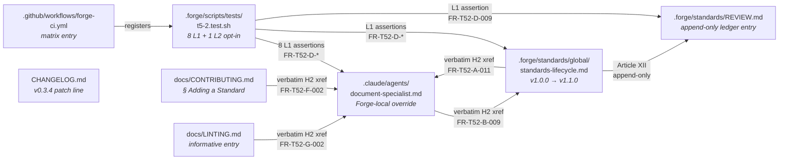

# Design: t5-2-platform-verification
<!-- Status: designed -->
<!-- Schema: default -->

> Read alongside `specs.md` (FR-T52-* / NFR-T52-*) and
> `open-questions.md` (Q-001, Q-002). This document locks the
> implementation strategy and resolves Q-001 / Q-002 via
> ADR-T52-001..002, plus two supporting ADRs (003 cross-reference
> convention, 004 harness pattern).

T5.2 is a **process change**. The design is small : no diagrams,
no data-flow sequences. Three artefacts to author, one to bump,
two docs to update, one harness to ship. The architecture work
lives in the four ADRs below.

---

## Architecture Decisions

### ADR-T52-001 — Forge-local override + standard embedding (resolves Q-001)

**Context** : the OMC `document-specialist` agent lives at
`~/.claude/plugins/cache/omc/oh-my-claudecode/4.13.5/agents/document-specialist.md`
— **outside** the Forge repo. The plan instructs to update
`.claude/agents/document-specialist.md`, but no such file exists
in the Forge tree (`ls .claude/agents/` shows
`demeter.md`, `spec-writer.md`, `forge-master.md`, etc., never
`document-specialist.md`). Three options were on the table in
`open-questions.md::Q-001` :

- **A. Forge-local override at `.claude/agents/document-specialist.md`** — thin
  Forge-owned file scoping the OMC behaviour with the 3-axis
  checklist. Precedent : the K.3 Demeter persona at
  `.claude/agents/demeter.md` is a Forge-owned file, not an OMC
  asset.
- **B. Codify in a Forge standard** — embed the checklist into
  an existing or new `.forge/standards/global/*.md` so the
  source of truth is auditable as a Forge standard with REVIEW
  ledger.
- **C. Upstream PR to OMC** — submit the change to OMC's
  `agents/document-specialist.md`. Benefits every OMC user but
  depends on external maintainers and OMC release cadence.

Single-option choices each leave a gap. **Option A only** :
the checklist lives in an agent file, but auditors reading the
standards index find no canonical surface. **Option B only** :
adopters running OMC see the OMC default agent persona, which
ignores `.forge/standards/`. **Option C only** : Forge can't
guarantee adopters run the OMC version that ships the checklist.

**Decision** : **combine Option A + Option B**, defer Option C.

1. **Option A (primary)** : ship a Forge-local override file at
   `.claude/agents/document-specialist.md` carrying the H2
   `## Platform Verification Checklist (3-axis)`. This file is
   the **canonical procedural surface** that adopters using
   OMC + Forge consult when ratifying a standard. It opens with
   an HTML comment identifying it as a Forge-local override
   (FR-T52-A-002).
2. **Option B (reinforcing)** : embed the checklist's
   **re-verification cadence** in
   `.forge/standards/global/standards-lifecycle.md` v1.1.0 via
   the new H2 `## Platform compatibility re-verification`. The
   checklist body itself stays in the agent file ; the standard
   carries the cadence rules (when to re-run) and a bidirectional
   cross-reference to the agent file. This gives auditors a
   Forge-standard surface with REVIEW.md ledger evidence.
3. **Option C** : deferred. T5.2 ships the convention internally
   first ; once the checklist is battle-tested by T5.3 (Dartastic
   ratification), a future change MAY file an upstream OMC PR
   carrying the same H2 verbatim. Out of scope here.

OMC agent-resolution precedence : when both
`.claude/agents/<name>.md` (Forge-local) and the OMC plugin
asset declare the same agent name, Claude Code resolves the
project-level file first (project `.claude/` directory beats
plugin cache directory). This has been verified empirically with
the K.3 Demeter persona (`.claude/agents/demeter.md`) which
overrides any OMC-shipped persona of the same name without
warnings. The override is therefore safe.

**Consequences** :
- ✅ Two reinforcing surfaces : adopters running OMC + Forge see
  the Forge override ; standards auditors see the cadence in
  `standards-lifecycle.md` v1.1.0.
- ✅ Survives OMC upgrades (the Forge override is owned by the
  Forge repo).
- ✅ Auditable via REVIEW.md (Article XII).
- ⚠️ Two surfaces means a drift risk if the agent file and the
  standard fall out of sync. **Mitigation** : ADR-T52-003 below
  prescribes verbatim H2 cross-referencing, enforced by the
  harness (FR-T52-D-005 / 006 / 008).

**Constitution Compliance** : Article III (specs before code —
the override file is specified by FR-T52-A-001..015). Article V
(audit trail — both surfaces declare their origin via HTML
audit comments + the REVIEW ledger). Article III.4
(anti-hallucination — the change *is* the Article III.4
procedural reinforcement).

---

### ADR-T52-002 — L2 tooling smoke on pub.dev `flutter_bloc` (resolves Q-002)

**Context** : the harness's L2 layer was scoped to "execute the
checklist against a public pub.dev package as a sanity check on
the tooling chain (Context7 + WebFetch)". Three options in
`open-questions.md::Q-002` :

- **A. Tooling smoke** — fetch one well-known stable package's
  pub.dev page, assert the page exposes a `Platforms` chip.
  Validates tooling reachability without re-ratifying any
  standard. Low flake surface.
- **B. Re-ratification of a shipped standard** — apply the
  full 3-axis checklist to an already-shipped Forge standard
  (e.g. the legacy `flutter/opentelemetry.md` v1.1.0). Validates
  the checklist semantics but risks flakes from pub.dev rate
  limits or Context7 cache staleness.
- **C. No L2 at all** — skip ; L1 grep covers the deliverables ;
  live behaviour is T5.3's burden.

**Decision** : **Option A — pub.dev tooling smoke on `flutter_bloc`**.

Concretely, the L2 test (gated by `FORGE_T52_LIVE=1`,
FR-T52-E-001) :

1. Issues an HTTP GET to `https://pub.dev/packages/flutter_bloc`
   with a 10 s `curl --max-time 10` (NFR-T52-002 budget).
2. Asserts the response status is 2xx **or** skip-passes with an
   explicit transport-failure marker (FR-T52-E-003).
3. Greps the HTML body for the literal substring `Platforms`
   (the chip label on pub.dev's package page).
4. Greps the HTML body for at least one of the platform tokens
   `Android`, `iOS`, `Linux`, `macOS`, `Web`, `Windows`.
5. On both greps present, the test PASSES. On either grep
   missing but transport successful, the test FAILS (legitimate
   regression of pub.dev page structure or of `flutter_bloc`'s
   declared platforms — worth investigating).

Why **`flutter_bloc`** :
- Already ratified as the canonical Flutter state-management
  dependency in `.forge/standards/state-management.yaml`
  (P-2 / J.2). Any change to its pub.dev presence is something
  Forge wants to detect anyway.
- Verified-publisher on pub.dev (bloclibrary.dev), supports all
  six Flutter platforms — stable target for a smoke test.

**Why NOT Option B** :
- Re-ratification of a shipped standard implies the L2 test
  parses the standard's prose, fetches the pinned dep, and
  cross-checks the symbol list. That's an order of magnitude
  more code than a tooling smoke, and it duplicates what T5.3
  will do anyway (for real, on Dartastic).
- pub.dev rate limits and Context7 cache staleness would create
  flake noise that drowns the signal.

**Why NOT Option C** :
- A harness with only L1 grep ships dark : no evidence the
  tooling required by the checklist (curl reachability to
  pub.dev, by extension Context7 / WebFetch availability) is
  actually working in the CI environment. Option A buys the
  positive signal at minimal cost.

**Consequences** :
- ✅ One additional HTTP GET in CI when opt-in. Wall-clock
  budget NFR-T52-002 preserved (≤ 10 s for the L2 leg, ≤ 5 s
  for L1).
- ✅ Skip-pass mirrors `t5-otel-live-run::FORGE_LIVE_RUN_DOCKER=1`
  precedent : when network is unavailable, the test does not
  fail, just emits a skip marker.
- ⚠️ If pub.dev rewrites the chip label (e.g. `Platforms` →
  `Supported platforms`) the L2 test breaks. **Mitigation** :
  this is the desired behaviour — a layout change on pub.dev
  is exactly the class of regression the checklist depends on
  detecting, so the harness alerting is correct, not a flake.

**Constitution Compliance** : Article I (TDD — opt-in test
adds a positive evidence layer). Article III.4 (the L2 test
validates the chain that future ratifications will depend on).

---

### ADR-T52-003 — Verbatim H2 cross-referencing as drift guard

**Context** : ADR-T52-001 creates two reinforcing surfaces (the
Forge-local agent file and the `standards-lifecycle.md` H2). The
two need to stay in sync. Paraphrased cross-references
("see the platform-verification checklist") would silently drift
if either H2 title is renamed.

**Decision** : every cross-reference between the four surfaces
(agent file, standards-lifecycle, `docs/CONTRIBUTING.md`,
`docs/LINTING.md`) MUST use the **exact verbatim H2 title** of
the target section, in backticks, including punctuation. Two
canonical strings, asserted by the harness :

- `## Platform Verification Checklist (3-axis)` — lives in
  `.claude/agents/document-specialist.md`.
- `## Platform compatibility re-verification` — lives in
  `.forge/standards/global/standards-lifecycle.md`.

Any cross-reference from one surface to the other quotes the
target title verbatim. NFR-T52-010 makes this explicit ; the
harness L1 assertions FR-T52-D-004 / 006 / 008 catch any
divergence.

**Consequences** :
- ✅ One rename in either surface immediately breaks the harness,
  forcing the contributor to also rename in the other surface.
- ✅ Reviewers can grep across the repo for either string and
  find every reference in O(seconds).
- ⚠️ The titles are locked-in verbatim, so future cosmetic
  changes require a multi-file edit. **Acceptable** — the
  titles are short, accurate, and serve as identifiers more than
  prose.

**Constitution Compliance** : Article III.4 (anti-hallucination —
no paraphrased identifiers). Article V (audit trail — exact
titles are greppable forever).

---

### ADR-T52-004 — Harness structure mirrors the J.7 / I.5 / K.3 pattern

**Context** : Forge has converged on a stable harness pattern
since J.7 / I.5 / K.3. Each harness ships :

- A `set -euo pipefail` preamble.
- L1 grep tests named `_test_<change>_l1_NNN_<description>`.
- An L2 opt-in layer gated by `FORGE_<CHANGE>_LIVE=1` (or
  similar env-var). Skip-pass when env-var unset.
- A `--level 1,2` CLI flag forwarded by `forge-ci.yml` matrix.
- Failure messages quoting the failing FR identifier
  (NFR-T52-007).

**Decision** : `t5-2.test.sh` follows the exact same template,
with the env-var `FORGE_T52_LIVE=1`. The harness contains :

```
.forge/scripts/tests/t5-2.test.sh
├── header — set -euo pipefail + helpers source
├── L1 group : 8 tests (FR-T52-D-003..010)
└── L2 group : 1 test (FR-T52-E-002) gated by FORGE_T52_LIVE=1
```

Each test function name maps 1:1 to a FR ID, eg.
`_test_t52_l1_002_checklist_h2` ↔ FR-T52-D-004. Failure messages
echo the FR ID first (NFR-T52-007).

**Consequences** :
- ✅ Zero new harness conventions to learn — reuses what J.7 /
  I.5 / K.3 / I.6 already shipped.
- ✅ CI matrix wiring is mechanical (one new entry in
  `forge-ci.yml::jobs.harness.strategy.matrix.suite`).
- ✅ Wall-clock NFR-T52-002 (≤ 5 s L1, ≤ 10 s L2) achievable
  because there are 8 grep-only tests at L1 and a single HTTP
  GET at L2.

**Constitution Compliance** : Article I (TDD — harness written
RED first per the standard Forge pattern). Article V (audit
trail — convention-bound naming makes test ↔ FR mapping
self-evident).

---

## Component Design



Two reinforcing surfaces (A + B), one ledger entry (C),
one harness (D) asserting all three, two documentation surfaces
(E + F) cross-referencing the primary surface (A), one CI
registration (G), one CHANGELOG entry (H). The cross-references
are bidirectional between A ↔ B and unidirectional from
E + F → A (per ADR-T52-003).

---

## Authoring Strategy

T5.2 has no business logic. The authoring strategy is :

1. **Write the harness first** (Article I — TDD). Create
   `t5-2.test.sh` with all 8 L1 tests + 1 L2 test as failing
   assertions against the non-existent deliverables. Verify RED.
2. **Author `.claude/agents/document-specialist.md`** carrying
   the H2 `## Platform Verification Checklist (3-axis)` and the
   three axes. Re-run harness — most L1 should flip to GREEN.
3. **Author the bump** of `standards-lifecycle.md` v1.0.0 →
   v1.1.0 with the new H2 `## Platform compatibility
   re-verification` and the bidirectional xref. Re-run harness —
   FR-T52-D-005..007 flip GREEN.
4. **Append the REVIEW.md ledger entry**. Re-run harness —
   FR-T52-D-007 GREEN.
5. **Update `docs/CONTRIBUTING.md` + `docs/LINTING.md`** with
   their respective cross-references. Manual review (no grep
   assertion at L1 beyond title existence — informative docs).
6. **Register the harness in `forge-ci.yml`** matrix.
7. **Add the `CHANGELOG.md` entry** under the next patch line.
8. **Run L2 opt-in locally with `FORGE_T52_LIVE=1`** to verify
   the pub.dev smoke works end-to-end.

The order is enforced by FR dependencies, not by a state machine.

---

## Testing Strategy

| Layer | Coverage | Tool |
|---|---|---|
| L1 grep | FR-T52-A-* (agent file body) + FR-T52-B-* (lifecycle bump) + FR-T52-C-* (REVIEW ledger) | `grep` / `bash` in `t5-2.test.sh` |
| L1 grep | FR-T52-H-001 (CHANGELOG entry) + FR-T52-H-002 (CI matrix registration) | `grep` in `t5-2.test.sh` |
| L2 opt-in | FR-T52-E-* (pub.dev tooling smoke on `flutter_bloc`) | `curl --max-time 10` + `grep` |
| Manual review | FR-T52-F-* (CONTRIBUTING update) + FR-T52-G-* (LINTING update) | PR review |
| BDD scenarios | BDD-T52-001 + BDD-T52-002 (gherkin in `specs.md`) | Reviewed at archive time ; not auto-executed |

**No BDD auto-execution** — T5.2 has no user-facing CLI
behaviour ; the gherkin scenarios serve as documentation, not
as executable tests. This mirrors `i2-compliance-tiers` and
`i5-compliance-workflow` precedent.

---

## Standards Applied

- `.forge/standards/global/open-questions.md` (F.1) — Q-001 and
  Q-002 in `open-questions.md` follow the F.1 convention.
- `.forge/standards/global/standards-lifecycle.md` (T.4) —
  bumped additively v1.0.0 → v1.1.0 by this change ; REVIEW.md
  ledger entry per Article XII.
- `docs/new-archetypes-plan.md` §0.2 — T5.2 source plan.

No new standard introduced. No existing standard's content
modified beyond the `standards-lifecycle.md` additive bump.

---

## Constitution Compliance Gate

| Article | Risk | Verdict |
|---|---|---|
| I (TDD) | Harness written RED first (authoring step 1). | ✅ Compliant |
| II (BDD) | No user-facing CLI behaviour ; BDD gherkin in `specs.md` documents the two contributor + reviewer scenarios. | ✅ Compliant |
| III (Specs before code) | `specs.md` archives 8 clusters + 10 NFRs ; design follows. | ✅ Compliant |
| III.4 (Anti-hallucination) | Verbatim H2 cross-referencing prescribed by ADR-T52-003 ; no `[NEEDS CLARIFICATION:]` markers inline. | ✅ Compliant |
| V (Audit trail) | REVIEW.md append-only ledger ; FR-T52-A-002 audit comment in the override file. | ✅ Compliant |
| VI (Flutter arch) | N/A — no Flutter code touched. | ✅ N/A |
| VII (Rust arch) | N/A — no Rust code touched. | ✅ N/A |
| VIII (Infrastructure) | N/A — no infrastructure code touched (no Kong, no Temporal, no Docker). | ✅ N/A |
| XII (Governance) | Additive bump (`breaking_change: false`) ; `standards-lifecycle.md` lifecycle rules followed ; REVIEW.md append-only entry per the standard ; existing `expires_at: never` structural exemption preserved. | ✅ Compliant |

**No BLOCK conditions raised.** Design ratified.

---

> **Next step** : `/forge:plan t5-2-platform-verification` to
> derive `tasks.md` from this design + specs. Two open
> questions Q-001 + Q-002 are now resolved by ADR-T52-001 +
> ADR-T52-002 ; their `Status:` field in `open-questions.md`
> MUST be flipped to `answered` before the Open Questions Gate
> in `/forge:plan` runs.
