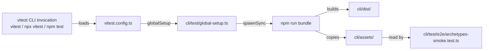
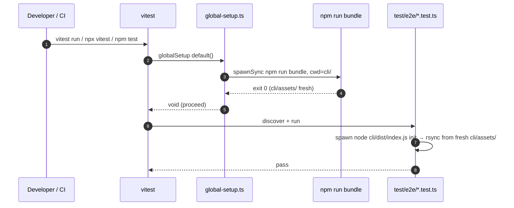

# Design: t5-3-3-vitest-bundle-preflight
<!-- Status: designed -->
<!-- Schema: default -->
<!-- Audit: T5.3.3 (docs/new-archetypes-plan.md §0.6) -->

> Tight design — both ADRs resolved inline (low-stakes).

## Architecture Decisions

### ADR-T533-001 — `spawnSync` for bundle invocation

**Context** : vitest globalSetup signature accepts
`() => void | Promise<void>`. The bundle invocation can use
sync (`spawnSync`) or async (`spawn` + Promise).

**Decision** : **`spawnSync`**.

**Rationale** :
1. Vitest globalSetup runs serially before any test
   parallelism kicks in — there is no concurrency to
   exploit, so the async form gains nothing.
2. Synchronous code is shorter, more obviously correct, and
   doesn't require a `new Promise(...)` wrapper or
   `child_process.exec` with callback shimming.
3. Error propagation is simpler — `spawnSync` returns an
   object with `status`, easy to throw on `status !== 0`.

**Consequences** : ~10 LOC implementation, no async
boilerplate. Vitest waits the full bundle duration before
test discovery — exactly what we want.

**Constitution Compliance** : Article I (TDD) — harness L1
asserts the file contains `spawnSync`. Article III.4 — the
chosen API is documented vitest + Node.js stdlib, not
invented.

### ADR-T533-002 — `forge-ci.yml` compression target

**Context** : adding `t5-3-3.test.sh` as a matrix entry
brings the file from 299 → 302 lines, exceeding NFR-CI-002
(≤ 300).

**Decision** : **compress the `i5.test.sh` 3-line audit
comment block** (currently lines 122-123) into a single
inline comment, mirroring the T5.3.1 pattern that compressed
the `t5-3-1.test.sh` comment to fit.

**Rationale** :
1. The existing `i5.test.sh` comment block (lines 122-123,
   2 lines : `# I.5 reusable compliance workflow harness …`)
   carries the same info that `i5-compliance-workflow`'s
   own design.md and CHANGELOG already document. Trimming
   to 1-line preserves the audit trail without bloat.
2. Consistent with the trim applied to `t5-3-1.test.sh`
   in T5.3.1 (3-line comment → 1-line) — same precedent.

**Consequences** : -1 line on i5 comment + +3 lines on
t5-3-3 entry → net 301 ; one more trim needed. Apply same
1-line compression to `f3.test.sh` block (currently
lines 126-128, 3 lines) → -2 lines → net **299**, safe.

**Constitution Compliance** : N/A — pure CI hygiene.

---

## Component Design

Single new file (`global-setup.ts`), single config wire
(`vitest.config.ts`), single asserted invariant
(cli/assets/ is fresh).

## Data Flow

## Testing Strategy

| Level | Scope                                                       | Tools                                  |
|-------|-------------------------------------------------------------|----------------------------------------|
| L1    | 5 grep assertions on new files + CHANGELOG                  | `t5-3-3.test.sh`                       |
| L2    | None (FR-T533-042 — inverse proof via the existing e2e)     | —                                      |
| Manual| `rm -rf cli/assets/ && npx vitest run` → tests GREEN        | One-shot adopter verification          |

## Standards Applied

| Standard         | How Applied                                               |
|------------------|-----------------------------------------------------------|
| `global/tdd-rules.md` | RED-GREEN — harness lands FIRST, then code              |
| Article VIII (Infrastructure) | Test infra additive ; no service / network touch  |

---

*Next : `/forge:plan t5-3-3-vitest-bundle-preflight`.*
