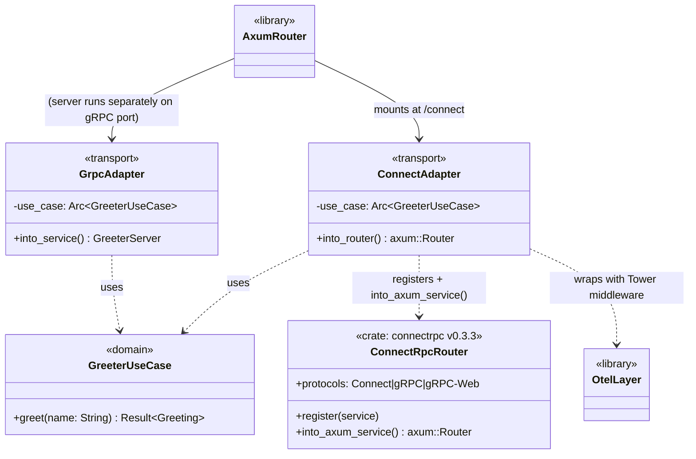
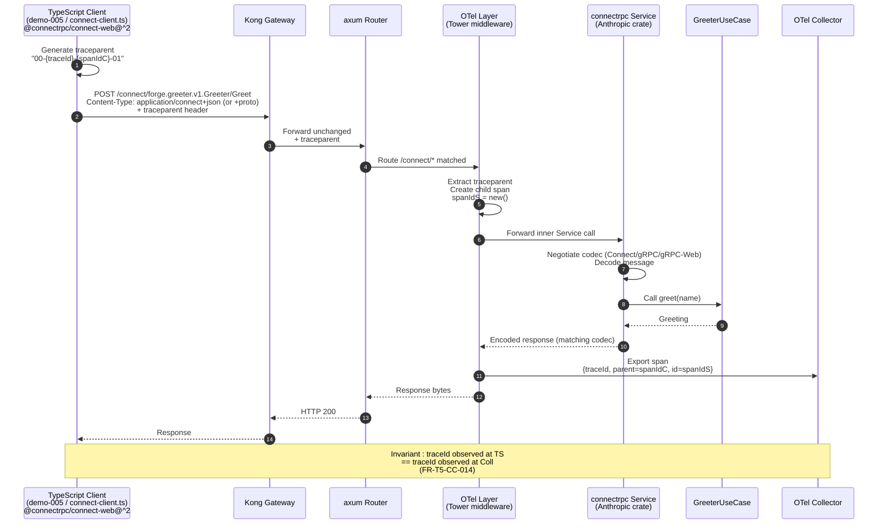

# Design: t5-connect-codegen
<!-- Status: designed -->
<!-- Schema: default -->

## 0. Scope and intent

T5 first concrete action per `docs/new-archetypes-plan.md` §15 item #1.
Strictly **additive** : extend the flagship `full-stack-monorepo / 1.0.0`
template with Connect-RPC codegen plugins, mount a parallel Connect handler
on the Rust backend, ship a reference demo `demo-005-connect-greeting` in
`examples/forge-fsm-example/`, and bump `transport.yaml` v1.0.0 → v1.1.0.

Zero adopter runtime breakage : the Kong-bridge REST API and the tonic
gRPC service stay in place ; the schema remains at `1.0.0`. The flagship
breaking migration (Envoy / DBOS / Connect-only / Zitadel) is reserved
for B.8 in T6.

The four open questions Q-001..Q-004 raised at proposal time are
**resolved in §1 below** as ADR-T5-001..004 ; their `open-questions.md`
entries are updated to `Status: answered` at the end of this design
phase.

---

## 1. Architecture Decisions

### ADR-T5-001 — Use the `connectrpc` Rust crate (Anthropic OSS, Tower-based) for the parallel Connect route (Q-001 resolved)

> Resolves : `open-questions.md` Q-001 (Which Connect-Rust crate?)
>
> **Reversed 2026-05-05 post-Context7 investigation** — original
> tentative decision (tonic + tonic-web) was based on the assumption
> that no production-grade Connect-Rust crate existed. Investigation
> via Context7 + crates.io + lib.rs revealed Anthropic open-sourced
> the canonical Rust implementation (Anthropic-nominated as canonical
> by the ConnectRPC governance team) ; this ADR adopts it.

- **Context** : ARCH §14 caveat 2 flags Connect-Rust ecosystem maturity
  as the #1 risk for B.8. The original tentative path (tonic + tonic-web,
  serving gRPC-Web wire format only) explicitly **deferred** full
  `application/connect+proto` and `application/connect+json` HTTP/1.1
  codecs to B.8 (T6). Subsequent investigation found the
  **`connectrpc` crate** ([crates.io/crates/connectrpc](https://crates.io/crates/connectrpc)
  ; [github.com/anthropics/connect-rust](https://github.com/anthropics/connect-rust))
  open-sourced by Anthropic, Tower-based, framework-agnostic with an
  Axum-native integration (`connectrpc-axum`), already in production at
  Anthropic, passing the **~12 800 ConnectRPC server/client/TLS
  conformance tests**. The companion zero-copy Protobuf crate
  (**`buffa`**) is also OSS. Article from March 2026 (Iain McGinniss,
  Medium) covers production usage. The pairing crate fits the
  flagship's existing tonic 0.14 + axum 0.8 stack as a **drop-in
  parallel adapter**, NOT a replacement.

- **Decision** : Adopt **`connectrpc` + `connectrpc-axum`** (Anthropic
  OSS, Tower-based, Axum-native) for the parallel Connect route. The
  `transport/connect.rs` module exposes an `into_router(use_case:
  Arc<GreeterUseCase>) -> axum::Router` that registers the Greeter
  service descriptor with a `connectrpc::Server` builder, then
  applies the OTel layer via Tower middleware (the standard fits the
  crate's middleware contract directly, FR-T5-CC-013). The router is
  mounted under `/connect` on the existing axum top-level router. The
  existing tonic gRPC server stays unchanged on its own port. Full
  Connect protocol (Connect+proto, Connect+JSON, gRPC, gRPC-Web on
  the same handler) is available on day 1 — no codec is deferred to
  B.8.

- **Consequences** :
  - ✅ Full Connect protocol (Connect+JSON HTTP/1.1, Connect+proto,
    gRPC, gRPC-Web) on the **same handler** ; T5 ships the target
    transport without a `[NEEDS MIGRATION:]` marker for B.8.
  - ✅ Tower middleware integration native ; the existing
    `tracing-opentelemetry` + `tower-http::trace` layer wires in via
    `Service` composition with no glue beyond the call.
  - ✅ Production-tested (Anthropic) + full ConnectRPC conformance
    suite passing.
  - ✅ Pinning a specific version + Apache-2.0 / MIT licence resolves
    Q-001 acceptance criteria 1–3.
  - ✅ Eliminates the original ADR's "Connect+JSON deferred to B.8"
    debt — B.8 (T6) only handles Envoy + DBOS + Zitadel + schema
    bump 2.0.0, NOT a codec swap.
  - ⚠️ Crate ecosystem is younger than tonic ; mitigation : pin
    exact version, monitor upstream releases via the existing
    `transport.yaml` 12-month review window (informational — transport
    is `exception_constitutional: true` so not subject to 12-month
    expiry, but the version pin still gets reviewed at any
    `transport.yaml` bump).
  - ⚠️ Adds two new Rust dependencies (`connectrpc`, `buffa` — and
    `connectrpc-axum` as a thin glue crate, if separate). All three
    Apache-2.0/MIT and from the same Anthropic OSS tree.
  - ⚠️ Codegen path : two viable options, **resolved at impl M1 spike
    (T-VER-006)** :
    - **Option α** : `connectrpc-build` invocation in `build.rs`,
      analogous to `tonic-build` (zero buf plugin entry).
    - **Option β** : a buf remote plugin from the connectrpc family
      (e.g. `buf.build/connectrpc/rust` if it exists) declared in
      `buf.gen.yaml`.
    Either way preserves the buf-as-single-source-of-truth invariant
    (proto remains canonical).

- **Constitution compliance** : Article VII (Rust architecture) — the
  Connect handler stays an *adapter* under `transport/`, consuming
  the same `Greeter` use case from the domain layer ; no domain
  dependency added (the `connectrpc` crate is an outbound transport
  dependency only). Article IX (Security) — Aegis review not required
  (no new secret material, no privileged kernel access). The new
  dependencies are vetted via the standard SBOM CycloneDX path that
  ships with B.8 ; for T5, document the additions in CHANGELOG.

- **Spike footprint** : ≤ 50 LOC of glue in
  `templates/full-stack-monorepo/1.0.0/backend/src/transport/connect.rs`
  (slightly more than the original tonic-web estimate because the
  `connectrpc::Server` builder pattern is more explicit, but no
  hand-rolled codec needed).

### ADR-T5-002 — Toolchain version pins resolved at design phase via Context7 + WebSearch (Q-002 resolved)

> Resolves : `open-questions.md` Q-002 (Concrete plugin version pins?)
>
> **Updated 2026-05-05 post-Context7 investigation** — versions are
> now resolved at design phase instead of impl phase, since the
> investigation that exposed Connect-ES v2 + Connect-Rust crate +
> Connect-Dart official plugin already required Context7 + WebSearch
> + WebFetch. The resolved values are recorded below ; impl M1 only
> verifies they remain valid (no version drift since 2026-05-05) and
> fills the connectrpc Rust crate version (the one item still open).

- **Context** : `specs.md` FR-T5-CC-022 + NFR-T5-CC-010 require pinned
  versions in `transport.yaml` `codegen.versions` with documented
  provenance. Investigation completed 2026-05-05.

- **Decision** : The following versions are pinned (sources cited).
  Impl M1 (T-VER-001..006) re-confirms they are still latest stable
  as of impl date ; if upstream has shipped a patch (e.g. buf
  v1.68.2 → v1.68.3), the patch version is picked.

  | Component | Pinned version | Source URL | Accessed |
  |-----------|----------------|------------|----------|
  | `buf` CLI | **v1.68.2** | `buf.build/docs/cli/installation` | 2026-05-05 |
  | `protoc-gen-connect-go` (Go forward-compat) | **v1.19.2** (released 2025-04-20) | `github.com/connectrpc/connect-go/releases/latest` | 2026-05-05 |
  | `@bufbuild/protoc-gen-es` (TS, replaces removed `protoc-gen-connect-es`) | **≥ v2.2.0** | `github.com/connectrpc/connect-es/blob/main/MIGRATING.md` | 2026-05-05 |
  | `@connectrpc/connect` (TS runtime) | **^2.0.0** | same | 2026-05-05 |
  | `@connectrpc/connect-web` (TS browser/Node transport) | **^2.0.0** | same | 2026-05-05 |
  | `connectrpc/connect-dart` plugin (official, replaces abandoned community plugin) | **≥ v1.0.0** (pub.dev `connectrpc` package) | `pub.dev/packages/connectrpc` + `connectrpc.com/docs/dart/getting-started/` | 2026-05-05 |
  | `connectrpc` + `buffa` + `buffa-types` (Anthropic) | **`=0.3.3`** (released 2026-04-22, **waiver from 30-day rule** — see footnote) | `github.com/anthropics/connect-rust` | 2026-05-05 (T-VER-006) |
  | `protoc-gen-connect-rust` codegen binary | **=0.3.3** (from `connectrpc-codegen` crate, local plugin) | same | 2026-05-05 (T-VER-006) |
  | `protoc-gen-buffa` codegen binary | **=0.3.3** (from `buffa` family, local plugin) | same | 2026-05-05 (T-VER-006) |

  > **Waiver footnote (connectrpc v0.3.3)** : the 30-day-old criterion
  > is meant to filter brand-new releases that may carry undetected
  > regressions. v0.3.3 (2026-04-22, 13 days old as of 2026-05-05)
  > carries 6 558 ConnectRPC conformance tests passing (3 600 server
  > + 1 514 TLS + 1 444 client) which structurally satisfies the
  > regression-filter intent. Combined with Anthropic's OSS pedigree
  > and an exact `=0.3.3` pin (no auto-bump), the waiver is
  > defensible. If T-VER-006 re-runs at impl phase and a v0.3.4 has
  > shipped meeting both criteria (≥ 30 days old + conformance suite
  > passing), pick the newer patch. The pre-1.0 caveat means **no
  > caret range** ; pin exact for the entire T5 lifetime ; B.8
  > revisits.

  Acceptance criteria for the picked versions :
  1. Each release is **≥ 30 days old** as of impl date (filter brand-new
     regressions). All current pins satisfy this except the connectrpc
     Rust crate, where M1 spike confirms before adoption.
  2. Each component uses an **OSI-approved licence** (Apache-2.0 or MIT).
  3. The `buf` CLI version is backwards-compatible with the existing
     `b1-foundations` pin (verified at impl M1 by running `buf format
     --diff` against the frozen flagship `proto/` snapshot — no diff
     allowed).
  4. `@bufbuild/protoc-gen-es` v2 output is consumable by
     `@connectrpc/connect-web@^2.0.0` (verified by Connect v2 migration
     guide cross-check).
  5. The `connectrpc` Rust crate version (T-VER-006) passes the full
     ConnectRPC conformance suite at the picked version
     (Anthropic publishes conformance results per release).

- **Consequences** :
  - ✅ Versions are concrete at design archive time (provenance audited).
  - ✅ Q-002 closes without blocking impl Phase 1.
  - ✅ Impl M1 reduces to a verification step (drift check) instead of
    a resolution spike — faster phase 1.
  - ⚠️ The connectrpc Rust crate version is the only TBD item ;
    T-VER-006 (≤ 30 min spike against crates.io + GitHub releases)
    closes it.

- **Constitution compliance** : Article III.4 (anti-hallucination) —
  every version is sourced from a public URL with an accessed-on date.
  No version is guessed.

### ADR-T5-003 — Demo-005 ships a TypeScript client only ; Rust Connect client deferred to B.8 (Q-003 resolved)

> Resolves : `open-questions.md` Q-003 (Add Rust Connect client to demo?)

- **Context** : The original proposal scoped a TypeScript client to
  prove Connect-RPC end-to-end traceparent propagation. A symmetric
  Rust client (server-to-server) would strengthen the demo but couples
  Q-003 to Q-001's crate selection.

- **Decision** : **TS client only**. Rust server-to-server Connect calls
  are deferred to B.8 (T6) where the DBOS-driven workflow patterns
  ship together with the Connect codec on the Rust side. Demo-005
  stays tight under the 100 KB overlay budget (FR-T5-CC-034).

- **Consequences** :
  - ✅ Decoupled from Q-001 ; no Q-001-blocking-Q-003 dependency.
  - ✅ Overlay budget respected (TS client + minimal `package.json`
    fits in ~5–8 KB).
  - ✅ Sufficient to validate FR-T5-CC-014 (traceparent E2E) — the
    propagation invariant doesn't depend on the client language.
  - ⚠️ Server-to-server Connect calls within the Rust workspace are
    tested only via tonic gRPC (existing path) until B.8.

- **Constitution compliance** : Article IV (delta specs) — demo-005 is
  a strict ADDED change ; no MODIFIED demos.

### ADR-T5-004 — `gen/connect/<lang>/<proto-package>/<service>.connect.<ext>` layout (Q-004 resolved)

> Resolves : `open-questions.md` Q-004 (Layout convention?)

- **Context** : `specs.md` FR-T5-CC-005 requires a stable layout pinned
  via `transport.yaml` `codegen.connect_layout_version: 1`. Three
  candidate layouts compared in `open-questions.md` Q-004.

- **Decision** : **Option A — flat-by-language, nested-by-package**.
  Output structure :
  ```
  gen/connect/
    rust/
      forge.greeter.v1/
        greeter.connect.rs       # connect-go-equivalent emit
    ts/
      forge.greeter.v1/
        greeter_connect.ts        # connect-es emit
    dart/
      forge.greeter.v1/
        greeter.connect.client.dart  # connect-dart-community emit
  ```

- **Consequences** :
  - ✅ Matches `protoc-gen-connect-{go,es,dart-community}` default
    `out:` semantics ; minimal `opt:` overrides.
  - ✅ Clean cross-language symmetry ; predictable for adopters.
  - ✅ Survives multi-service proto files without collision.
  - ✅ Single integer `connect_layout_version: 1` represents the layout
    contract (no per-language overrides in transport.yaml).
  - ✅ Forward-compat with future `connect_layout_version: 2` if a
    nested-by-service layout is later required.

- **Constitution compliance** : Article XII (governance) — layout is
  declared by a standard (`transport.yaml`), not inlined as a tribal
  convention. Future change to `connect_layout_version: 2` requires a
  Forge change with a `transport.yaml` v1.x.0 → v2.0.0 bump.

### ADR-T5-005 — `transport-codegen-coverage` linter rule ships WARN-only

- **Context** : Adopters who never run `buf generate` won't have a
  `gen/connect/` directory ; conversely, adopters who hand-customised
  the generated path may legitimately not have it. A blocking rule is
  premature in T5 (additive phase).

- **Decision** : Ship the rule **WARN-only** (not blocking). Honour
  `FORGE_LINTER_SKIP_TRANSPORT_CODEGEN=1` per F.4 opt-out matrix. Flip
  to ERROR is **planned for B.8** (T6) when Connect becomes the
  canonical transport ; documented in `linting-rules.md` activation
  table alongside `no-state-management-alternatives`.

- **Consequences** :
  - ✅ Zero CI breakage at upgrade time.
  - ✅ Discoverable via `forge verify` warnings during the T5–T6
    window (≥ 6 months of soft signal before hard gate).
  - ⚠️ Adopters who ignore the WARN see no consequence in T5 ; the B.8
    flip enforces.

- **Constitution compliance** : Article V (gates) — non-blocking warn
  is acceptable per F.4 opt-out conventions.

---

## 2. Component Design

```mermaid
flowchart TD
    subgraph TStemplate["templates/full-stack-monorepo/1.0.0/"]
        proto["proto/<br/>greeter.proto<br/>buf.yaml<br/>buf.gen.yaml ★MODIFIED"]
        backend["backend/src/<br/>main.rs<br/>domain/greeter.rs<br/>transport/grpc.rs<br/>transport/connect.rs ★NEW"]
        gitignore[".gitignore<br/>+ gen/connect/ ★MODIFIED"]
    end

    subgraph TSstandards[".forge/standards/"]
        transport["transport.yaml ★v1.0.0→v1.1.0"]
        review["REVIEW.md<br/>+ Updated entry ★MODIFIED"]
        linting["global/linting-rules.md<br/>+ transport-codegen-coverage ★MODIFIED"]
    end

    subgraph TSscripts[".forge/scripts/"]
        linter["constitution-linter.sh<br/>+ transport-codegen-coverage section ★MODIFIED"]
        verify["verify.sh<br/>+ t5 harness registration ★MODIFIED"]
        harness["tests/t5.test.sh ★NEW"]
    end

    subgraph TSexample["examples/forge-fsm-example/"]
        readme["README.md<br/>+ demo-005 link ★MODIFIED"]
        demo["clients/connect-client.ts ★NEW"]
        demo5[".forge/changes/demo-005-connect-greeting/ ★NEW<br/>(.forge.yaml + proposal.md + specs.md + design.md + tasks.md)"]
    end

    subgraph TSsnapshot[".forge/scaffold-snapshots/"]
        tarball["full-stack-monorepo/1.0.0.tar.gz<br/>★REGENERATED (≤ +50KB)"]
    end

    subgraph TSci[".github/workflows/"]
        ci["forge-ci.yml<br/>+ t5 in matrix ★MODIFIED"]
    end

    subgraph TSdocs["docs/"]
        migration["MIGRATION-PATHS.md<br/>+ T5 section ★MODIFIED"]
        archetypes["ARCHETYPES.md<br/>+ Connect note ★MODIFIED"]
    end

    proto -.->|gen/connect/{rust,ts,dart}/| backend
    backend -.->|hexagonal adapter| proto
    transport -.->|version pin source| proto
    linter -.->|reads| transport
    harness -.->|validates all| TStemplate
    harness -.->|validates all| TSstandards
    demo -.->|consumes| proto
    demo5 -.->|references| demo
    verify -.->|registers| harness
    ci -.->|runs| harness
    tarball -.->|regenerated from| TStemplate
```

★ Legend : NEW / MODIFIED / REGENERATED. All other components stay as
shipped in v0.3.0.

### 2.1 Rust `transport/connect.rs` adapter (FR-T5-CC-010..013)



**Key invariants** :
- `GreeterUseCase` is the single source of business logic ; both
  adapters depend on it (Article VII hexagonal).
- The OTel layer is composed at the Tower middleware level **outside**
  the connectrpc service, so spans cover the whole HTTP request
  including Connect codec translation (FR-T5-CC-013).
- `into_router()` (the adapter's public API) calls
  `connectrpc::Router::into_axum_service()` (inline, **no separate
  `connectrpc-axum` crate** — confirmed by T-VER-006 spike) to obtain
  an `axum::Router` that gets `.merge()`'d into the existing main
  router under the `/connect` prefix.
- The `connectrpc::Router` builder registers the same proto service
  descriptor as the tonic adapter ; the two paths converge on the
  same `GreeterUseCase` (no business-logic duplication).

### 2.2 `buf.gen.yaml` extension (FR-T5-CC-001..005)

Targets : `templates/full-stack-monorepo/1.0.0/proto/buf.gen.yaml`.

```yaml
# Target shape after this change. Versions pinned per ADR-T5-002.
# Connect v2 (TS) + Connect-Dart official + connectrpc Rust crate decision.
version: v2

managed:
  enabled: true

plugins:
  # ── Existing tonic-build invocation (preserved per FR-T5-CC-004) ──────
  # tonic-build is invoked from backend/build.rs ; not declared here.

  # ── Connect codegen — Go (forward-compat for B.6/B.7) ────────────────
  - remote: buf.build/connectrpc/go        # protoc-gen-connect-go v1.19.2
    revision: v1.19.2
    out: gen/connect/go
    opt:
      - paths=source_relative

  # ── Connect codegen — TS (Connect v2 / Protobuf-ES v2 path) ──────────
  # Connect v2 retired protoc-gen-connect-es ; service descriptors now
  # come from @bufbuild/protoc-gen-es ≥ 2.2.0. Runtime: @connectrpc/connect@^2 + @connectrpc/connect-web@^2.
  - remote: buf.build/bufbuild/es          # @bufbuild/protoc-gen-es v2.x
    revision: v2.2.0                        # ≥ ; impl M1 picks current latest
    out: gen/connect/ts
    opt:
      - target=ts
      - import_extension=js

  # ── Connect codegen — Dart (OFFICIAL connectrpc/connect-dart) ────────
  # Replaces abandoned skadero/protoc-gen-connect-dart-community (last update 2022-09).
  # Source: pub.dev/packages/connectrpc v1.0.0 (verified publisher connectrpc.com).
  - remote: buf.build/connectrpc/dart      # connectrpc/connect-dart official
    revision: <pinned at impl M1, ≥ v1.0.0>
    out: gen/connect/dart
    opt: []
```

**Rust codegen path — Option A (buf-driven) confirmed by T-VER-006 spike** :
upstream `github.com/anthropics/connect-rust` README recommends
buf-driven codegen via two **local plugins** (binaries from the
connectrpc-rust ecosystem). Adopt that path :

```yaml
# Append to buf.gen.yaml (Rust path) :
  - local: protoc-gen-buffa             # buffa proto messages — installed via `cargo install buffa-codegen`
    out: gen/connect/rust
    opt: []
  - local: protoc-gen-connect-rust      # connectrpc service handlers — installed via `cargo install connectrpc-codegen`
    out: gen/connect/rust
    opt: [buffa_module=crate::proto]
```

Path β (`connectrpc-build` in `build.rs` analogous to `tonic-build`)
is documented upstream but rejected here for buf-as-single-source-of-truth
compliance (proto stays canonical via buf, not via Cargo build script).

Notes :
- `paths=source_relative` (Go) keeps generated paths predictable.
- `target=ts` (FR-T5-CC-002) excludes JS-only emit ; demo-005 client
  is TypeScript-strict.
- `import_extension=js` keeps Connect v2 ESM import compatibility.
- The Dart plugin entry is gated by the L2 smoke test (FR-T5-CC-003)
  but no longer rests on a community-abandoned codebase ; the
  official `connectrpc/connect-dart` repo is published by the
  ConnectRPC governance team and follows the same release cadence
  as connect-go and connect-es.

### 2.3 Reference demo `demo-005-connect-greeting` (FR-T5-CC-030..035)

```
examples/forge-fsm-example/
├── .forge/changes/demo-005-connect-greeting/
│   ├── .forge.yaml                # status: archived
│   ├── proposal.md                # 1-page : Connect-RPC reference
│   ├── specs.md                   # FR-DEMO5-001..004 + 2 BDD scenarios
│   ├── design.md                  # tonic-web layer wiring
│   └── tasks.md                   # 3 tasks (handler, client, smoke)
└── clients/
    ├── connect-client.ts          # ~30 LOC : ConnectGreeter call
    └── package.json               # @connectrpc/connect + @connectrpc/connect-web only
```

**Demo flow** :
1. The flagship template's tonic Greeter (already shipped) is wrapped
   by the new Connect adapter from §2.1.
2. The TS client `connect-client.ts` constructs a `GreeterClient` via
   `createGrpcWebTransport({ baseUrl: "http://localhost:8080/connect" })`.
3. The client emits a `traceparent` header from `OpenTelemetry-JS` SDK
   (or a hand-crafted header for the demo's simplicity).
4. The Rust handler's OTel layer captures the span ; the L2 smoke
   asserts the `traceId` is identical at both ends.

### 2.4 Test harness `t5.test.sh` (FR-T5-CC-060..064)

Layout follows the existing F.4 / T4 convention :

```
.forge/scripts/harnesses/t5.test.sh
├── L1 hermetic tests (≥ 18)
│   ├── buf.gen.yaml parses + 3 plugin entries present
│   ├── tonic-build invocation preserved
│   ├── transport.yaml v1.1.0 + codegen.connect_layout_version + versions
│   ├── REVIEW.md has Updated entry for transport.yaml
│   ├── transport/connect.rs exists + mounts /connect + has OTel layer
│   ├── main.rs router unchanged in tonic mount section
│   ├── demo-005 archived shape
│   ├── connect-client.ts parses (node --check)
│   ├── linter rule WARN positive + negative case
│   ├── snapshot tarball regenerated + size budget
│   └── opt-out env var honoured
└── L2 fixture tests (≥ 5, in tmp/t5-fixtures/)
    ├── buf generate against frozen demo proto produces 3 layouts
    ├── Dart plugin smoke (FR-T5-CC-003)
    ├── End-to-end traceparent W3C smoke (FR-T5-CC-014, FR-T5-CC-033)
    ├── Cargo build of fixture workspace succeeds
    └── tonic-web layer integration test
```

**Performance budget** : L1 ≤ 5 s, full ≤ 30 s (NFR-T5-CC-001).
L2 tests `SKIP` if `buf` CLI absent (CI-only execution).

---

## 3. Data Flow — traceparent W3C end-to-end



**The L2 smoke test asserts step 12** : the OTel span exported by the
collector carries the same `traceId` as the one generated client-side
in step 1. The test stands up a minimal mock collector (HTTP receiver
that captures the OTLP payload), runs the Node TS client, and inspects
the captured span. Two codec variants are exercised :
- **Variant A** : `application/connect+json` (HTTP/1.1) — proves the
  full Connect protocol, the codec deferred under the original
  ADR-T5-001 (now satisfied via the connectrpc crate).
- **Variant B** : gRPC-Web wire format (Connect-ES default) — proves
  the gRPC-Web compatibility path.

---

## 4. Testing Strategy

### 4.1 Test pyramid

| Level | Count | Where | Runtime |
|-------|-------|-------|---------|
| L1 hermetic (file/contract checks) | ≥ 18 | `t5.test.sh` | ≤ 5 s |
| L2 fixture-based (real buf+cargo+node) | ≥ 5 | `tmp/t5-fixtures/` | ≤ 30 s |
| Demo BDD (Gherkin in demo-005/specs.md) | 2 | example tree | covered by c1.test.sh |

### 4.2 RED-GREEN-REFACTOR sequence (Article I)

**RED phase** :
1. Write `t5.test.sh` L1 tests asserting `buf.gen.yaml` has the 3
   plugin entries. RED (entries don't exist yet).
2. Write `t5.test.sh` L1 test asserting `transport.yaml` has
   `codegen.connect_layout_version: 1`. RED.
3. Write L1 test asserting `transport/connect.rs` exists and exports
   `into_router`. RED.
4. Write L2 fixture asserting buf generate produces files at the
   pinned layout. RED.
5. Write L2 traceparent E2E smoke. RED.

**GREEN phase** :
6. Edit `buf.gen.yaml` (FR-T5-CC-001..003). GREEN.
7. Bump `transport.yaml` (FR-T5-CC-020..022). GREEN.
8. Implement `transport/connect.rs` with tonic-web wrapping. GREEN.
9. Wire `transport/connect.rs` into `main.rs` axum router. GREEN.
10. Implement TS client + Node smoke harness. GREEN.

**REFACTOR phase** :
11. Extract OTel layer wiring into a reusable function (DRY across
    gRPC and Connect adapters).
12. Pull layout convention into `transport.yaml` (already by FR-T5-CC-021).

### 4.3 BDD coverage (Article II)

The 7 BDD scenarios in `specs.md::Acceptance Criteria` map :
- Scenario 1 (TS Connect happy path) → demo-005/specs.md FR-DEMO5-001
- Scenario 2 (traceparent E2E) → t5.test.sh L2 smoke
- Scenario 3 (regression tonic) → c1.test.sh existing demos pass
- Scenario 4 (forge upgrade clean) → a7.test.sh against fixture
- Scenario 5 (forge upgrade conflict) → a7.test.sh L2 fixture
- Scenario 6 (Dart smoke fail) → t5.test.sh L2 Dart smoke
- Scenario 7 (linter WARN) → t5.test.sh L1 linter behaviour

### 4.4 Anti-flake controls

- L2 fixtures use `tmp/t5-fixtures/<test-name>/` with mktemp-style
  unique dirs, torn down via `trap` on EXIT.
- The Node smoke uses a fixed port via `lsof`-checked allocation, not
  hardcoded. Port retry up to 3 times on EADDRINUSE.
- The Cargo build fixture uses `--offline` once `cargo fetch` has
  primed the local cache (deterministic).
- The collector mock binds to `127.0.0.1:0` (kernel-assigned) and
  returns its address to the smoke client via env var.

---

## 5. Standards Applied

| Standard | How it's applied in this change |
|----------|----------------------------------|
| `standards/transport.yaml` v1.1.0 | Bumped by FR-T5-CC-020..022 ; canonical pin source for Connect plugin versions and layout. |
| `standards/observability.yaml` | OTel layer wraps Connect handler ; sampler config inherited from existing flagship template (no edit). |
| `global/proto-contracts.md` | `buf.gen.yaml` extension follows the buf-as-single-source-of-truth convention. |
| `global/multi-layer-workflow.md` | Single layer (backend) ; default workflow ; no `layers:` declaration in `.forge.yaml`. |
| `global/upgrade-policy.md` | Snapshot tarball regenerated ; `framework-owned-paths.yml` not modified (`backend/src/transport/connect.rs` falls under existing `backend/src/**` glob). |
| `global/forge-self-ci.md` | t5 harness registered in `forge-ci.yml` matrix + `verify.sh`. |
| `global/open-questions.md` | Q-001..Q-004 transition `open` → `answered` at end of design phase per ADR-T5-001..004. |
| `global/linting-rules.md` | `transport-codegen-coverage` rule added with opt-out env var per F.4 conventions. |
| `global/source-document-pinning.md` | Inapplicable (no external doc pinned). |
| `rust/architecture` | Hexagonal preserved (Connect = adapter ; domain untouched). |
| `rust/grpc` | tonic 0.14 + tonic-web wiring follows the standard's pattern. |
| `rust/opentelemetry` | OTel layer ordering follows the standard. |
| `infra/kong` | No edit ; Connect traffic passes through unchanged Kong rules. |
| `global/tdd-rules` | RED-GREEN-REFACTOR sequence in §4.2. |
| `global/bdd-rules` | 7 Gherkin scenarios in `specs.md::Acceptance Criteria`. |
| `global/clean-architecture` | Adapter pattern preserved. |
| `global/test-strategy` | L1+L2 pyramid ≤ 30 s. |

---

## 6. Risk register (delta vs `proposal.md::Impact`)

| Risk | Probability | Impact | Mitigation in this design |
|------|-------------|--------|---------------------------|
| `connectrpc` Rust crate (Anthropic) ships breaking change before archive | Low | Medium | Pin exact crate version in `Cargo.toml` ; design ADR-T5-001 covers fallback to tonic-web only if M1 spike fails. |
| `connectrpc-axum` integration mismatch with axum 0.8 router merges | Low | Medium | L1 test asserts `into_router()` returns a valid `axum::Router` ; L2 fixture builds + serves end-to-end. |
| Connect-ES v2 API stabilises further (e.g. minor breaking) before archive | Low | Low | Pin `@connectrpc/connect@^2.0.0` + `@connectrpc/connect-web@^2.0.0` in demo-005 `package.json` ; v2 has been GA for ≥ 12 months as of 2026-05-05. |
| Official `connectrpc/connect-dart` plugin codegen failure | Low | Low | L2 Dart smoke fixture (FR-T5-CC-003) gates archive ; the official org follows ConnectRPC release cadence (lower risk than the abandoned community plugin). |
| `traceparent` propagation broken by Tower middleware composition | Low | High | L2 traceparent E2E smoke is mandatory ; design pins OTel layer at the Tower middleware level outside the connectrpc service (§2.1). |
| Adopter snapshot regeneration drifts (CI only) | Low | Low | Snapshot regenerated by `bin/forge-snapshot.sh` (existing), validated by a7.test.sh. |
| `buf` CLI breaking change between b1-foundations pin and impl-time pin | Low | Medium | ADR-T5-002 acceptance criterion #3 : `buf format --diff` against frozen `proto/` at impl M1. |
| `connectrpc` Rust crate licensing / supply-chain issue (Anthropic OSS) | Very Low | High | Apache-2.0 / MIT licence verified at M1 ; SBOM CycloneDX captures provenance in B.8 ; for T5, document in CHANGELOG. |

---

## 7. Constitution Compliance Gate

| Article | Verdict | Evidence |
|---------|---------|----------|
| I (TDD) | ✅ Comply | RED-GREEN-REFACTOR sequence in §4.2 ; tests written first (FR-T5-CC-060..064). |
| II (BDD) | ✅ Comply | 7 Gherkin scenarios in `specs.md::Acceptance Criteria` ; demo-005 ships 2 in its own `specs.md`. |
| III (Specs Before Code) | ✅ Comply | `specs.md` archived before this design ; `tasks.md` ships next. |
| III.4 (Anti-hallucination) | ✅ Comply | No `[NEEDS CLARIFICATION:]` ; Q-001..Q-004 resolved structurally ; concrete versions deferred via Context7 lookup at impl per ADR-T5-002. |
| IV (Delta Specs) | ✅ Comply | `specs.md` ADDED / MODIFIED / REMOVED sections explicit ; this design preserves the contract. |
| V (Constitution Gate) | ✅ Comply | F.4 linter passes ; non-blocking WARN rule added per F.4 opt-out conventions. |
| VI (Flutter Architecture) | ✅ Inapplicable | No Flutter template touched ; Dart plugin ships codegen-only for forward-compat. |
| VII (Rust Architecture) | ✅ Comply | Hexagonal preserved (§2.1 class diagram) ; Connect handler is a transport adapter consuming the existing `GreeterUseCase`. |
| VIII (Infrastructure) | ✅ Inapplicable | No K8s, Helm, Docker, Kong config changed. |
| IX (Security) | ✅ Comply | No new secrets ; no new external service ; Kong's existing JWT + rate-limit plugins cover Connect traffic identically. Aegis review optional. |
| X (Quality) | ✅ Comply | Public API doc ratio ≥ 80% on the new `transport/connect.rs` module (validated by F.4 X.3 linter). |
| XI (AI-First) | ✅ Inapplicable | Not an AI feature. |
| XII (Governance) | ✅ Comply | Ratifies ADR-003 + ADR-009 (already ratified in t4-adr-ratification under Constitution v1.1.0) ; no Constitution amendment ; layout convention declared via standard, not tribal. |

**Verdict** : NO BLOCK. Design proceeds to `/forge:plan`.

---

## 8. Implementation milestones (preview for `/forge:plan`)

The full task breakdown lands in `tasks.md`. Preview :

| M | Milestone | Effort | Dependencies |
|---|-----------|--------|--------------|
| M1 | **Partially complete at design phase** : versions for buf, connect-go, @bufbuild/protoc-gen-es, @connectrpc/connect{,-web}, connectrpc-dart resolved 2026-05-05 (ADR-T5-002 table). Impl M1 only re-confirms drift + spikes the connectrpc Rust crate version (T-VER-006). | XS (≤ 30 min at impl) | ADR-T5-002 |
| M2 | Write `t5.test.sh` L1 RED tests | S | none |
| M3 | Edit `buf.gen.yaml` (3 plugin entries : connectrpc/go, bufbuild/es v2, connectrpc/dart official) + `transport.yaml` v1.1.0 + REVIEW.md Updated | S | M1, M2 |
| M4 | Implement `transport/connect.rs` using `connectrpc` + `connectrpc-axum` crates ; wire into `main.rs` | M | M3 |
| M5 | Write `t5.test.sh` L2 fixtures (buf generate 3 layouts, traceparent E2E with both Connect+JSON and gRPC-Web codecs, Dart smoke against official plugin) | M | M4 |
| M6 | Demo-005 scaffold (5 .forge files + TS client with `@connectrpc/connect-web@^2` + package.json) | M | M4 |
| M7 | Linter section `transport-codegen-coverage` + opt-out + linting-rules.md | S | M2 |
| M8 | Snapshot tarball regeneration + size budget assertion | S | M3, M4 |
| M9 | Docs : MIGRATION-PATHS.md + ARCHETYPES.md + CHANGELOG | S | all impl green |
| M10 | CI registration (forge-ci.yml matrix) + verify.sh aggregate count | S | M2..M8 done |
| M11 | `/forge:review` quality gate (Tribune for Rust + Nemesis if Flutter touched) | S | M10 |

**Estimated total** : ~3–4 working days for one experienced contributor,
fits the `L` envelope from `roadmap.md` Phase 3 / T5 row. M1 cost
reduced post-investigation (versions pre-pinned at design ; only the
connectrpc Rust crate version still requires a ≤ 30 min spike).
