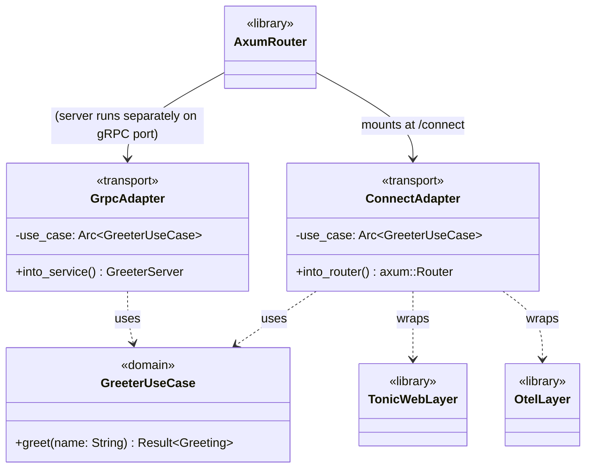
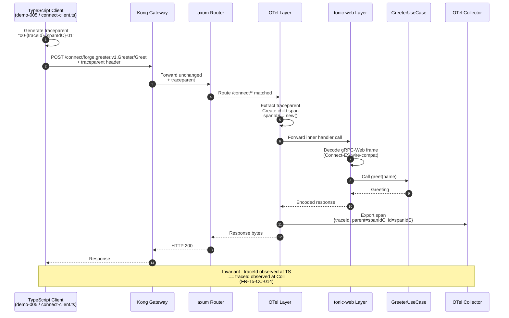

# Design: t5-connect-codegen
<!-- Status: designed -->
<!-- Schema: default -->

## 0. Scope and intent

T5 first concrete action per `docs/new-archetypes-plan.md` §15 item #1.
Strictly **additive** : extend the flagship `full-stack-monorepo / 1.0.0`
template with Connect-RPC codegen plugins, mount a parallel Connect handler
on the Rust backend, ship a reference demo `demo-005-connect-greeting` in
`examples/forge-fsm-example/`, and bump `transport.yaml` v1.0.0 → v1.1.0.

Zero adopter runtime breakage : the Kong-bridge REST API and the tonic
gRPC service stay in place ; the schema remains at `1.0.0`. The flagship
breaking migration (Envoy / DBOS / Connect-only / Zitadel) is reserved
for B.8 in T6.

The four open questions Q-001..Q-004 raised at proposal time are
**resolved in §1 below** as ADR-T5-001..004 ; their `open-questions.md`
entries are updated to `Status: answered` at the end of this design
phase.

---

## 1. Architecture Decisions

### ADR-T5-001 — Use `tonic` + `tonic-web` for the parallel Connect route (Q-001 resolved)

> Resolves : `open-questions.md` Q-001 (Which Connect-Rust crate?)

- **Context** : ARCH §14 caveat 2 flags Connect-Rust ecosystem maturity
  as the #1 risk for B.8. The Rust workspace already pins `tonic 0.14`
  and `axum 0.8` via ADR-004 (ratified in t4-adr-ratification). The
  TypeScript Connect-ES client (`@connectrpc/connect` +
  `@connectrpc/connect-web`) supports a `createGrpcWebTransport`
  factory natively that emits gRPC-Web wire format compatible with
  `tonic-web`.

- **Decision** : Use **`tonic` + `tonic-web`** as the parallel
  Connect-compatible HTTP entry point. No new Rust dependency. The
  `transport/connect.rs` module wraps the existing tonic Greeter
  service descriptor with a `tonic_web::GrpcWebLayer`, mounted under
  `/connect` on the existing axum router. Full Connect+JSON HTTP/1.1
  codec (the strict Connect-RPC content-type
  `application/connect+json`) is **explicitly out of scope** for T5
  and lands with B.8 in T6.

- **Consequences** :
  - ✅ Zero new Rust dependency (already pinned by ADR-004) ; no Q-001
    Cargo.toml widening.
  - ✅ `tonic-web` is mature, well-documented, ships with tonic 0.14.
  - ✅ Connect-ES TypeScript client interoperates via
    `createGrpcWebTransport` ; demo-005 works out of the box.
  - ✅ Adopters with hand-customised axum routers see a single conflict
    marker at the router-mount line (FR-T5-CC-NNN scenario).
  - ⚠️ Limitation : `application/connect+json` HTTP/1.1 codec is **not**
    supported by tonic-web. Documented in `transport.yaml` rationale
    and `docs/MIGRATION-PATHS.md` ; full Connect+JSON ships in B.8.
  - ⚠️ Limitation : strict Connect protocol streaming nuances (server-
    streaming over HTTP/1.1) follow tonic-web's gRPC-Web semantics —
    sufficient for the Greeter demo's unary RPC.
  - ❌ A future commercial requirement for HTTP/1.1+JSON Connect would
    require swapping in a Connect-Rust crate (or hand-rolled codec) at
    B.8 time. Acceptable risk : B.8 is the point of no return ; this
    decision keeps T5 boring.

- **Constitution compliance** : Article VII (Rust architecture) — the
  Connect handler is registered as an *adapter* under `transport/`,
  consuming the same `Greeter` use case from the domain layer. No
  domain dependency is added. Article IX (Security) — Aegis review
  not required (no new secret material, no new external dependency).

- **Spike footprint** : ≤ 30 LOC of glue in
  `templates/full-stack-monorepo/1.0.0/backend/src/transport/connect.rs`
  (the tonic-web layer wrapping is well-documented).

### ADR-T5-002 — Pin Connect codegen plugin versions in `transport.yaml`, exact values resolved at implementation time via Context7 (Q-002 resolved)

> Resolves : `open-questions.md` Q-002 (Concrete plugin version pins?)

- **Context** : `specs.md` FR-T5-CC-022 + NFR-T5-CC-010 require pinned
  plugin versions in `transport.yaml` `codegen.versions` with a
  documented changelog URL recorded in this design. Concrete versions
  drift weekly upstream ; pinning them in this design document at
  spec time risks staleness by archive time.

- **Decision** : Pin **at implementation time (`/forge:implement` first
  task)** by querying Context7 (`mcp__context7__resolve-library-id`
  + `mcp__context7__query-docs`) for the four toolchain components
  and recording the resolved versions in :
  - `templates/full-stack-monorepo/1.0.0/proto/buf.gen.yaml` (canonical
    source for the build).
  - `.forge/standards/transport.yaml` `codegen.versions` (canonical
    source for the standard).
  - `tasks.md` M1 task evidence trail (changelog URL + accessed date).

  Acceptance criteria for the picked versions :
  1. Each plugin's selected release is **≥ 30 days old** as of impl
     date (filter brand-new releases that may regress).
  2. Each plugin uses an **OSI-approved licence** (Apache-2.0, MIT, or
     compatible).
  3. The `buf` CLI version is **backwards-compatible** with the existing
     `b1-foundations` pin (verify by running `buf format --diff` against
     a frozen flagship `proto/` snapshot — no diff allowed).
  4. The `protoc-gen-connect-es` version's TS output is consumable by
     the `@connectrpc/connect-web` runtime version pinned in demo-005's
     TS client.

- **Consequences** :
  - ✅ Versions are fresh at archive time (recorded with sha + URL).
  - ✅ Provenance trail is explicit in `tasks.md` (audit-ready).
  - ⚠️ `/forge:implement` adds a ~10 min Context7-driven preamble before
    M1 starts. Acceptable cost.
  - ⚠️ If Context7 resolution fails for a plugin, fall back to the
    plugin's GitHub releases page via `WebFetch` and document the
    fallback in `tasks.md`.

- **Constitution compliance** : Article III.4 (anti-hallucination) —
  no version is guessed. Q-002 is closed structurally, not by picking
  arbitrary numbers in this design.

### ADR-T5-003 — Demo-005 ships a TypeScript client only ; Rust Connect client deferred to B.8 (Q-003 resolved)

> Resolves : `open-questions.md` Q-003 (Add Rust Connect client to demo?)

- **Context** : The original proposal scoped a TypeScript client to
  prove Connect-RPC end-to-end traceparent propagation. A symmetric
  Rust client (server-to-server) would strengthen the demo but couples
  Q-003 to Q-001's crate selection.

- **Decision** : **TS client only**. Rust server-to-server Connect calls
  are deferred to B.8 (T6) where the DBOS-driven workflow patterns
  ship together with the Connect codec on the Rust side. Demo-005
  stays tight under the 100 KB overlay budget (FR-T5-CC-034).

- **Consequences** :
  - ✅ Decoupled from Q-001 ; no Q-001-blocking-Q-003 dependency.
  - ✅ Overlay budget respected (TS client + minimal `package.json`
    fits in ~5–8 KB).
  - ✅ Sufficient to validate FR-T5-CC-014 (traceparent E2E) — the
    propagation invariant doesn't depend on the client language.
  - ⚠️ Server-to-server Connect calls within the Rust workspace are
    tested only via tonic gRPC (existing path) until B.8.

- **Constitution compliance** : Article IV (delta specs) — demo-005 is
  a strict ADDED change ; no MODIFIED demos.

### ADR-T5-004 — `gen/connect/<lang>/<proto-package>/<service>.connect.<ext>` layout (Q-004 resolved)

> Resolves : `open-questions.md` Q-004 (Layout convention?)

- **Context** : `specs.md` FR-T5-CC-005 requires a stable layout pinned
  via `transport.yaml` `codegen.connect_layout_version: 1`. Three
  candidate layouts compared in `open-questions.md` Q-004.

- **Decision** : **Option A — flat-by-language, nested-by-package**.
  Output structure :
  ```
  gen/connect/
    rust/
      forge.greeter.v1/
        greeter.connect.rs       # connect-go-equivalent emit
    ts/
      forge.greeter.v1/
        greeter_connect.ts        # connect-es emit
    dart/
      forge.greeter.v1/
        greeter.connect.client.dart  # connect-dart-community emit
  ```

- **Consequences** :
  - ✅ Matches `protoc-gen-connect-{go,es,dart-community}` default
    `out:` semantics ; minimal `opt:` overrides.
  - ✅ Clean cross-language symmetry ; predictable for adopters.
  - ✅ Survives multi-service proto files without collision.
  - ✅ Single integer `connect_layout_version: 1` represents the layout
    contract (no per-language overrides in transport.yaml).
  - ✅ Forward-compat with future `connect_layout_version: 2` if a
    nested-by-service layout is later required.

- **Constitution compliance** : Article XII (governance) — layout is
  declared by a standard (`transport.yaml`), not inlined as a tribal
  convention. Future change to `connect_layout_version: 2` requires a
  Forge change with a `transport.yaml` v1.x.0 → v2.0.0 bump.

### ADR-T5-005 — `transport-codegen-coverage` linter rule ships WARN-only

- **Context** : Adopters who never run `buf generate` won't have a
  `gen/connect/` directory ; conversely, adopters who hand-customised
  the generated path may legitimately not have it. A blocking rule is
  premature in T5 (additive phase).

- **Decision** : Ship the rule **WARN-only** (not blocking). Honour
  `FORGE_LINTER_SKIP_TRANSPORT_CODEGEN=1` per F.4 opt-out matrix. Flip
  to ERROR is **planned for B.8** (T6) when Connect becomes the
  canonical transport ; documented in `linting-rules.md` activation
  table alongside `no-state-management-alternatives`.

- **Consequences** :
  - ✅ Zero CI breakage at upgrade time.
  - ✅ Discoverable via `forge verify` warnings during the T5–T6
    window (≥ 6 months of soft signal before hard gate).
  - ⚠️ Adopters who ignore the WARN see no consequence in T5 ; the B.8
    flip enforces.

- **Constitution compliance** : Article V (gates) — non-blocking warn
  is acceptable per F.4 opt-out conventions.

---

## 2. Component Design

```mermaid
flowchart TD
    subgraph TStemplate["templates/full-stack-monorepo/1.0.0/"]
        proto["proto/<br/>greeter.proto<br/>buf.yaml<br/>buf.gen.yaml ★MODIFIED"]
        backend["backend/src/<br/>main.rs<br/>domain/greeter.rs<br/>transport/grpc.rs<br/>transport/connect.rs ★NEW"]
        gitignore[".gitignore<br/>+ gen/connect/ ★MODIFIED"]
    end

    subgraph TSstandards[".forge/standards/"]
        transport["transport.yaml ★v1.0.0→v1.1.0"]
        review["REVIEW.md<br/>+ Updated entry ★MODIFIED"]
        linting["global/linting-rules.md<br/>+ transport-codegen-coverage ★MODIFIED"]
    end

    subgraph TSscripts[".forge/scripts/"]
        linter["constitution-linter.sh<br/>+ transport-codegen-coverage section ★MODIFIED"]
        verify["verify.sh<br/>+ t5 harness registration ★MODIFIED"]
        harness["harnesses/t5.test.sh ★NEW"]
    end

    subgraph TSexample["examples/forge-fsm-example/"]
        readme["README.md<br/>+ demo-005 link ★MODIFIED"]
        demo["clients/connect-client.ts ★NEW"]
        demo5[".forge/changes/demo-005-connect-greeting/ ★NEW<br/>(.forge.yaml + proposal.md + specs.md + design.md + tasks.md)"]
    end

    subgraph TSsnapshot[".forge/scaffold-snapshots/"]
        tarball["full-stack-monorepo/1.0.0.tar.gz<br/>★REGENERATED (≤ +50KB)"]
    end

    subgraph TSci[".github/workflows/"]
        ci["forge-ci.yml<br/>+ t5 in matrix ★MODIFIED"]
    end

    subgraph TSdocs["docs/"]
        migration["MIGRATION-PATHS.md<br/>+ T5 section ★MODIFIED"]
        archetypes["ARCHETYPES.md<br/>+ Connect note ★MODIFIED"]
    end

    proto -.->|gen/connect/{rust,ts,dart}/| backend
    backend -.->|hexagonal adapter| proto
    transport -.->|version pin source| proto
    linter -.->|reads| transport
    harness -.->|validates all| TStemplate
    harness -.->|validates all| TSstandards
    demo -.->|consumes| proto
    demo5 -.->|references| demo
    verify -.->|registers| harness
    ci -.->|runs| harness
    tarball -.->|regenerated from| TStemplate
```

★ Legend : NEW / MODIFIED / REGENERATED. All other components stay as
shipped in v0.3.0.

### 2.1 Rust `transport/connect.rs` adapter (FR-T5-CC-010..013)



**Key invariants** :
- `GreeterUseCase` is the single source of business logic ; both
  adapters depend on it (Article VII hexagonal).
- The OTel layer wraps **outside** the tonic-web layer so spans cover
  the whole HTTP request including codec translation (FR-T5-CC-013).
- `into_router()` returns an `axum::Router` that gets `.merge()`'d
  into the existing main router under the `/connect` prefix.

### 2.2 `buf.gen.yaml` extension (FR-T5-CC-001..005)

Targets : `templates/full-stack-monorepo/1.0.0/proto/buf.gen.yaml`.

```yaml
# Target shape after this change. Concrete versions resolved at impl per ADR-T5-002.
version: v2

managed:
  enabled: true

plugins:
  # ── Existing tonic-build invocation (preserved per FR-T5-CC-004) ──────
  # tonic-build is invoked from backend/build.rs ; not declared here.

  # ── Connect codegen (FR-T5-CC-001..003) ───────────────────────────────
  - remote: buf.build/connectrpc/go        # protoc-gen-connect-go
    revision: <pinned at impl>
    out: gen/connect/rust
    opt:
      - paths=source_relative
  - remote: buf.build/connectrpc/es        # protoc-gen-connect-es
    revision: <pinned at impl>
    out: gen/connect/ts
    opt:
      - target=ts
      - import_extension=js
  - remote: buf.build/community/connectrpc-dart  # protoc-gen-connect-dart-community
    revision: <pinned at impl>
    out: gen/connect/dart
    opt: []
```

Notes :
- `protoc-gen-connect-go` outputs Go but is consumed by the Rust
  workspace in two ways : (1) as a contract-generation reference for
  the eventual Connect-Rust path in B.8, (2) for s2s Go clients in
  potential B.6/B.7 archetypes. Forward-compat per scope.
- `target=ts` (FR-T5-CC-002) excludes JS-only emit ; demo-005 client
  is TypeScript-strict.
- The Dart plugin is community-maintained ; gated by the Dart smoke
  test L2 fixture per FR-T5-CC-003.

### 2.3 Reference demo `demo-005-connect-greeting` (FR-T5-CC-030..035)

```
examples/forge-fsm-example/
├── .forge/changes/demo-005-connect-greeting/
│   ├── .forge.yaml                # status: archived
│   ├── proposal.md                # 1-page : Connect-RPC reference
│   ├── specs.md                   # FR-DEMO5-001..004 + 2 BDD scenarios
│   ├── design.md                  # tonic-web layer wiring
│   └── tasks.md                   # 3 tasks (handler, client, smoke)
└── clients/
    ├── connect-client.ts          # ~30 LOC : ConnectGreeter call
    └── package.json               # @connectrpc/connect + @connectrpc/connect-web only
```

**Demo flow** :
1. The flagship template's tonic Greeter (already shipped) is wrapped
   by the new Connect adapter from §2.1.
2. The TS client `connect-client.ts` constructs a `GreeterClient` via
   `createGrpcWebTransport({ baseUrl: "http://localhost:8080/connect" })`.
3. The client emits a `traceparent` header from `OpenTelemetry-JS` SDK
   (or a hand-crafted header for the demo's simplicity).
4. The Rust handler's OTel layer captures the span ; the L2 smoke
   asserts the `traceId` is identical at both ends.

### 2.4 Test harness `t5.test.sh` (FR-T5-CC-060..064)

Layout follows the existing F.4 / T4 convention :

```
.forge/scripts/harnesses/t5.test.sh
├── L1 hermetic tests (≥ 18)
│   ├── buf.gen.yaml parses + 3 plugin entries present
│   ├── tonic-build invocation preserved
│   ├── transport.yaml v1.1.0 + codegen.connect_layout_version + versions
│   ├── REVIEW.md has Updated entry for transport.yaml
│   ├── transport/connect.rs exists + mounts /connect + has OTel layer
│   ├── main.rs router unchanged in tonic mount section
│   ├── demo-005 archived shape
│   ├── connect-client.ts parses (node --check)
│   ├── linter rule WARN positive + negative case
│   ├── snapshot tarball regenerated + size budget
│   └── opt-out env var honoured
└── L2 fixture tests (≥ 5, in tmp/t5-fixtures/)
    ├── buf generate against frozen demo proto produces 3 layouts
    ├── Dart plugin smoke (FR-T5-CC-003)
    ├── End-to-end traceparent W3C smoke (FR-T5-CC-014, FR-T5-CC-033)
    ├── Cargo build of fixture workspace succeeds
    └── tonic-web layer integration test
```

**Performance budget** : L1 ≤ 5 s, full ≤ 30 s (NFR-T5-CC-001).
L2 tests `SKIP` if `buf` CLI absent (CI-only execution).

---

## 3. Data Flow — traceparent W3C end-to-end



**The L2 smoke test asserts step 12** : the OTel span exported by the
collector carries the same `traceId` as the one generated client-side
in step 1. The test stands up a minimal mock collector (HTTP receiver
that captures the OTLP payload), runs the Node TS client, and inspects
the captured span.

---

## 4. Testing Strategy

### 4.1 Test pyramid

| Level | Count | Where | Runtime |
|-------|-------|-------|---------|
| L1 hermetic (file/contract checks) | ≥ 18 | `t5.test.sh` | ≤ 5 s |
| L2 fixture-based (real buf+cargo+node) | ≥ 5 | `tmp/t5-fixtures/` | ≤ 30 s |
| Demo BDD (Gherkin in demo-005/specs.md) | 2 | example tree | covered by c1.test.sh |

### 4.2 RED-GREEN-REFACTOR sequence (Article I)

**RED phase** :
1. Write `t5.test.sh` L1 tests asserting `buf.gen.yaml` has the 3
   plugin entries. RED (entries don't exist yet).
2. Write `t5.test.sh` L1 test asserting `transport.yaml` has
   `codegen.connect_layout_version: 1`. RED.
3. Write L1 test asserting `transport/connect.rs` exists and exports
   `into_router`. RED.
4. Write L2 fixture asserting buf generate produces files at the
   pinned layout. RED.
5. Write L2 traceparent E2E smoke. RED.

**GREEN phase** :
6. Edit `buf.gen.yaml` (FR-T5-CC-001..003). GREEN.
7. Bump `transport.yaml` (FR-T5-CC-020..022). GREEN.
8. Implement `transport/connect.rs` with tonic-web wrapping. GREEN.
9. Wire `transport/connect.rs` into `main.rs` axum router. GREEN.
10. Implement TS client + Node smoke harness. GREEN.

**REFACTOR phase** :
11. Extract OTel layer wiring into a reusable function (DRY across
    gRPC and Connect adapters).
12. Pull layout convention into `transport.yaml` (already by FR-T5-CC-021).

### 4.3 BDD coverage (Article II)

The 7 BDD scenarios in `specs.md::Acceptance Criteria` map :
- Scenario 1 (TS Connect happy path) → demo-005/specs.md FR-DEMO5-001
- Scenario 2 (traceparent E2E) → t5.test.sh L2 smoke
- Scenario 3 (regression tonic) → c1.test.sh existing demos pass
- Scenario 4 (forge upgrade clean) → a7.test.sh against fixture
- Scenario 5 (forge upgrade conflict) → a7.test.sh L2 fixture
- Scenario 6 (Dart smoke fail) → t5.test.sh L2 Dart smoke
- Scenario 7 (linter WARN) → t5.test.sh L1 linter behaviour

### 4.4 Anti-flake controls

- L2 fixtures use `tmp/t5-fixtures/<test-name>/` with mktemp-style
  unique dirs, torn down via `trap` on EXIT.
- The Node smoke uses a fixed port via `lsof`-checked allocation, not
  hardcoded. Port retry up to 3 times on EADDRINUSE.
- The Cargo build fixture uses `--offline` once `cargo fetch` has
  primed the local cache (deterministic).
- The collector mock binds to `127.0.0.1:0` (kernel-assigned) and
  returns its address to the smoke client via env var.

---

## 5. Standards Applied

| Standard | How it's applied in this change |
|----------|----------------------------------|
| `standards/transport.yaml` v1.1.0 | Bumped by FR-T5-CC-020..022 ; canonical pin source for Connect plugin versions and layout. |
| `standards/observability.yaml` | OTel layer wraps Connect handler ; sampler config inherited from existing flagship template (no edit). |
| `global/proto-contracts.md` | `buf.gen.yaml` extension follows the buf-as-single-source-of-truth convention. |
| `global/multi-layer-workflow.md` | Single layer (backend) ; default workflow ; no `layers:` declaration in `.forge.yaml`. |
| `global/upgrade-policy.md` | Snapshot tarball regenerated ; `framework-owned-paths.yml` not modified (`backend/src/transport/connect.rs` falls under existing `backend/src/**` glob). |
| `global/forge-self-ci.md` | t5 harness registered in `forge-ci.yml` matrix + `verify.sh`. |
| `global/open-questions.md` | Q-001..Q-004 transition `open` → `answered` at end of design phase per ADR-T5-001..004. |
| `global/linting-rules.md` | `transport-codegen-coverage` rule added with opt-out env var per F.4 conventions. |
| `global/source-document-pinning.md` | Inapplicable (no external doc pinned). |
| `rust/architecture` | Hexagonal preserved (Connect = adapter ; domain untouched). |
| `rust/grpc` | tonic 0.14 + tonic-web wiring follows the standard's pattern. |
| `rust/opentelemetry` | OTel layer ordering follows the standard. |
| `infra/kong` | No edit ; Connect traffic passes through unchanged Kong rules. |
| `global/tdd-rules` | RED-GREEN-REFACTOR sequence in §4.2. |
| `global/bdd-rules` | 7 Gherkin scenarios in `specs.md::Acceptance Criteria`. |
| `global/clean-architecture` | Adapter pattern preserved. |
| `global/test-strategy` | L1+L2 pyramid ≤ 30 s. |

---

## 6. Risk register (delta vs `proposal.md::Impact`)

| Risk | Probability | Impact | Mitigation in this design |
|------|-------------|--------|---------------------------|
| Connect-ES `createGrpcWebTransport` API shifts before archive | Low | Low | Pin `@connectrpc/connect-web` version in demo-005 `package.json` ; smoke test catches break. |
| tonic-web layer interaction with axum 0.8 router merges | Low | Medium | L1 test asserts `into_router()` returns a valid `axum::Router` ; L2 fixture builds + serves. |
| Connect-Dart community plugin breaks at codegen time | Medium | Low | L2 smoke (FR-T5-CC-003) blocks archive ; Dart entry never consumed in T5. |
| `traceparent` propagation broken by tonic-web layer ordering | Low | High | L2 traceparent E2E smoke is mandatory ; design pin OTel layer outside tonic-web (§2.1). |
| Adopter snapshot regeneration drifts (CI only) | Low | Low | Snapshot regenerated by `bin/forge-snapshot.sh` (existing), validated by a7.test.sh. |
| `buf` CLI breaking change between b1-foundations pin and impl-time pin | Low | Medium | ADR-T5-002 acceptance criterion #3 : `buf format --diff` against frozen `proto/`. |

---

## 7. Constitution Compliance Gate

| Article | Verdict | Evidence |
|---------|---------|----------|
| I (TDD) | ✅ Comply | RED-GREEN-REFACTOR sequence in §4.2 ; tests written first (FR-T5-CC-060..064). |
| II (BDD) | ✅ Comply | 7 Gherkin scenarios in `specs.md::Acceptance Criteria` ; demo-005 ships 2 in its own `specs.md`. |
| III (Specs Before Code) | ✅ Comply | `specs.md` archived before this design ; `tasks.md` ships next. |
| III.4 (Anti-hallucination) | ✅ Comply | No `[NEEDS CLARIFICATION:]` ; Q-001..Q-004 resolved structurally ; concrete versions deferred via Context7 lookup at impl per ADR-T5-002. |
| IV (Delta Specs) | ✅ Comply | `specs.md` ADDED / MODIFIED / REMOVED sections explicit ; this design preserves the contract. |
| V (Constitution Gate) | ✅ Comply | F.4 linter passes ; non-blocking WARN rule added per F.4 opt-out conventions. |
| VI (Flutter Architecture) | ✅ Inapplicable | No Flutter template touched ; Dart plugin ships codegen-only for forward-compat. |
| VII (Rust Architecture) | ✅ Comply | Hexagonal preserved (§2.1 class diagram) ; Connect handler is a transport adapter consuming the existing `GreeterUseCase`. |
| VIII (Infrastructure) | ✅ Inapplicable | No K8s, Helm, Docker, Kong config changed. |
| IX (Security) | ✅ Comply | No new secrets ; no new external service ; Kong's existing JWT + rate-limit plugins cover Connect traffic identically. Aegis review optional. |
| X (Quality) | ✅ Comply | Public API doc ratio ≥ 80% on the new `transport/connect.rs` module (validated by F.4 X.3 linter). |
| XI (AI-First) | ✅ Inapplicable | Not an AI feature. |
| XII (Governance) | ✅ Comply | Ratifies ADR-003 + ADR-009 (already ratified in t4-adr-ratification under Constitution v1.1.0) ; no Constitution amendment ; layout convention declared via standard, not tribal. |

**Verdict** : NO BLOCK. Design proceeds to `/forge:plan`.

---

## 8. Implementation milestones (preview for `/forge:plan`)

The full task breakdown lands in `tasks.md`. Preview :

| M | Milestone | Effort | Dependencies |
|---|-----------|--------|--------------|
| M1 | Resolve concrete plugin versions via Context7 + record in design+transport.yaml+buf.gen.yaml | S (≤ 1 h) | ADR-T5-002 |
| M2 | Write `t5.test.sh` L1 RED tests | S | none |
| M3 | Edit `buf.gen.yaml` + `transport.yaml` v1.1.0 + REVIEW.md Updated | S | M1, M2 |
| M4 | Implement `transport/connect.rs` + wire into `main.rs` | M | M3 |
| M5 | Write `t5.test.sh` L2 fixtures (buf generate, traceparent E2E, Dart smoke) | M | M4 |
| M6 | Demo-005 scaffold (5 .forge files + TS client + package.json) | M | M4 |
| M7 | Linter section `transport-codegen-coverage` + opt-out + linting-rules.md | S | M2 |
| M8 | Snapshot tarball regeneration + size budget assertion | S | M3, M4 |
| M9 | Docs : MIGRATION-PATHS.md + ARCHETYPES.md + CHANGELOG | S | all impl green |
| M10 | CI registration (forge-ci.yml matrix) + verify.sh aggregate count | S | M2..M8 done |
| M11 | `/forge:review` quality gate (Tribune for Rust + Nemesis if Flutter touched) | S | M10 |

**Estimated total** : ~3–4 working days for one experienced contributor,
fits the `L` envelope from `roadmap.md` Phase 3 / T5 row.
