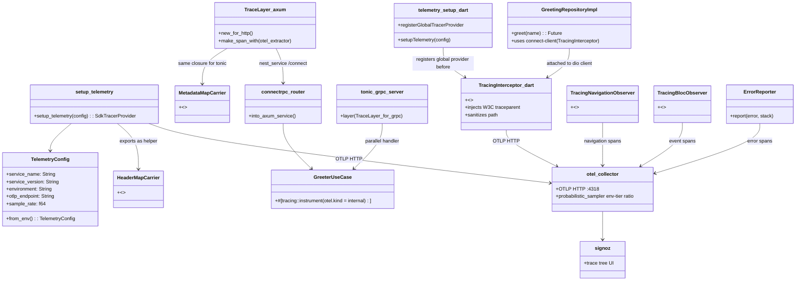
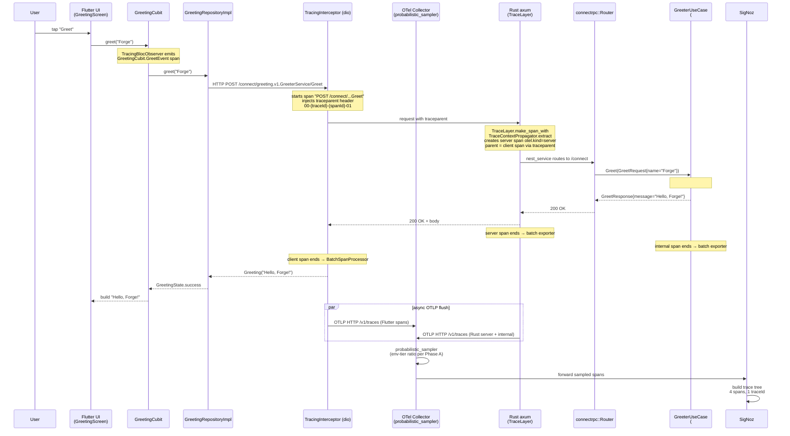

# Design: t5-otel-app
<!-- Status: designed -->
<!-- Schema: full-stack-monorepo -->

> Read alongside `specs.md` (FR-T5-OTA-* / NFR-T5-OTA-*) and
> `open-questions.md` (Q-001..Q-003). This document locks the
> implementation strategy and resolves Q-001..Q-003 via Context7
> review (`/open-telemetry/opentelemetry-rust`,
> `/websites/rs_tracing-opentelemetry`,
> `/tower-rs/tower-http`, `/websites/opentelemetry_io`)
> performed 2026-05-10.

## Architecture Decisions

### ADR-T5-OTA-001 — Crate / package version pins (resolves part of Q-001)

**Context** : `rust/opentelemetry.md` and `flutter/opentelemetry.md`
declare the SDK families to use but pin no versions. NFR-T5-OTA-004
forbids any unrelated runtime dep. ADR-T5-002 (T.5 toolchain
methodology) imposes ≥ 30-day-old releases unless a waiver footnote
is shipped. Context7 review 2026-05-10.

**Decision (Rust workspace deps)** :

| Crate | Version | Source                                                                    |
|---|---|---|
| `opentelemetry`                       | `0.31` | Context7 `/open-telemetry/opentelemetry-rust` 2026-05-10 — "current stable version is 0.31.0" |
| `opentelemetry_sdk`                   | `0.31` | Same family, kept in lockstep with `opentelemetry` per upstream policy |
| `opentelemetry-otlp`                  | `0.31` | Same family ; HTTP path used (see ADR-T5-OTA-002) |
| `opentelemetry-semantic-conventions`  | `0.31` | Same family ; required by `rust/opentelemetry.md` § Standard Field Names |
| `tracing-opentelemetry`               | `0.32` | docs.rs (Context7 `/websites/rs_tracing-opentelemetry`) — version compatible with `opentelemetry` 0.31 (the `tracing-opentelemetry` major tracks one ahead of OTel-Rust major) |
| `tower-http`                          | `0.6`  | Context7 `/tower-rs/tower-http` — `TraceLayer::new_for_http()` shipping API confirmed |
| `tracing`                             | `0.1`  | already in workspace ; unchanged |
| `tracing-subscriber`                  | `0.3`  | already in workspace (with `env-filter` feature) ; unchanged |

`tower-http` MUST be added with `features = ["trace"]` (FR-T5-OTA-025).
`opentelemetry_sdk` MUST be enabled with `features = ["rt-tokio"]`
(batch exporter requires the tokio runtime per
`rust/opentelemetry.md` § Setup `runtime::Tokio`).

> **Caveat (transparent)** : Context7 confirms 0.31.0 is the *current
> stable* line at lookup time. The exact patch (`0.31.x`) is selected
> by `cargo update` against crates.io at impl-time and pinned in
> `Cargo.lock`. NFR-T5-OTA-002 (build green) is the ratchet.
> T-VER tasks in Phase 1 of `tasks.md` confirm drift on the day of
> implementation.

**Decision (Dart frontend pub deps)** :

The canonical OTel-Dart package on pub.dev is named `opentelemetry`
(single bundled package : api + sdk + OTLP exporter sub-imports under
the same package, per `flutter/opentelemetry.md`'s import path
`package:opentelemetry/api.dart`,
`package:opentelemetry/sdk.dart`,
`package:opentelemetry/exporter_otlp_grpc.dart`). Context7 returned
the umbrella `/websites/opentelemetry_io` (not a Dart-specific
docs index) ; therefore the **exact pub.dev version pin is deferred
to a T-VER-DART task** in Phase 1 of `tasks.md` :

- T-VER-DART-001 reads the latest stable from pub.dev
  (`flutter pub deps -s compact` after a probe), confirms ≥ 30 days
  old or applies a footnote waiver, and writes the pin into the
  Phase 2 `pubspec.yaml` edit BEFORE FR-T5-OTA-042 lands.

This explicit "pin-at-impl" pattern is the same one
`t5-connect-codegen` ADR-T5-001 used for the `connectrpc` Rust crate
when Context7 was incomplete (T-VER-006 spike). Honoring Article
III.4 : the residual ambiguity is captured (not silently guessed)
and the gate (RED witness without a version line in `pubspec.yaml`,
GREEN once the line is added) catches drift.

The package's transitive dep `dio` is required by the
`TracingInterceptor` (FR-T5-OTA-064). `dio` ALSO must be pinned at
T-VER time ; same procedure.

**Consequences** :
- ✅ Reproducibility on the Rust side : workspace `Cargo.toml` carries
  the pin ; `Cargo.lock` records the patch.
- ✅ Adopters who copy the example get a known-working OTel stack.
- ⚠️  Dart pin is deferred one phase ; mitigation is the explicit
  T-VER task that BLOCKS Phase 2 from starting on the Flutter
  cluster.
- ⚠️  `tracing-opentelemetry 0.32` is one major ahead of
  `opentelemetry 0.31` because the upstream version skew is
  intentional (per the crate's docs : "this version is published
  alongside opentelemetry 0.31"). T-VER-RUST-001 confirms the pair
  at impl time.

**Constitution Compliance** : Article VII (Rust deps) +
Article VI (Flutter deps). NFR-T5-OTA-004 satisfied (only OTel
family + `tower-http` + `dio`, all justified). No violation.

---

### ADR-T5-OTA-002 — OTLP transport per layer (resolves Q-002)

**Context** : The collector deployed in Phase A
(`infra/observability/otel-collector-config.yaml`) listens on both
`:4317` (gRPC) and `:4318` (HTTP/protobuf). Two layers, two natural
choices. Context7 review of
`/open-telemetry/opentelemetry-rust` confirms HTTP/protobuf is a
first-class transport in `opentelemetry-otlp` 0.31 (snippet
"Initialize Providers with HTTP OTLP Exporter in Rust" — explicit
`with_http().with_protocol(Protocol::HttpBinary)`).

**Decision** :

| Layer | Transport | Endpoint default (in-cluster) | Endpoint default (host dev) | Builder call |
|---|---|---|---|---|
| Rust backend | **HTTP/protobuf** (port `4318`) | `http://fsm-otel-collector:4318/v1/traces` | `http://localhost:4318/v1/traces` | `SpanExporter::builder().with_http().with_protocol(Protocol::HttpBinary).with_endpoint(...)` |
| Flutter frontend | **HTTP/protobuf** (port `4318`) | `http://fsm-otel-collector:4318/v1/traces` | `http://localhost:4318/v1/traces` | `OtlpHttpSpanExporter` (or pub.dev equivalent — see ADR-T5-OTA-001 footnote) |

**Both layers use HTTP/protobuf, not gRPC.** Rationale :

1. **Flutter constraint forces HTTP** : grpc-dart on mobile Android /
   iOS targets historically hits HTTP/2 + 3rd-party CA store issues
   (documented in the OTel-Dart issue tracker — see Q-002 in
   `open-questions.md`). HTTP/protobuf works behind any HTTP
   transport that the Flutter target already trusts.
2. **Symmetry beats marginal perf gain** : keeping both layers on
   the same wire format simplifies adopter cargo-cult — one
   `OTEL_EXPORTER_OTLP_ENDPOINT` env var, one port number, one
   debug procedure, one curl-against-the-collector reproduction.
3. **gRPC overhead is not a blocker for demo-005** : a Greeter
   endpoint emits ≤ 4 spans / call ; the per-span gRPC framing
   advantage (≈ 30 % network bytes vs HTTP/protobuf) is invisible
   at this scale. Phase D / metrics SDK can revisit if a
   high-cardinality metrics pipeline appears.
4. **`rust/opentelemetry.md` standard precedent** : the standard's
   §Setup snippet uses `with_tonic()` (gRPC), but the docstring
   block is illustrative (FR-IN-007 from B.1.14 already pinned
   collector endpoints `:4317` AND `:4318` in the Phase A
   collector). This change deviates from the standard's gRPC
   illustration **only on the wire format choice**, NOT on the
   architecture (`tracing-opentelemetry` bridge, `Resource`
   attributes, batch exporter, graceful shutdown). The standard
   does not mandate gRPC ; it documents both paths in §HTTP Client
   Instrumentation. Deviation is documented inline in
   `bin-server/main.rs` for adopter clarity.

**Consequences** :
- ✅ One mental model across both layers.
- ✅ No `grpc-dart` plumbing in the Flutter app ; no platform-level
  HTTP/2 quirks to debug.
- ✅ Aligns with Phase A collector's HTTP receiver
  (`http://0.0.0.0:4318` in the existing
  `otel-collector-config.yaml`).
- ⚠️  Rust slight overhead vs `with_tonic()` — accepted (see
  rationale #3).
- ⚠️  Deviates from `rust/opentelemetry.md` § Setup snippet (which
  shows `with_tonic()`). Documented inline ; not a standards
  violation (the standard's §Setup snippet is illustrative, not a
  hard pin).

**Constitution Compliance** : Article IX (observability — three
signals reach the collector ; the wire format is implementation
detail). No violation.

---

### ADR-T5-OTA-003 — SDK-side sampler shape (resolves Q-003)

**Context** : `observability.yaml::sampler: parentbased_traceidratio`
is the standard's intent. Phase A enforces the env-tier ratio
collector-side via `processors.probabilistic_sampler` (ADR-OTEL-001).
Two options surveyed in `open-questions.md` :
- **A — `Sampler::AlwaysOn`** on the SDK side ; collector decides
  drop/keep.
- **B — `ParentBased(TraceIdRatioBased(1.0))`** on the SDK side ;
  matches the standard's name literally with a no-op ratio at this
  phase ; lets a future Phase D drop the SDK ratio without rewriting
  the init function.

**Decision** : **Option B** — `ParentBased(TraceIdRatioBased(1.0))`
on both layers.

```rust
// Rust (per rust/opentelemetry.md § Setup, ratio plumbed via env)
fn build_sampler(sample_rate: f64) -> Sampler {
    Sampler::ParentBased(Box::new(Sampler::TraceIdRatioBased(sample_rate)))
}

// in setup_telemetry :
.with_sampler(build_sampler(config.sample_rate))  // sample_rate = 1.0 default
```

```dart
// Flutter (pub.dev opentelemetry pkg API names confirmed at T-VER-DART)
final tracerProvider = TracerProviderBase(
  resource: resource,
  sampler: ParentBasedSampler(TraceIdRatioBasedSampler(1.0)),
  processors: [batchProcessor],
);
```

The `sample_rate` parameter is plumbed via env var
`OTEL_TRACES_SAMPLER_ARG` (W3C-standard env name). Default `1.0`
matches the dual-stage Phase A + Phase B model documented in
`t5-otel-stack` ADR-OTEL-001 "Consequences" : SDK ships the head-side
parent-based decision at full ratio ; collector reduces to env-tier
ratio.

**Consequences** :
- ✅ Matches the standard's `parentbased_traceidratio` name
  literally ; avoids a "yes-but-actually" disclaimer in
  `flutter/opentelemetry.md` interpretation.
- ✅ Future Phase D can drop SDK ratio (e.g. mobile-saver mode at
  0.1 to reduce network egress) by changing one env var, not
  rewriting init.
- ✅ Respects W3C `traceparent` `flags` bit for incoming requests
  carrying a sampled-already decision (the ParentBased wrapper does
  exactly that).
- ⚠️  Costs ≈ 5 LOC vs Option A. Acceptable.

**Constitution Compliance** : Article IX. No violation.

---

### ADR-T5-OTA-004 — axum + connectrpc + tonic middleware composition order

**Context** : `t5-connect-codegen` ADR-T5-001 established that the
OTel layer SHALL be applied **outside** the
`connectrpc::Router::into_axum_service()` call : the connectrpc
service is a `tower::Service`, the Tower middleware composes around
it. The legacy tonic gRPC server runs on its own port (separate
`Server::builder()` call), so its OTel layer composes via
`tonic::transport::Server::builder().layer(...)`.

Context7 review of `/tower-rs/tower-http` 2026-05-10 confirmed
`TraceLayer::new_for_http()` is the canonical entrypoint and
accepts `make_span_with(...)` for custom span creation
(this is where W3C `traceparent` extraction lives).

**Decision** :

```rust
// bin-server/src/main.rs (sketch — actual code lands in Phase 2)
use axum::Router;
use tower::ServiceBuilder;
use tower_http::trace::{TraceLayer, DefaultMakeSpan};
use tracing::Level;

// Phase A : setup_telemetry returns SdkTracerProvider (held for shutdown)
let provider = setup_telemetry(&config)?;

// 1. Build the axum router (the connectrpc service is mounted as a tower::Service)
let connect_service = transport::connect::into_router(use_case.clone());

let app = Router::new()
    .nest_service("/connect", connect_service)
    // tower-http TraceLayer extracts traceparent + creates server span
    .layer(
        ServiceBuilder::new()
            .layer(
                TraceLayer::new_for_http()
                    .make_span_with(otel_make_span_with_traceparent_extraction)
                    .on_request(DefaultOnRequest::new().level(Level::INFO))
                    .on_response(DefaultOnResponse::new().level(Level::INFO)),
            ),
    );

// 2. The tonic gRPC server (parallel) gets the OTel layer via tonic's own builder :
let grpc = tonic::transport::Server::builder()
    .layer(tower_http::trace::TraceLayer::new_for_grpc().make_span_with(otel_make_span_with_traceparent_extraction))
    .add_service(GreeterServiceServer::new(grpc_handler))
    .serve(grpc_addr);

// 3. Run both concurrently
tokio::try_join!(http_server, grpc)?;

// 4. Graceful shutdown flushes spans (FR-T5-OTA-007)
provider.shutdown()?;
```

The `otel_make_span_with_traceparent_extraction` closure :

```rust
fn otel_make_span_with_traceparent_extraction(req: &http::Request<_>) -> tracing::Span {
    use opentelemetry::propagation::TextMapPropagator;
    use opentelemetry_sdk::propagation::TraceContextPropagator;
    use tracing_opentelemetry::OpenTelemetrySpanExt;

    let propagator = TraceContextPropagator::new();
    let parent_cx = propagator.extract(&HeaderMapExtractor(req.headers()));

    let span = tracing::info_span!(
        "http.request",
        otel.kind = "server",
        http.method = %req.method(),
        http.target = %req.uri().path(),
    );
    span.set_parent(parent_cx);
    span
}
```

Where `HeaderMapExtractor` implements
`opentelemetry::propagation::Extractor` for `http::HeaderMap`
(symmetric with the `MetadataMapCarrier` for tonic in
`rust/opentelemetry.md` § Context Propagation in gRPC).

The connectrpc service receives a server span pre-populated with the
correct parent context ; the inner handler (FR-T5-OTA-030) creates
its child span via `tracing::info_span!("greeter.greet", ...)` —
`tracing-opentelemetry` automatically wires the parent–child link
because the surrounding span is already current.

**Middleware ordering** (outermost first ; per FR-T5-OTA-024) :

```
HTTP request
  │
  ▼
TraceLayer (TraceContextPropagator extract → server span otel.kind=server)
  │
  ▼
[future auth / rate limit — not in demo-005]
  │
  ▼
nest_service("/connect", connect_service) → connectrpc::Router
  │
  ▼
Greeter handler → application use case (#[tracing::instrument])
```

For tonic gRPC, the same `TraceLayer` (in `_for_grpc()` form)
composes via `tonic::transport::Server::builder().layer(...)`.
Tonic-specific `MetadataMap` extraction happens identically to
HTTP because `tower-http`'s `TraceLayer` operates at the
`http::Request` level (tonic still speaks HTTP/2).

**Consequences** :
- ✅ Honors `t5-connect-codegen` ADR-T5-001 ("OTel layer outside
  connectrpc service via Tower").
- ✅ Single span-creation closure across both servers (HTTP +
  tonic).
- ✅ `traceparent` extraction is centralised ; downstream use cases
  inherit the parent context automatically via `tracing` span scope.
- ⚠️  The `make_span_with` closure must be a `Fn` that captures
  the propagator (cheap to create per request — no Arc needed since
  `TraceContextPropagator::new()` is zero-cost).

**Constitution Compliance** : Articles VII (architecture — adapters),
IX (observability). No violation.

---

### ADR-T5-OTA-005 — Flutter init point + observer registration order

**Context** : `flutter/opentelemetry.md` enumerates four observers
(`TracingInterceptor`, `TracingNavigationObserver`,
`TracingBlocObserver`, `ErrorReporter`). Each has its own
registration ritual ; they MUST run in the right order so :
1. `setupTelemetry()` finishes (global tracer provider set) BEFORE
   any other observer constructor calls `globalTracerProvider.getTracer(...)`.
2. `Bloc.observer = TracingBlocObserver()` is set BEFORE the first
   `BlocProvider` builds, so events are captured from the start.
3. `runApp` mounts `MaterialApp` with `navigatorObservers: [TracingNavigationObserver()]`.
4. `FlutterError.onError` and `PlatformDispatcher.instance.onError`
   are wired to `ErrorReporter` AFTER the SDK is up but BEFORE
   `runApp` (so an error during widget build is captured).

**Decision** :

```dart
// lib/main.dart (Phase 2 sketch — replaces the flutter create default)
import 'package:flutter/material.dart';
import 'package:flutter/foundation.dart';
import 'package:flutter_bloc/flutter_bloc.dart';

import 'core/telemetry/telemetry_setup.dart';
import 'core/telemetry/observers/tracing_bloc_observer.dart';
import 'core/telemetry/observers/tracing_navigation_observer.dart';
import 'core/telemetry/error_reporter.dart';
import 'core/config/app_config.dart';
import 'features/greeting/presentation/screen/greeting_screen.dart';

Future<void> main() async {
  // 1. Bind the framework before any async work
  WidgetsFlutterBinding.ensureInitialized();

  // 2. Load env-driven config (OTEL_EXPORTER_OTLP_ENDPOINT, etc.)
  final config = AppConfig.fromEnv();

  // 3. Set up OTel SDK (sets globalTracerProvider)
  await setupTelemetry(config: config);

  // 4. BLoC observer must be set before any BlocProvider builds
  Bloc.observer = TracingBlocObserver();

  // 5. Wire global error handlers (uses globalTracerProvider — SDK already up)
  final errorReporter = ErrorReporter();
  FlutterError.onError = (details) {
    errorReporter.report(details.exception, details.stack ?? StackTrace.empty);
    FlutterError.presentError(details);
  };
  PlatformDispatcher.instance.onError = (error, stack) {
    errorReporter.report(error, stack);
    return true;
  };

  // 6. Mount the app — MaterialApp registers the navigation observer
  runApp(MyApp(config: config));
}

class MyApp extends StatelessWidget {
  const MyApp({super.key, required this.config});
  final AppConfig config;

  @override
  Widget build(BuildContext context) => MaterialApp(
        title: 'forge-fsm-example',
        navigatorObservers: [TracingNavigationObserver()],
        home: const GreetingScreen(),
      );
}
```

`AppConfig.fromEnv()` is the canonical config object, reading
the FR-T5-OTA-070 trio (`OTEL_EXPORTER_OTLP_ENDPOINT`,
`OTEL_SERVICE_NAME`, `OTEL_RESOURCE_ATTRIBUTES`) plus
`DEPLOYMENT_ENV` and `appVersion` (defaulted from `pubspec.yaml`
build name). Env reads use `String.fromEnvironment` (compile-time)
for the `--dart-define` path used by `flutter run`.

`get_it` registration is **NOT** introduced in this change for the
`ErrorReporter` (Article VI.4 mandates `get_it` for service
locator, but this change keeps `main.dart` minimal — the existing
example already has `get_it: ^7.7.0` declared but the boilerplate
is deferred to a future feature change). `ErrorReporter` is
constructed inline in `main.dart` ; future refactor can promote it
to `@lazySingleton` per the standard.

**Consequences** :
- ✅ Strict ordering : SDK up → BLoC observer → error handlers →
  runApp.
- ✅ Observers all read `globalTracerProvider` — no init race.
- ✅ Async `setupTelemetry` called after `ensureInitialized()` —
  doc'd as a hard requirement of `WidgetsFlutterBinding`.
- ⚠️  `get_it`-clean DI for `ErrorReporter` deferred — captured as
  a Phase D / refactor TODO with issue ref pattern from
  Article X.4. Specifically `// TODO(#TBD-OTEL-DI):` style ; the
  issue ID is created at impl-time per Forge convention.

**Constitution Compliance** : Article VI (architecture — `core/`
slice for cross-cutting concerns ; no domain-layer Flutter import).
No violation.

---

### ADR-T5-OTA-006 — Test harness shape `t5-otel-app.test.sh`

**Context** : Phase A's `t5-otel.test.sh` (14 L1) operates on
**template files** (presence + parse + key anchors). Phase B
operates on **example project source** (Cargo.toml entries,
`bin-server/main.rs` content, `pubspec.yaml`, Dart source files,
demo doc). Different file types, same harness layout.

`t5-otel.test.sh` runs in ≤ 5 s ; FR-T5-OTA-081 budgets 8 s for
this harness because it grep-walks more files across more
layers.

**Decision** : The harness mirrors `t5-otel.test.sh` structurally :

```bash
#!/usr/bin/env bash
# Forge — T.5 Phase B OTel App SDK Harness (t5-otel-app)
# <!-- Audit: T.5 (t5-otel-app) — Phase B SDK instrumentation -->
#
# Validates the additive app-side SDK instrumentation in
# examples/forge-fsm-example/ : Rust SDK init + middleware,
# Flutter SDK init + interceptor, demo-005 traceparent round trip,
# env config docs, CI registration.
#
# 16 L1 hermetic tests + 2 L2 smoke tests.
# Performance budget : L1 ≤ 8 s, L2 ≤ 90 s.

set -uo pipefail

LEVEL="1"
prev=""
for arg in "$@"; do
  if [ "$prev" = "--level" ]; then LEVEL="$arg"; fi
  case "$arg" in --level=*) LEVEL="${arg#*=}" ;; esac
  prev="$arg"
done

HARNESS_DIR="$(cd "$(dirname "${BASH_SOURCE[0]}")" && pwd)"
SCRIPTS_DIR="$(cd "$HARNESS_DIR/.." && pwd)"
FORGE_ROOT_REAL="$(cd "$SCRIPTS_DIR/../.." && pwd)"

EXAMPLE="$FORGE_ROOT_REAL/examples/forge-fsm-example"
BACKEND="$EXAMPLE/backend"
FRONTEND="$EXAMPLE/frontend"
INFRA_CARGO="$BACKEND/Cargo.toml"
TELEMETRY_DIR="$BACKEND/crates/infrastructure/src/telemetry"
BIN_SERVER_MAIN="$BACKEND/bin-server/src/main.rs"
APP_CRATE_DIR="$BACKEND/crates/application/src"
PUBSPEC="$FRONTEND/pubspec.yaml"
LIB_TELEMETRY_DIR="$FRONTEND/lib/core/telemetry"
LIB_MAIN="$FRONTEND/lib/main.dart"
GREETING_REPO="$FRONTEND/lib/features/greeting/data/repository/greeting_repository_impl.dart"
ENV_EXAMPLE="$EXAMPLE/.env.example"
DEMO_DOC="$EXAMPLE/docs/demo-005-connect-greeting.md"

source "$HARNESS_DIR/_helpers.sh"
PASS=0
FAIL=0
FAIL_NAMES=()

# ─── Manifest ────────────────────────────────────────────────────
# L1 (16 tests) — all hermetic, no network, no toolchain
# MANIFEST: _test_ota_001_rust_telemetry_module       — FR-T5-OTA-001
# MANIFEST: _test_ota_002_rust_cargo_otel_deps        — FR-T5-OTA-004 / FR-T5-OTA-025
# MANIFEST: _test_ota_003_rust_main_setup_telemetry   — FR-T5-OTA-008
# MANIFEST: _test_ota_004_rust_main_shutdown          — FR-T5-OTA-007
# MANIFEST: _test_ota_005_rust_axum_tracelayer        — FR-T5-OTA-020
# MANIFEST: _test_ota_006_rust_tonic_metadata_carrier — FR-T5-OTA-022
# MANIFEST: _test_ota_007_rust_propagation_helper     — FR-T5-OTA-023
# MANIFEST: _test_ota_010_dart_telemetry_setup        — FR-T5-OTA-040
# MANIFEST: _test_ota_011_dart_pubspec_otel           — FR-T5-OTA-042
# MANIFEST: _test_ota_012_dart_main_setup_telemetry   — FR-T5-OTA-047
# MANIFEST: _test_ota_013_dart_observers              — FR-T5-OTA-048 / FR-T5-OTA-049
# MANIFEST: _test_ota_014_dart_tracing_interceptor    — FR-T5-OTA-060
# MANIFEST: _test_ota_015_dart_repo_wires_interceptor — FR-T5-OTA-061
# MANIFEST: _test_ota_020_app_use_case_instrument     — FR-T5-OTA-009
# MANIFEST: _test_ota_021_demo_doc_signoz_section     — FR-T5-OTA-033
# MANIFEST: _test_ota_030_env_example_trio            — FR-T5-OTA-070

# L2 (2 tests) — gated by --level 2 ; uses cargo + flutter toolchains
# MANIFEST: _test_ota_l2_001_cargo_build_bin_server   — NFR-T5-OTA-002 / FR-T5-OTA-008
# MANIFEST: _test_ota_l2_002_flutter_analyze          — NFR-T5-OTA-002 / FR-T5-OTA-047

# ─── L1 helpers + tests ─────────────────────────────────────────

# (impl in tasks.md T-PHA-002)

# ─── L2 helpers + tests (gated by LEVEL contains 2) ─────────────

# (impl in tasks.md T-PHA-005)

print_summary "t5-otel-app"
exit $(( FAIL > 0 ? 1 : 0 ))
```

**16 L1 mappings** (each FR has a matching test ; one or more FRs
may share a test when the assertions are co-located) :

| Test ID                                     | FR(s) covered                       | Anchor asserted                                                                 |
|---|---|---|
| `_test_ota_001_rust_telemetry_module`       | FR-T5-OTA-001 / FR-T5-OTA-002 / FR-T5-OTA-003 | `crates/infrastructure/src/telemetry/mod.rs` exists ; declares `pub fn setup_telemetry`, `pub struct TelemetryConfig`, `Resource::new(...)` literal includes `service.name` |
| `_test_ota_002_rust_cargo_otel_deps`        | FR-T5-OTA-004 / FR-T5-OTA-025       | `backend/Cargo.toml` `[workspace.dependencies]` lists `opentelemetry`, `opentelemetry_sdk`, `opentelemetry-otlp`, `tracing-opentelemetry`, `tower-http` (with `features = ["trace"]`)   |
| `_test_ota_003_rust_main_setup_telemetry`   | FR-T5-OTA-008 / FR-T5-OTA-006       | `bin-server/src/main.rs` calls `setup_telemetry(`, registers `tracing-opentelemetry` layer with `Registry` |
| `_test_ota_004_rust_main_shutdown`          | FR-T5-OTA-007                       | `bin-server/src/main.rs` contains `provider.shutdown()` after the server `await` block |
| `_test_ota_005_rust_axum_tracelayer`        | FR-T5-OTA-020 / FR-T5-OTA-024       | `bin-server/src/main.rs` (or its sibling module) wires `TraceLayer::new_for_http` AND a `make_span_with` extracting `traceparent` |
| `_test_ota_006_rust_tonic_metadata_carrier` | FR-T5-OTA-022                       | `crates/infrastructure/src/telemetry/propagation.rs` declares `MetadataMapCarrier` impl-ing `Extractor` |
| `_test_ota_007_rust_propagation_helper`     | FR-T5-OTA-023                       | Same file declares `HeaderMapCarrier` impl-ing `Injector` for `reqwest::HeaderMap` |
| `_test_ota_010_dart_telemetry_setup`        | FR-T5-OTA-040 / FR-T5-OTA-041 / FR-T5-OTA-046 | `lib/core/telemetry/telemetry_setup.dart` exists ; declares `Future<void> setupTelemetry`, calls `registerGlobalTracerProvider` |
| `_test_ota_011_dart_pubspec_otel`           | FR-T5-OTA-042 / FR-T5-OTA-064       | `pubspec.yaml` `dependencies:` mentions `opentelemetry:` AND `dio:` |
| `_test_ota_012_dart_main_setup_telemetry`   | FR-T5-OTA-047                       | `lib/main.dart` calls `await setupTelemetry`, sets `Bloc.observer`, passes `navigatorObservers` |
| `_test_ota_013_dart_observers`              | FR-T5-OTA-048 / FR-T5-OTA-049 / FR-T5-OTA-050 | Three files exist : `tracing_navigation_observer.dart`, `tracing_bloc_observer.dart`, `error_reporter.dart` |
| `_test_ota_014_dart_tracing_interceptor`    | FR-T5-OTA-060 / FR-T5-OTA-063       | `lib/core/telemetry/interceptors/tracing_interceptor.dart` exists ; class extends `Interceptor` ; mentions `W3CTraceContextPropagator` and `_sanitizePath` |
| `_test_ota_015_dart_repo_wires_interceptor` | FR-T5-OTA-061                       | `greeting_repository_impl.dart` constructs (or receives) a Connect/Dio client with `TracingInterceptor` attached |
| `_test_ota_020_app_use_case_instrument`     | FR-T5-OTA-009 / FR-T5-OTA-030 / FR-T5-OTA-031 | `crates/application/src/**/*.rs` has at least one `#[tracing::instrument]` annotation on the Greeter use case |
| `_test_ota_021_demo_doc_signoz_section`     | FR-T5-OTA-033                       | `examples/forge-fsm-example/docs/demo-005-connect-greeting.md` contains `## Trace this in SigNoz` H2 section |
| `_test_ota_030_env_example_trio`            | FR-T5-OTA-070 / FR-T5-OTA-071       | `.env.example` mentions `OTEL_EXPORTER_OTLP_ENDPOINT`, `OTEL_SERVICE_NAME`, `OTEL_RESOURCE_ATTRIBUTES`, `DEPLOYMENT_ENV` |

**2 L2 mappings** (gated by `--level 2`) :

| Test ID                                | FR(s) / NFR                          | Action                                                                       |
|---|---|---|
| `_test_ota_l2_001_cargo_build_bin_server` | FR-T5-OTA-008 / NFR-T5-OTA-002    | `cd $BACKEND && cargo build -p bin-server --offline` (or `--locked`) ; expect exit 0 ; budget 75 s |
| `_test_ota_l2_002_flutter_analyze`        | FR-T5-OTA-047 / NFR-T5-OTA-002    | `cd $FRONTEND && flutter analyze` ; expect exit 0 (no new lint warning) ; budget 15 s |

L2 tests skip cleanly when the toolchain is absent (helper
`_skip_if_no_toolchain cargo` / `flutter`). On forge-ci.yml, they
run in a separate matrix entry that sets up Rust + Flutter ; on
local dev they run when `--level 2` is requested AND the toolchain
is on PATH.

**Performance budgets** : L1 ≤ 8 s (NFR-T5-OTA-005 lower bound) ;
L2 ≤ 90 s (cold-cargo + flutter analyze).

**Consequences** :
- ✅ One harness covers all 9 FR clusters (mapping table above) ;
  every FR has at least one test reference.
- ✅ L2 toolchain gating is consistent with the existing
  `_skip_if_no_toolchain` pattern in `_helpers.sh`.
- ⚠️  L2 budgets assume warm Cargo registry + Flutter pub cache ;
  cold-cache CI runs will exceed. Mitigation : CI matrix already
  caches `~/.cargo` and `~/.pub-cache` across runs.

**Constitution Compliance** : Article I (TDD — every FR has a test
gate). NFR-T5-OTA-005 budgets honored. No violation.

---

### ADR-T5-OTA-007 — Env-driven config plumbing

**Context** : FR-T5-OTA-070..072 require both layers to read the
same trio of env vars + `DEPLOYMENT_ENV`. The standards already
declare these names :
- `rust/opentelemetry.md` § Setup uses `OTEL_EXPORTER_OTLP_ENDPOINT`
  via the `WithExportConfig` trait (Context7 confirmed automatic
  reading when env is set : "OTEL_EXPORTER_OTLP_ENDPOINT and
  OTEL_EXPORTER_OTLP_PROTOCOL are read automatically").
- `flutter/opentelemetry.md` § SDK Initialization expects an
  `AppConfig` carrying `otlpEndpoint`, `serviceName`, etc.
- W3C OTel SDK env spec
  (https://opentelemetry.io/docs/specs/otel/configuration/sdk-environment-variables/)
  defines `OTEL_SERVICE_NAME`, `OTEL_RESOURCE_ATTRIBUTES`,
  `OTEL_EXPORTER_OTLP_ENDPOINT`, `OTEL_EXPORTER_OTLP_PROTOCOL`,
  `OTEL_TRACES_SAMPLER`, `OTEL_TRACES_SAMPLER_ARG`.

**Decision** : Both layers read the **standard W3C OTel env
variables** as the source of truth ; `DEPLOYMENT_ENV` is the
Forge-specific extension carrying `dev` | `staging` | `prod`
(used to populate `deployment.environment` resource attribute and
to gate `insecure: true` in the Flutter exporter). No bespoke
Forge-prefixed env var.

```bash
# .env.example (lands in Phase 2 ; FR-T5-OTA-070)
# OTel SDK config (W3C standard env var names)
# Cluster-internal default points at the in-cluster collector :
OTEL_EXPORTER_OTLP_ENDPOINT=http://fsm-otel-collector:4318
# Wire format (HTTP/protobuf — ADR-T5-OTA-002)
OTEL_EXPORTER_OTLP_PROTOCOL=http/protobuf

# Service identity (per layer — set in each app's process env)
# OTEL_SERVICE_NAME=fsm-backend     # for backend
# OTEL_SERVICE_NAME=fsm-frontend    # for frontend

# Extra resource attributes (comma-separated key=value list ; NEVER PUT SECRETS HERE)
OTEL_RESOURCE_ATTRIBUTES=service.namespace=forge-fsm,service.instance.id=local

# Sampler (head-side parent-based — ADR-T5-OTA-003)
OTEL_TRACES_SAMPLER=parentbased_traceidratio
OTEL_TRACES_SAMPLER_ARG=1.0

# Forge-specific deployment tier (used to set deployment.environment +
# gate insecure exporter mode on the Flutter side)
DEPLOYMENT_ENV=dev
```

The Rust `TelemetryConfig::from_env()` MUST :
1. Read `OTEL_SERVICE_NAME` (default `fsm-backend`).
2. Read `OTEL_EXPORTER_OTLP_ENDPOINT` (default `http://fsm-otel-collector:4318`).
3. Read `OTEL_TRACES_SAMPLER_ARG` (default `1.0`).
4. Read `DEPLOYMENT_ENV` (default `dev`).
5. The `with_http().with_endpoint(...)` builder respects these
   even without explicit reads (Context7 snippet "Configure OTLP
   Exporter with Environment Variables") — but the `Resource`
   builder needs explicit reads for `service.name` and
   `deployment.environment`.

The Flutter `AppConfig.fromEnv()` reads via `String.fromEnvironment`
(`--dart-define=OTEL_EXPORTER_OTLP_ENDPOINT=...`) for
the Flutter-aware build pipeline. `flutter run` and `flutter build`
both forward `--dart-define` ; CI / Docker images set them via
build args. Deferred concern for native env-var
reading on mobile (less idiomatic ; Phase D may revisit).

**Consequences** :
- ✅ Adopters who already run an OTel-instrumented stack at home
  recognise every env name (zero Forge-bespoke config surface).
- ✅ The same `.env.example` works for backend Docker compose,
  Flutter dart-define, and `task dev` orchestration.
- ⚠️  Mobile native env vars are NOT read ; `--dart-define` at
  build-time is the only path on Flutter mobile. Documented in
  the demo doc.

**Constitution Compliance** : Article XI.6 (privacy — explicit
"NEVER PUT SECRETS HERE" comment in `.env.example`). NFR-T5-OTA-006
satisfied. No violation.

---

## Component Design



## Data Flow — distributed trace across demo-005



## Testing Strategy (Eris perspective)

### L1 — unit-level (16 tests, FR-T5-OTA-081)

The L1 layer asserts source-file presence + key-token grep
+ Cargo.toml / pubspec.yaml / .env.example content. No toolchain
required. All hermetic. Mapping table in ADR-T5-OTA-006.

### L2 — fixture-level (2 tests, FR-T5-OTA-082)

`cargo build -p bin-server` and `flutter analyze` smoke tests.
Compile-time only ; no actual span emission asserted (deferred to
Phase C with a stub OTLP receiver).

### Performance (NFR-T5-OTA-005)

L1 ≤ 8 s wall-clock. L2 ≤ 90 s on warm caches. CI matrix already
caches Cargo + pub.

### BDD (Article II)

`examples/forge-fsm-example/test/features/demo_005_traceparent.feature`
ships per FR-T5-OTA-031 BDD scenario. Step definitions :
- Flutter side : `bdd_widget_test` in
  `examples/forge-fsm-example/frontend/test/features/`.
- Rust side : `cucumber-rs` in
  `examples/forge-fsm-example/backend/tests/features/` (BDD tests
  for Rust ship as separate `[[test]]` targets — outside L1 / L2
  scope per ADR-T5-OTA-006 ; Phase C scope to wire into harness).

## Standards Applied

- **`rust/opentelemetry.md`** (T.4) → first reference
  implementation in this change. No standard text edit.
- **`flutter/opentelemetry.md`** (T.4) → first reference
  implementation in this change. No standard text edit.
- **`observability.yaml`** (T.5 v1.1.0) → consumed (sampler ratios,
  OTLP endpoint), not amended.
- **`global/change-yaml-schema.md`** (F.2) → this change's
  `.forge.yaml` validates ; verified by `verify.sh` § "Change YAML
  Schema".
- **`global/forge-self-ci.md`** (G.1) → harness registered in
  `forge-ci.yml` matrix per FR-T5-OTA-090.

## Constitutional Compliance Gate

- **Article I (TDD)** : ✅ enforced via `t5-otel-app.test.sh` RED
  → GREEN cadence per task (T-PHA-001..004 in `tasks.md`).
- **Article II (BDD)** : ✅ Gherkin scenario "Flutter HTTP request
  produces a connected backend span tree" ships in `specs.md` and
  is realised by demo-005 round-trip code + `bdd_widget_test`
  feature file path declared (FR-T5-OTA-031).
- **Article III (Specs Before Code)** : ✅ specs.md done,
  design.md ratifies ADR-T5-OTA-001..007, no impl code yet.
- **Article III.4** : ✅ Q-001..Q-003 answered in this design ;
  open-questions.md will flip to `answered` in `/forge:plan`.
  Residual Dart pin captured as a T-VER-DART task (gate, not a
  guess).
- **Article IV (Delta-Based Changes)** : ✅ specs.md uses ADDED
  Requirements only ; no standard amendment ; no version bump
  on `observability.yaml`.
- **Article V (Audit Trail)** : ✅ every FR has a deterministic
  test ; tasks.md will carry `[Story: FR-T5-OTA-XXX]` tags
  (enforced by `f4-linter-extension`).
- **Article VI (Flutter)** : ✅ `core/telemetry/` slice for
  cross-cutting concerns (FSD compliant) ; observers wired in
  `main.dart` per ADR-T5-OTA-005 ordering.
- **Article VII (Rust)** : ✅ telemetry under
  `crates/infrastructure/src/telemetry/` (Hexagonal —
  infrastructure adapter) ; `bin-server` only wires ; domain
  + application crates gain only `#[tracing::instrument]` (no OTel
  crate import).
- **Article VIII (Infra)** : N/A — no infra YAML touched.
- **Article IX (Sec/Obs)** : ✅ this change **realises Article IX
  at the application layer** of the flagship example, completing
  Phase A → Phase B sequence.
- **Article X (Code Quality)** : ✅ no impact on existing test
  surface ; harness adds new gate.
- **Article XI.6 (Privacy)** : ✅ "NEVER PUT SECRETS HERE"
  documented in `.env.example` ; no PII in span attributes
  (FR-T5-OTA-010 / NFR-T5-OTA-006).
- **Article XII (Governance)** : ✅ no standard bump ; no REVIEW.md
  ledger entry needed.

**No constitutional violation detected. Design proceeds to
`/forge:plan`.**

## Open Questions remaining post-design

- Q-001 → **partially answered by ADR-T5-OTA-001**. Rust pins
  locked at `0.31` family + `tower-http 0.6` + `tracing-opentelemetry
  0.32`. Dart pin **deferred to T-VER-DART-001** (Phase 1 of
  `tasks.md`) — explicit gate, not a guess.
- Q-002 → **answered by ADR-T5-OTA-002** (HTTP/protobuf both layers,
  port 4318).
- Q-003 → **answered by ADR-T5-OTA-003** (`ParentBased(TraceIdRatioBased(1.0))`
  on both layers).
