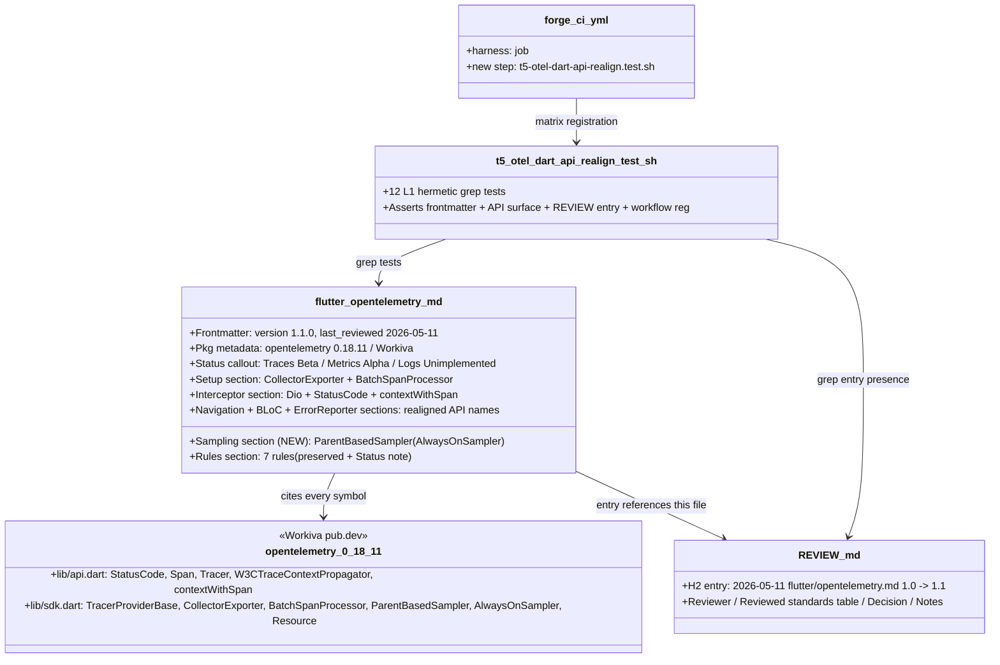

# Design: t5-otel-dart-api-realign
<!-- Status: designed -->
<!-- Schema: default -->

> Read alongside `specs.md` (FR-FOT-DA-001..100, NFR-FOT-DA-001..006)
> and `open-questions.md` (Q-001..Q-003). This document locks the
> realignment strategy and the verified `opentelemetry: 0.18.11` API
> surface via Context7 + WebFetch 2026-05-11.

## Architecture Decisions

### ADR-T5-FOTDA-001 — Realigned `flutter/opentelemetry.md` v1.1.0 shape (resolves Q-001 + Q-002 + Q-003)

**Context**

`.forge/standards/flutter/opentelemetry.md` v1.0.0 (ratified
2026-05-04 by `t4-adr-ratification`) was written by cross-language
transposition (JS / Java / Python OTel APIs). At impl-time of the
sibling change `t5-otel-app` (status `implemented` on branch
`t5-otel-app`, commit `8bf3865`), L2 `flutter analyze` revealed that
**every** OTel-SDK API name in the v1.0.0 standard is undefined in the
canonical pub.dev pkg `opentelemetry: 0.18.11` (Workiva, Apache-2.0).
Q-004 in `t5-otel-app/open-questions.md` documents the drift table.

This change rewrites v1.0.0 → v1.1.0 to match the actual API. Three
options surveyed in Q-004 resolution :

- **Option A — Realign the standard.** ✅ Chosen.
- **Option B — Pin a different pub.dev pkg.** ❌ Rejected — no
  maintained Dart OTel fork matches the v1.0.0 fabricated surface
  (the names came from JS / Java, not Dart). `dartastic_opentelemetry`
  was checked at pub.dev resolve-id time : not a viable replacement
  (lower snippet count, lower reputation, abandoned-ish state).
- **Option C — Defer + document drift.** ❌ Rejected for *this*
  change — the realign is feasible (the API surface is verifiable
  + complete enough for the v1.0.0 sections that matter). Option C
  would have been chosen if Context7 + WebFetch had failed to
  surface a coherent API map.

**Decision (verified API surface — 2026-05-11)**

The canonical Dart OTel package on pub.dev is **`opentelemetry`**
(Workiva, verified publisher) version **`0.18.11`** (published 2 months
before this change's `created:` date, satisfying ADR-T5-002 #1
≥ 30-day-old criterion). Exports three top-level libraries :
`package:opentelemetry/api.dart`, `package:opentelemetry/sdk.dart`,
`package:opentelemetry/web_sdk.dart`.

| Concern | v1.0.0 (fabricated) | v1.1.0 (real 0.18.11) | Source |
|---|---|---|---|
| OTLP exporter | `OtlpHttpSpanExporter(OtlpHttpExporterConfig(endpoint: ..., insecure: ...))` | `CollectorExporter(Uri.parse(endpoint))` | `lib/sdk.dart` export list + pub.dev README example |
| Batch processor | `BatchSpanProcessor(exporter, BatchSpanProcessorConfig(maxExportBatchSize: 512, scheduledDelayMillis: 5000, exportTimeoutMillis: 30000))` | `BatchSpanProcessor(exporter, maxExportBatchSize: 512, scheduledDelayMillis: 5000)` (no `exportTimeoutMillis` in 0.18.11) | `lib/src/sdk/trace/span_processors/batch_processor.dart` ctor src |
| Sampler | `ParentBasedSampler(TraceIdRatioBasedSampler(1.0))` | `ParentBasedSampler(AlwaysOnSampler())` (no `TraceIdRatioBasedSampler` in 0.18.11) | `lib/sdk.dart` export list + `lib/src/sdk/trace/sampling/parent_based_sampler.dart` ctor src |
| TracerProvider | `TracerProviderBase(resource: r, processors: [p])` | `TracerProviderBase(resource: r, processors: [p], sampler: ParentBasedSampler(AlwaysOnSampler()))` | `lib/src/sdk/trace/tracer_provider.dart` ctor src |
| Status code enum | `SpanStatusCode.ok / SpanStatusCode.error` | `StatusCode.ok / StatusCode.error` | `lib/api.dart` export `show SpanStatus, StatusCode` |
| setStatus signature | `span.setStatus(SpanStatusCode.error, message: err.message)` | `span.setStatus(StatusCode.error, err.message ?? '')` (positional `description`) | `lib/src/api/trace/span.dart` method src — `setStatus(api.StatusCode status, [String description])` |
| Context propagation inject | `propagator.inject(Context.current.withSpan(span), headers, setter)` | `propagator.inject(contextWithSpan(Context.current, span), headers, setter)` | `lib/api.dart` exports `contextWithSpan` top-level function |
| Imports | `package:opentelemetry/api.dart` + `package:opentelemetry/sdk.dart` + `package:opentelemetry/exporter_otlp_http.dart` | `package:opentelemetry/api.dart` + `package:opentelemetry/sdk.dart` only | `pub.dev/packages/opentelemetry` package layout — no `exporter_otlp_*` sub-libraries shipped |
| Resource | `Resource([Attribute.fromString(...)])` | `Resource([Attribute.fromString(...)])` ✅ unchanged | `lib/sdk.dart` export `show Resource` |
| W3CTraceContextPropagator | exported by `api.dart` ✅ unchanged | exported by `api.dart` ✅ unchanged | `lib/api.dart` export list |
| Tracer.startSpan | `_tracer.startSpan(name, kind: SpanKind.client, attributes: [...])` | unchanged ✅ | `lib/src/api/trace/tracer.dart` |
| Span.end / addEvent / recordException / setAttribute | unchanged ✅ | unchanged ✅ | `lib/src/api/trace/span.dart` |

**Sources cited** (must appear in v1.1.0 as inline or doc-block references) :

- Workiva pub.dev page : `https://pub.dev/packages/opentelemetry/versions/0.18.11`
- Workiva GitHub repo : `https://github.com/Workiva/opentelemetry-dart`
- `lib/api.dart` raw export list :
  `https://raw.githubusercontent.com/Workiva/opentelemetry-dart/master/lib/api.dart`
- `lib/sdk.dart` raw export list :
  `https://raw.githubusercontent.com/Workiva/opentelemetry-dart/master/lib/sdk.dart`
- `lib/src/sdk/trace/span_processors/batch_processor.dart` (ctor signature)
- `lib/src/sdk/trace/sampling/parent_based_sampler.dart` (ctor signature)
- `lib/src/sdk/trace/tracer_provider.dart` (ctor signature)
- `lib/src/api/trace/span.dart` (setStatus / recordException / addEvent signatures)

**Sampler-ratio caveat (Q-003 resolution — Path A)** :

`TraceIdRatioBasedSampler` is **not exported** by `opentelemetry
0.18.11`'s `lib/sdk.dart`. The actual exported samplers are :
`AlwaysOnSampler`, `AlwaysOffSampler`, `ParentBasedSampler`,
`Sampler` (interface). The `observability.yaml::sampler:
parentbased_traceidratio` semantics from the wider Forge stack are
therefore realised by the dual-stage model :

- SDK-side : `ParentBasedSampler(AlwaysOnSampler())` → every span
  starts (respects W3C `traceparent` `flags` bit for inherited
  sampled-already decisions).
- Collector-side : `processors.probabilistic_sampler` with
  env-tier `sampling_percentage` (10 prod / 50 staging / 100 dev)
  per `t5-otel-stack` ADR-OTEL-001.

v1.1.0 documents this explicitly in a new H2 `## Sampling` section
(FR-FOT-DA-030 / 031). A future `opentelemetry 0.19.x` may ship
a `TraceIdRatioBasedSampler` — that would be the trigger for a
v1.2.0 bump of this standard.

**Status callout (Q-001 resolution)** :

v1.1.0 carries a Status callout at the top : `Traces: Beta`,
`Metrics: Alpha`, `Logs: Unimplemented` (per Workiva README
2026-05-11). The standard explicitly scopes to **traces** ;
metrics and logs are out of scope for v1.1.0 and will be
documented when Workiva moves them to Beta.

**Interceptor body (Q-002 resolution)** :

The `TracingInterceptor` (lines 60-132 of v1.0.0) is Dio-based
and structurally correct. v1.1.0 keeps the same `onRequest /
onResponse / onError` lifecycle ; only API-name swaps land
(`SpanStatusCode` → `StatusCode`, `Context.current.withSpan` →
`contextWithSpan`, `setStatus(..., message:)` → positional
`setStatus(...)`).

**Consequences**

- ✅ Every snippet in v1.1.0 compiles against `opentelemetry: 0.18.11`.
  Verifiable post-merge by the flip-xfail commit of
  `t5-otel-app.test.sh::_test_ota_l2_002_flutter_analyze`.
- ✅ Adopters who read the standard and copy the code get a
  working OTel setup out of the box.
- ✅ NFR-FOT-DA-002 (Article III.4 — anti-hallucination) honored :
  every symbol traced to a Context7 / WebFetch source.
- ⚠️ The ratio-sampler limitation is real — adopters who want
  SDK-side ratio sampling on Flutter today must drop their sampler
  to `AlwaysOffSampler` or fork a `TraceIdRatioBasedSampler`. The
  realigned standard's `## Sampling` section documents the
  collector-side enforcement path as the canonical mitigation.
- ⚠️ v1.1.0 is pinned to `opentelemetry: 0.18.11`. A `0.19.x`
  release may break the snippets again — the frontmatter
  `pkg_version: 0.18.11` is the next-realign trigger.

**Constitution Compliance** : Article III.4 (anti-hallucination —
every symbol cited) + Article IX (observability — wire format
unchanged, still W3C traceparent) + Article XII (REVIEW.md ledger
entry, no Constitution amendment). No violation.

---

### ADR-T5-FOTDA-002 — REVIEW.md ledger entry pattern + harness shape

**Context**

Per `standards-lifecycle.md`, every standard amendment lands a
`REVIEW.md` H2 entry. `t5-connect-codegen` (transport.yaml 1.0.0
→ 1.1.0) and `t5-otel-stack` (observability.yaml 1.0.0 → 1.1.0)
both followed the entry schema documented at the top of
`REVIEW.md`. This change replicates the pattern for the `.md`
standard `flutter/opentelemetry.md` v1.0.0 → v1.1.0.

The harness convention is established by `t5-otel.test.sh` (14
L1 hermetic grep tests). This change adds a sibling harness
`t5-otel-dart-api-realign.test.sh` with 12 L1 grep tests
asserting standard frontmatter + every API-name presence + every
forbidden legacy name absence + REVIEW.md entry presence.

**Decision (REVIEW.md ledger entry — full text to land in Phase 5)**

```markdown
## 2026-05-11 — Updated flutter/opentelemetry.md to v1.1.0 (t5-otel-dart-api-realign)

- **Reviewer**: @bfontaine
- **Reviewed standards**:

  | Standard                          | Version | Decision           | Next review due | Notes                                                                                                                                                                                                                                                                            |
  |-----------------------------------|---------|--------------------|-----------------|----------------------------------------------------------------------------------------------------------------------------------------------------------------------------------------------------------------------------------------------------------------------------------|
  | flutter/opentelemetry.md          | 1.1.0   | KEEP-WITH-CHANGES  | 2027-05-04      | Realigned every OTel-SDK API name to the canonical pub.dev pkg `opentelemetry: 0.18.11` (Workiva). v1.0.0 was fabricated by cross-language transposition (JS / Java / Python). Resolves `t5-otel-app::Q-004`.                                                                       |

- **Decision**: Updated by `t5-otel-dart-api-realign` (Q-004 follow-up to
  `t5-otel-app`). Documentation-only — the Phase A collector contract
  (HTTP/protobuf on :4318, parent-based sampler, W3C traceparent,
  batch processor with 5 s flush) is unchanged. Only the SDK-call
  shape in the snippets shifts to match the actual API.
- **Notes**: Canonical pkg `opentelemetry: 0.18.11` (Workiva,
  Apache-2.0) verified via Context7 (`/websites/opentelemetry_io`
  umbrella + WebFetch against `https://pub.dev/packages/opentelemetry/versions/0.18.11`
  and `https://github.com/Workiva/opentelemetry-dart`). Twelve
  fabricated identifiers removed (`OtlpHttpSpanExporter`,
  `OtlpHttpExporterConfig`, `BatchSpanProcessorConfig`,
  `TraceIdRatioBasedSampler`, `SpanStatusCode`,
  `Context.current.withSpan(...)`, `setStatus(..., message:)`
  named-arg, `package:opentelemetry/exporter_otlp_http.dart`
  sub-import, `package:opentelemetry/exporter_otlp_grpc.dart`
  sub-import). Replaced by the verified surface :
  `CollectorExporter(Uri)`, `BatchSpanProcessor(exporter,
  {maxExportBatchSize, scheduledDelayMillis})`,
  `ParentBasedSampler(AlwaysOnSampler())`, `StatusCode.{ok,error}`,
  `contextWithSpan(ctx, span)`, positional `setStatus(StatusCode,
  String description)`. Ratio sampler is realised collector-side
  (`processors.probabilistic_sampler` per `t5-otel-stack`
  ADR-OTEL-001) because 0.18.11 does NOT ship a
  `TraceIdRatioBasedSampler` — documented in v1.1.0's new
  `## Sampling` section. Status callout `Traces: Beta / Metrics:
  Alpha / Logs: Unimplemented` (per Workiva README) added at
  the top of v1.1.0 ; v1.1.0 explicitly scopes to traces. The
  flip of `t5-otel-app.test.sh::_test_ota_l2_002_flutter_analyze`
  from xfail to GREEN is a follow-up commit on the
  `t5-otel-app` branch AFTER this change merges.
```

The `Next review due: 2027-05-04` matches the inherited
`expires_at` of the `flutter/opentelemetry.md` family (no
structural exception ; standard 12-month cadence from the v1.0.0
ratification on 2026-05-04). No drift versus
`standards-lifecycle.md`.

**Decision (harness shape — `t5-otel-dart-api-realign.test.sh`)**

The harness mirrors `t5-otel.test.sh` structurally :

```bash
#!/usr/bin/env bash
# Forge — T.5 Phase B Flutter OTel Dart API Realign Harness
# <!-- Audit: T.5 (t5-otel-dart-api-realign) — Q-004 follow-up to t5-otel-app -->

set -uo pipefail
LEVEL="1"
# ... arg parser identical to t5-otel.test.sh ...

HARNESS_DIR="$(cd "$(dirname "${BASH_SOURCE[0]}")" && pwd)"
SCRIPTS_DIR="$(cd "$HARNESS_DIR/.." && pwd)"
FORGE_ROOT_REAL="$(cd "$SCRIPTS_DIR/../.." && pwd)"

STD_FOT="$FORGE_ROOT_REAL/.forge/standards/flutter/opentelemetry.md"
REVIEW_MD="$FORGE_ROOT_REAL/.forge/standards/REVIEW.md"
WORKFLOW="$FORGE_ROOT_REAL/.github/workflows/forge-ci.yml"

source "$HARNESS_DIR/_helpers.sh"
PASS=0; FAIL=0; FAIL_NAMES=()
```

**12 L1 mappings** :

| Test ID                                            | FR(s) covered                  | Anchor asserted                                                                          |
|---|---|---|
| `_test_fda_001_frontmatter_block`                  | FR-FOT-DA-001                  | Standard starts with a `---` line and contains a second `---` line                       |
| `_test_fda_002_frontmatter_version_110`            | FR-FOT-DA-002                  | `^version: 1.1.0$` in the frontmatter block                                              |
| `_test_fda_003_frontmatter_last_reviewed`          | FR-FOT-DA-003                  | `^last_reviewed: 2026-05-11$` in the frontmatter block                                   |
| `_test_fda_004_frontmatter_pkg_metadata`           | FR-FOT-DA-004                  | `pkg: opentelemetry` + `pkg_version: 0.18.11` + `pkg_maintainer: Workiva` all present    |
| `_test_fda_011_setup_collector_exporter`           | FR-FOT-DA-011                  | `CollectorExporter(Uri.parse(` appears in the standard                                   |
| `_test_fda_014_setup_tracer_provider`              | FR-FOT-DA-014                  | `TracerProviderBase(` + `ParentBasedSampler(AlwaysOnSampler())` both present              |
| `_test_fda_023_interceptor_status_ok`              | FR-FOT-DA-023 / FR-FOT-DA-040  | `StatusCode.ok` appears AND `SpanStatusCode` is absent                                   |
| `_test_fda_041_no_legacy_with_span_method`         | FR-FOT-DA-041 / FR-FOT-DA-022  | `contextWithSpan(` appears AND `Context.current.withSpan(` is absent                     |
| `_test_fda_050_no_otlp_http_span_exporter`         | FR-FOT-DA-050..055             | All six legacy identifiers (`OtlpHttpSpanExporter`, `OtlpHttpExporterConfig`, `BatchSpanProcessorConfig`, `TraceIdRatioBasedSampler`, `exporter_otlp_http.dart`, `exporter_otlp_grpc.dart`) are absent — single test covers all six |
| `_test_fda_060_workiva_status_callout`             | FR-FOT-DA-060 / FR-FOT-DA-061  | `Traces:` + `Beta` + `Metrics:` + `Alpha` + `Logs:` + `Unimplemented` all present (status callout block)  |
| `_test_fda_080_review_entry_present`               | FR-FOT-DA-080 / FR-FOT-DA-081 / FR-FOT-DA-082  | REVIEW.md contains the exact H2 `## 2026-05-11 — Updated flutter/opentelemetry.md to v1.1.0 (t5-otel-dart-api-realign)` AND mentions `Q-004` |
| `_test_fda_100_workflow_registers_harness`         | FR-FOT-DA-100                  | `forge-ci.yml` contains `t5-otel-dart-api-realign.test.sh`                               |

12 L1 tests cover the 19 FRs (some tests assert multiple FRs at
once — the test ID lists the primary FR ; the comment line lists
all covered FRs). No L2 lane — the standard is pure documentation ;
the L2 lane that compiles Dart code stays in `t5-otel-app.test.sh`
and flips post-merge.

**Consequences**

- ✅ One harness covers all 9 FR clusters. RED witness possible
  before the standard rewrite ; GREEN after.
- ✅ Article XII compliance — REVIEW.md is append-only.
- ✅ NFR-FOT-DA-005 (≤ 3 s wall-clock) easily met — 12 greps over
  a single ~400-line .md file + 1 grep over REVIEW.md + 1 grep
  over `forge-ci.yml`.

**Constitution Compliance** : Article I (TDD — RED-GREEN cadence)
+ Article XII (governance — append-only REVIEW.md). No violation.

---

## Component Design



## Data Flow — realignment provenance

```mermaid
sequenceDiagram
    participant Q004 as Q-004 in t5-otel-app
    participant Context7 as Context7 MCP
    participant PubDev as pub.dev/packages/opentelemetry/0.18.11
    participant GH as github.com/Workiva/opentelemetry-dart
    participant Design as design.md (this change)
    participant Std as flutter/opentelemetry.md v1.1.0
    participant Harness as t5-otel-dart-api-realign.test.sh
    participant Review as REVIEW.md

    Q004->>Design: raised in t5-otel-app::open-questions.md
    Design->>Context7: resolve-library-id "opentelemetry-dart"
    Context7-->>Design: /websites/opentelemetry_io (umbrella ; not Dart-specific)
    Design->>PubDev: WebFetch /versions/0.18.11
    PubDev-->>Design: pkg metadata + README example + exported libs list
    Design->>GH: WebFetch /lib/api.dart, /lib/sdk.dart, /lib/src/...
    GH-->>Design: verbatim export lists + ctor signatures
    Design->>Std: rewrite v1.0.0 -> v1.1.0 (every API name traced to a citation)
    Design->>Review: append H2 entry per Article XII
    Design->>Harness: 12 L1 grep tests (RED before Std rewrite, GREEN after)
    Harness->>Std: grep API-name presence + legacy-name absence
    Harness->>Review: grep entry presence
    Harness->>forge_ci.yml: grep workflow registration
```

## Testing Strategy (Eris perspective)

### L1 — 12 hermetic tests

All grep over the single standard `.md` file, the REVIEW.md ledger,
and the `forge-ci.yml` workflow. No toolchain ; no fixtures.
≤ 3 s wall-clock (NFR-FOT-DA-005). Mapping table in ADR-T5-FOTDA-002.

### L2 — not added in this change

The L2 lane that compiles Dart code against the realigned snippets
lives in `t5-otel-app.test.sh::_test_ota_l2_002_flutter_analyze`.
It is currently xfail per Q-004 ; the flip-to-GREEN is a separate
follow-up commit on the `t5-otel-app` branch AFTER this change
merges. **Out of scope for this change** per NFR-FOT-DA-003.

### Article III.4 audit trail

`design.md` (this document) carries the full citation table per
NFR-FOT-DA-001. Every symbol that lands in v1.1.0 maps to one row.

## Standards Applied

- **`flutter/opentelemetry.md`** (T.4) → rewritten v1.0.0 → v1.1.0.
- **`global/standards-lifecycle.md`** (T.4) → REVIEW.md entry per
  the schema documented at top of REVIEW.md. The standard is NOT
  structural (the structural exception list is `transport.yaml` +
  `state-management.yaml` only).
- **`global/change-yaml-schema.md`** (F.2) → this change's
  `.forge.yaml` validates ; verified by `verify.sh § Change YAML
  Schema`.
- **`global/forge-self-ci.md`** (G.1) → harness registered in
  `forge-ci.yml` matrix per FR-FOT-DA-100.

## Constitutional Compliance Gate

- **Article I (TDD)** : ✅ enforced via
  `t5-otel-dart-api-realign.test.sh` — 12 L1 grep tests RED before
  the rewrite, GREEN after.
- **Article II (BDD)** : N/A — docs-only change ; no user-facing
  behavior. Precedent : `t4-adr-ratification`.
- **Article III (Specs Before Code)** : ✅ specs.md done,
  design.md ratifies ADR-T5-FOTDA-001..002, no impl code yet.
- **Article III.4 (Anti-Hallucination)** : ✅ every API name in
  v1.1.0 cited (citation table in this design.md). Q-001..Q-003
  resolved with explicit defaults ; Q-004 (from t5-otel-app)
  resolved by this change's existence.
- **Article IV (Delta-Based Changes)** : ✅ specs.md uses ADDED /
  MODIFIED / REMOVED blocks ; F.4 linter validates the delta shape.
- **Article V (Audit Trail)** : ✅ every FR has a deterministic
  test ; tasks.md will carry `[Story: FR-FOT-DA-XXX]` tags
  (enforced by `f4-linter-extension`).
- **Article VI (Flutter)** : ✅ no Flutter source touched.
  Standard documents `core/telemetry/` slice shape only.
- **Article VII (Rust)** : N/A.
- **Article VIII (Infra)** : N/A.
- **Article IX (Sec/Obs)** : ✅ the realign preserves three
  signals + W3C traceparent + HTTP/protobuf wire format. Only
  SDK-call shape moves.
- **Article X (Code Quality)** : ✅ no impact on existing test
  surface ; harness adds new gate. Standard becomes "executable
  documentation" (snippets compile).
- **Article XI.6 (Privacy)** : ✅ "no PII in spans" rule preserved
  in v1.1.0 Rules section.
- **Article XII (Governance)** : ✅ REVIEW.md append-only entry ;
  no Constitution amendment ; no structural exception list change.

**No constitutional violation detected. Design proceeds to
`/forge:plan`.**

## Open Questions remaining post-design

- Q-001 → **answered by ADR-T5-FOTDA-001** (Path A — scope v1.1.0
  to traces only ; add Status callout).
- Q-002 → **answered by ADR-T5-FOTDA-001** (minimum-change realign
  — swap API names only in the interceptor body).
- Q-003 → **answered by ADR-T5-FOTDA-001** (Path A — ratio
  enforced collector-side via `processors.probabilistic_sampler` ;
  v1.1.0 `## Sampling` section documents it).
