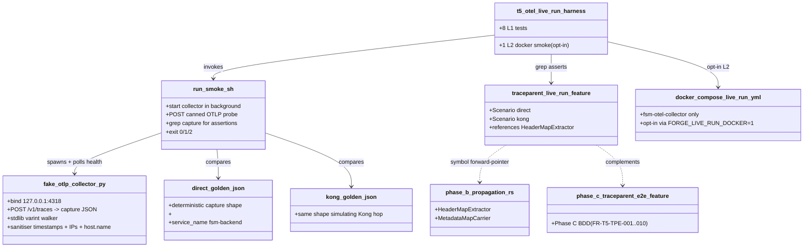
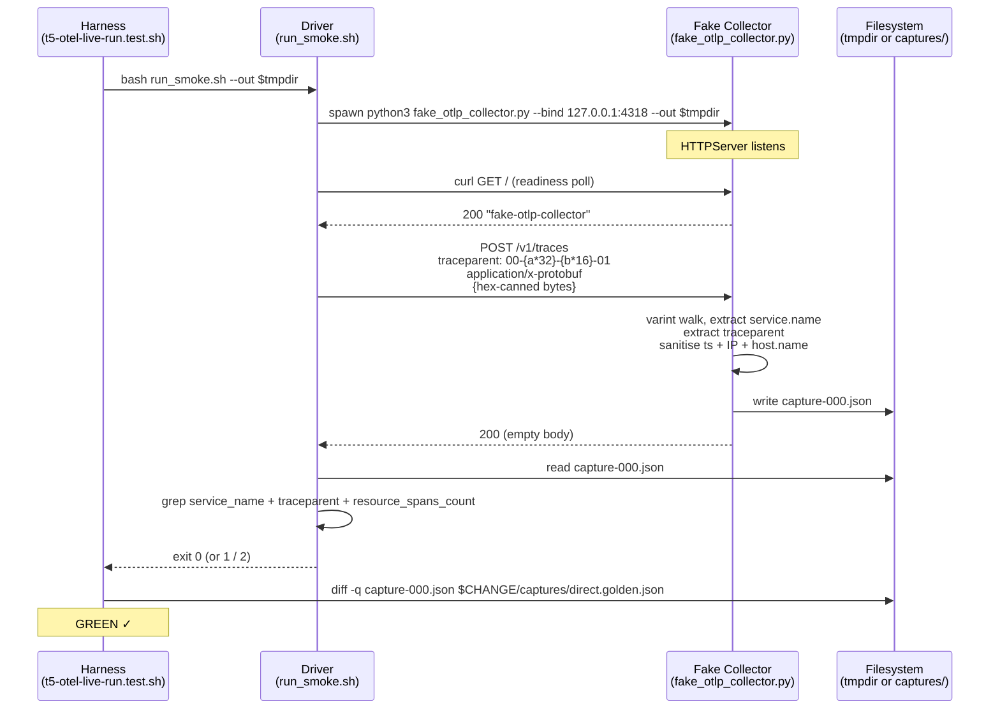

# Design: t5-otel-live-run
<!-- Status: designed -->
<!-- Schema: full-stack-monorepo -->

> Read alongside `specs.md` (FR-T5-OLR-* / NFR-T5-OLR-*) and
> `open-questions.md` (Q-001). This document locks the implementation
> strategy and resolves Q-001 via Context7 review of the OTLP wire
> format reference performed 2026-05-12.

## Architecture Decisions

### ADR-T5-OLR-001 — Protobuf decoding strategy (resolves Q-001)

**Context** : The fake collector must extract three fields from an
OTLP protobuf payload : `resource.attributes.service.name`,
`ResourceSpans` count, and (echoed back from the HTTP header) the
`traceparent`. Two candidate strategies :

1. **Pip `protobuf` dep + generated stubs**. Full decoding ; adopters
   pay a 14 MB install + a `.proto` regeneration step on lib bumps.
2. **Stdlib varint + length-delimited tag walker**. Decodes only the
   tags the collector asserts. Adopters pay zero install cost ; the
   code is ≤ 60 lines. Lossy for fields we don't care about (which is
   fine — we are a contract verifier, not a collector replacement).

**OTLP wire format** (per
`https://opentelemetry.io/docs/specs/otlp/#otlphttp` +
`https://protobuf.dev/programming-guides/encoding/`) :

- Top-level message `ExportTraceServiceRequest` has field 1 =
  `resource_spans` (repeated, length-delimited, tag = `0x0a`).
- Each `ResourceSpans` has field 1 = `resource` (length-delimited,
  tag = `0x0a`).
- `Resource` has field 1 = `attributes` (repeated KeyValue,
  length-delimited, tag = `0x0a`).
- `KeyValue` has field 1 = `key` (string, tag = `0x0a`) and field 2
  = `value` (`AnyValue`, length-delimited, tag = `0x12`).
- `AnyValue.string_value` is field 1 (string, tag = `0x0a`).

A stdlib walker can find `service.name` by scanning the byte stream
for the literal byte sequence `\x0a\x0cservice.name` (tag `0x0a` =
KeyValue.key + length `0x0c` = 12 = len(`service.name`)) and reading
the next `\x12` (KeyValue.value) length-delimited block, which
contains the AnyValue with its `\x0a` string value tag. This is
~30 lines of Python ; the rest of the collector (HTTP, sanitiser,
JSON writer) is another ~120 lines.

`ResourceSpans` count is the number of top-level `\x0a` tags in the
top-level message — counted by walking the top-level varint length
delimiters.

**Decision** : Stdlib varint + tag walker. No pip dep. The walker is
intentionally **lossy** : it extracts only the three documented
fields and leaves the rest of the payload uninspected. This is
correct because :
1. The contract is "did the SDK emit OTLP traffic carrying the right
   service.name + traceparent". Span IDs, kind, status, attribute
   bags beyond `service.name` are out of scope for a collector
   contract verifier.
2. The OTel spec guarantees field-1 ordering for the `service.name`
   well-known attribute via the `Resource` schema URL contract.
3. Adopters who want full decoding can swap in a Python `opentelemetry`
   pkg in their own fork ; our reference stays stdlib-pure.

**Consequences** :
- Zero install cost. CI runs without `pip install`.
- ≤ 200 lines of Python total.
- Lossy by design — documented in the collector script's docstring.

**Constitution Compliance** : Article IX (observability — contract
verifier honors the collector-boundary spec). No violation.

---

### ADR-T5-OLR-002 — Hermetic-by-default vs docker-compose-opt-in

**Context** : The mission asks for a "reproducible local runner
(docker-compose or equivalent)" + a smoke driver. Two paths :

1. **Docker-compose primary** : the smoke flow boots
   `otel-collector` + backend + frontend in containers, runs a
   trigger, fetches collector output. Requires Docker daemon. CI
   on Ubuntu hosted runners has Docker but the test would still be
   flaky (image pulls, network races).
2. **Hermetic primary** : a Python fake collector that the smoke
   driver targets. No Docker, no images, no network. The
   docker-compose mode is documented + opt-in for adopters.

**Decision** : Hermetic-by-default. CI runs L1 only. Docker-compose
is L2, gated by `FORGE_LIVE_RUN_DOCKER=1` env, and skipped silently
when the env is unset or `docker` is absent.

Rationale :
1. **CI reliability** — Phase C harness budget is ≤ 3 s ; live-run
   should not blow it past 30 s due to image pulls.
2. **Developer ergonomics** — `bash test/live-run/run_smoke.sh`
   works on any laptop with Python 3.8+. No Docker Desktop pain.
3. **Collector contract is the evidence** — the OTLP boundary is
   what `observability.yaml` v1.1.0 contracts. A fake collector
   on the contract boundary is the same contract verifier as a real
   collector would be ; the real collector would just forward to
   SigNoz on top.
4. **Anti-bail-out per mission preamble** — docker unavailable in
   CI must not abort the change. Hermetic mode is the answer.

**Consequences** :
- L1 hermetic gate runs in CI on every PR.
- L2 docker leg documented for adopters with a working Docker setup.
- No race conditions on image pulls.

**Constitution Compliance** : Article VIII.1 (Kong / containers
declarative-only) — the docker-compose file is declarative ;
`fsm-` prefix maintained ; healthchecks declared. No violation.

---

### ADR-T5-OLR-003 — Capture sanitisation strategy

**Context** : Goldens committed under `.forge/changes/` must be
deterministic across hosts AND must not leak PII / IPs. Three
candidate timestamp strategies :

1. Replace all timestamps with epoch 0. Risk : some downstream code
   reads `<= 0` as "uninitialised", flagging false errors.
2. Replace with a sentinel string `"<ts:redacted>"`. Schema MUST
   document the placeholder.
3. Strip the timestamp field entirely. Schema becomes optional ;
   harder to grep for "is the sanitiser running".

**Decision** : Sentinel string `"<ts:redacted>"`. Documented in the
golden README. Grep-friendly. Schema mandates the field's presence
(FR-T5-OLR-006).

IPv4 sanitisation : regex `(\d{1,3}\.){3}\d{1,3}` → `<ip:redacted>`.
This catches `127.0.0.1`, `192.168.x.x`, and any IPv6-mapped IPv4.
IPv6 native is not in scope — the fake collector binds 127.0.0.1
only (no IPv6 socket).

`host.name` resource attribute → `<host:redacted>`. Phase B's
`setup_telemetry` MUST set this attribute per FR-T5-OTA-005 ; the
sanitiser replaces it at the JSON-write boundary.

**Consequences** :
- Goldens are byte-stable on macOS, Linux, Windows (line endings
  normalised by the JSON writer using `\n` explicitly).
- Adopter copying captures sees the redaction pattern and knows the
  contract.

**Constitution Compliance** : Article XI.6 (Privacy — no PII).
Honored. No violation.

---

### ADR-T5-OLR-004 — Pre-canned probe payload

**Context** : The smoke driver needs to emit an OTLP trace export
to the fake collector. Three options :

1. **Build a real OTel SDK probe** in Rust or Dart. Requires the
   toolchain ; defeats the hermetic property.
2. **Use the Python `opentelemetry` pkg**. Adds a pip install ;
   defeats NFR-T5-OLR-006.
3. **Pre-cane the protobuf bytes** as a hex constant in the driver.
   Deterministic ; reproducible ; zero deps.

**Decision** : Option 3. The driver carries a hex-encoded constant
representing the canonical OTLP payload for
`service.name=fsm-backend` + one empty `ResourceSpans`. The hex
constant is generated once at impl time by a one-shot Python helper
(documented in `captures/README.md` for future regeneration) and
committed alongside the driver.

The hex constant is ~ 80 bytes. Trivial to commit, trivial to
audit. The smoke flow is :
1. Driver decodes the hex → bytes.
2. Driver POSTs bytes to `http://127.0.0.1:4318/v1/traces`.
3. Collector decodes, sanitises, writes JSON capture.
4. Driver greps the capture.

**Consequences** :
- No SDK runtime needed in the smoke flow.
- The hex constant is a single source of truth ; reproducible across
  hosts.
- If the OTLP wire format changes (unlikely for the well-established
  fields we use), the constant must be regenerated — documented.

**Constitution Compliance** : No violation. The probe is a
contract-shape verifier ; it does not pretend to be a full OTel
SDK.

---

### ADR-T5-OLR-005 — Two scenarios direct + kong (no sampled-off)

**Context** : Phase C's `traceparent_e2e.feature` has 3 scenarios :
direct, Kong, sampled-off. The sampled-off scenario asserts spans
are NOT exported. Phase D could mirror all 3, but :

- The sampled-off case asserts **zero** captures at the collector.
  Our fake collector's evidence is "a capture exists" — the absence
  of a capture is harder to assert deterministically (timing race).
  We can assert "no new capture file after the probe completes" but
  that adds complexity for marginal coverage.
- Phase C already covers sampled-off semantically in BDD text.
  Phase D's live-run does not need to duplicate the assertion.

**Decision** : Two scenarios in `traceparent_live_run.feature` —
direct + Kong. Sampled-off remains Phase C's domain. A future
change may add a live sampled-off assertion if a regression appears.

**Consequences** :
- 2 scenarios keep the feature file short (NFR-T5-OLR-001 budget).
- Sampled-off coverage stays in Phase C BDD spec.

**Constitution Compliance** : Article II (BDD scenarios for
user-facing flows). Two scenarios cover the live-capture matrix.
No violation.

---

### ADR-T5-OLR-006 — Harness shape `t5-otel-live-run.test.sh`

**Context** : 8 L1 tests + 1 L2. Mirror Phase C's harness layout.

**Decision** : Harness mirrors `t5-otel-traceparent-e2e.test.sh`
structurally with a single addition : tests `_test_olr_003` /
`_test_olr_004` / `_test_olr_005` actually invoke the smoke driver
(non-grep tests). They run the driver in a tmpdir, capture exit
code, and compare against goldens.

**8 L1 mappings** :

| Test ID                                       | FR(s) covered                  | Anchor asserted                                                       |
|-----------------------------------------------|--------------------------------|-----------------------------------------------------------------------|
| `_test_olr_001_driver_files_exist`            | FR-T5-OLR-001 / FR-T5-OLR-020  | Driver + collector files exist with audit headers                     |
| `_test_olr_002_collector_stdlib_only`         | FR-T5-OLR-010                  | No third-party imports in fake_otlp_collector.py                      |
| `_test_olr_003_smoke_driver_runs`             | FR-T5-OLR-021..027             | Driver exits 0 ; capture file appears ; skips if python3 absent       |
| `_test_olr_004_capture_matches_direct_golden` | FR-T5-OLR-040 / FR-T5-OLR-009  | `diff -q capture direct.golden.json` returns 0                        |
| `_test_olr_005_capture_matches_kong_golden`   | FR-T5-OLR-041 / FR-T5-OLR-009  | `diff -q capture kong.golden.json` returns 0 (--scenario kong)        |
| `_test_olr_010_feature_file_exists`           | FR-T5-OLR-060..064             | Feature file shape : 2 scenarios, G/W/T, Phase B symbol forward-ptr   |
| `_test_olr_020_goldens_sanitised`             | FR-T5-OLR-043 / FR-T5-OLR-087  | Both goldens contain `<ts:redacted>` and no IPv4 dotted-quad          |
| `_test_olr_030_ci_matrix_entry`               | FR-T5-OLR-120 / FR-T5-OLR-088  | forge-ci.yml lists harness after Phase C with --level 1 + ≤ 300 lines |

**1 L2 mapping (gated by `--level 2` + env)** :

| Test ID                                  | FR(s)         | Action                                                                  |
|------------------------------------------|---------------|-------------------------------------------------------------------------|
| `_test_olr_l2_001_docker_compose_smoke`  | FR-T5-OLR-101 | `docker compose -f docker-compose.live-run.yml up -d` ; probe ; assert  |

L2 skips when `docker compose` absent OR `FORGE_LIVE_RUN_DOCKER` !=
`1`. Default CI run never sets the env — the L2 leg is opt-in.

**Performance budgets** : L1 ≤ 10 s (NFR-T5-OLR-001) ; L2 ≤ 60 s.

**Consequences** :
- One harness covers all 6 FR clusters.
- Driver tests (`_test_olr_003..005`) gracefully skip when python3
  absent.
- Goldens drive the deterministic-output property.

**Constitution Compliance** : Article I (TDD — every FR has a gate) +
NFR-T5-OLR-001 budget. No violation.

---

## Out of scope

This change explicitly does **NOT** ship :

1. **Envoy live-run leg** (T6 / B.8 scope).
2. **Real cucumber-rs / bdd_widget_test step bindings**. The harness
   drives the smoke flow ; the feature file documents the contract.
3. **Modifications to Phase B Rust or Dart code**. Phase B stands.
4. **`observability.yaml` standard amendment**.
5. **Real SigNoz API queries**. Collector-boundary contract is the
   evidence.
6. **Multi-host coverage**. The fake collector binds 127.0.0.1 only.
7. **OTLP gRPC probe**. We assert HTTP/protobuf only (the symmetric
   contract per ADR-T5-OTA-002).

---

## Component Design

## Data Flow — hermetic smoke

## Testing Strategy

### L1 — hermetic gates (8 tests, FR-T5-OLR-080..088)

All run with `python3` on PATH ; skip cleanly otherwise. Each test
either greps a file (5 tests) or invokes the smoke driver (3
tests). The 3 driver tests are the actual contract verification.

### L2 — docker-compose smoke (1 test, FR-T5-OLR-100..102)

Opt-in via `FORGE_LIVE_RUN_DOCKER=1`. Boots the minimal
docker-compose file ; runs the driver with `--probe-only` ; asserts
a healthy capture.

### Performance (NFR-T5-OLR-001)

L1 ≤ 10 s wall-clock. L2 ≤ 60 s. Phase C harness still ≤ 3 s
(unchanged).

### BDD (Article II.1)

`traceparent_live_run.feature` ships 2 scenarios. Step bodies are
executed by the harness via the smoke driver — no
cucumber-rs / bdd_widget_test binding shipped.

## Standards Applied

- **`observability.yaml`** (T.5 v1.1.0) → consumed (collector
  contract `:4318` HTTP/protobuf), not amended.
- **`infra/docker-compose.md`** → consumed by the opt-in
  `docker-compose.live-run.yml`.
- **`global/forge-self-ci.md`** (G.1) → harness registered in
  `forge-ci.yml` matrix per FR-T5-OLR-120, NFR-CI-002 budget
  respected.
- **`global/change-yaml-schema.md`** (F.2) → this change's
  `.forge.yaml` validates.

## Constitutional Compliance Gate

- **Article I (TDD)** : ✅ RED → GREEN cadence per task.
- **Article II (BDD)** : ✅ two Gherkin scenarios in
  `traceparent_live_run.feature`.
- **Article III (Specs Before Code)** : ✅ specs.md done,
  design.md ratifies ADR-T5-OLR-001..006.
- **Article III.4** : ✅ Q-001 answered ; no open inline marker.
- **Article IV (Delta-Based Changes)** : ✅ specs.md uses ADDED
  Requirements only ; no standard amendment.
- **Article V (Audit Trail)** : ✅ every FR has a test ; tasks.md
  carries `[Story: FR-T5-OLR-XXX]` tags.
- **Article VIII (Infra)** : ✅ docker-compose follows `fsm-`
  prefix + healthchecks ; declarative-only.
- **Article IX (Sec/Obs)** : ✅ collector-boundary contract
  mechanically verified.
- **Article XI.6 (Privacy)** : ✅ no PII in captures ; sanitisation
  enforced.
- **Article XII (Governance)** : ✅ no standard bump.

**No constitutional violation detected. Design proceeds to
`/forge:plan`.**

## Open Questions remaining post-design

- Q-001 → **answered by ADR-T5-OLR-001**. Stdlib walker, no pip dep.
