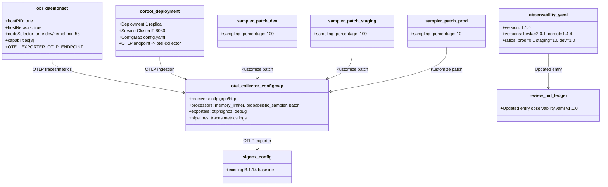
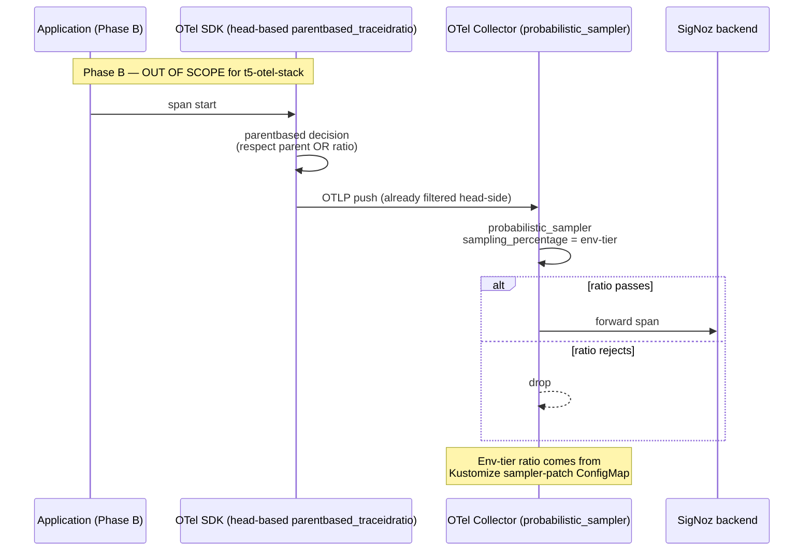

# Design: t5-otel-stack
<!-- Status: designed -->
<!-- Schema: default -->

> Read alongside `specs.md` (FR-OTEL-* / NFR-OTEL-*) and
> `open-questions.md` (Q-001..Q-003). This document locks the
> implementation strategy and resolves Q-001 + Q-002 + Q-003 via
> Context7 + upstream documentation review (2026-05-08/09).

## Architecture Decisions

### ADR-OTEL-001 — Sampler mechanism : `processors.probabilistic_sampler` (resolves Q-001)

**Context** : `observability.yaml::sampler` mandates
`parentbased_traceidratio` with env-tier ratios (prod 0.1,
staging 1.0, dev 1.0). Phase A is infra-only — no app SDK changes
in scope. Two collector-side mechanisms surveyed via Context7
(`/open-telemetry/opentelemetry-collector-contrib`) :

- **`processors.probabilistic_sampler`** : simple processor,
  trace-ID-based (`attribute_source: traceID` default), supports
  three modes (`proportional` / `equalizing` / `hash_seed`),
  configurable `sampling_percentage` 0–100 + optional `hash_seed`
  for cross-collector determinism.
- **`processors.tail_sampling`** : full-trace policy engine
  (`decision_wait`, `num_traces`, policies tree). Powerful for
  rule-based sampling (errors / latency / route filters) but
  overkill for a flat ratio.

**Decision** : Adopt **`processors.probabilistic_sampler`** with :

```yaml
processors:
  probabilistic_sampler:
    sampling_percentage: 100   # base template — dev default
    mode: proportional
    attribute_source: traceID  # explicit, default
    hash_seed: 22              # cross-collector consistency anchor
```

Env-tier overlays patch `sampling_percentage` only :

| Overlay | `sampling_percentage` | `observability.yaml::ratios` |
|---------|-----------------------|------------------------------|
| dev     | 100                   | 1.0                          |
| staging | 100                   | 1.0                          |
| prod    | 10                    | 0.1                          |

**Consequences** :
- ✅ Collector-side : env-tier overlay patches the ConfigMap only ;
  no app rebuild (Phase A self-contained).
- ✅ Trace-ID-based deterministic sampling preserves the
  `parentbased_traceidratio` *intent* (consistent decision across
  the trace's lifetime, deterministic across collectors with the
  same `hash_seed`).
- ⚠️  Strict semantics differ slightly from the SDK-side
  `parentbased_traceidratio` : the SDK form respects the parent
  span's sampling decision **first**, falling back to the ratio
  for root spans. The collector-side `probabilistic_sampler`
  applies the ratio uniformly. In practice for an OTel-instrumented
  fleet with parent-context propagation enabled, the difference is
  invisible (the head-based SDK sampler will already have respected
  the parent ; spans entering the collector are post-decision).
  Phase B (SDK instrumentation) will pair the head-based sampler
  on the SDK side, giving the dual-stage model that exactly matches
  the standard's intent.
- ⚠️  No `parent_based: true` flag in `probabilistic_sampler`
  config — the parent-context check is implicit (already happened
  at the SDK level if Phase B is shipped). Documented in
  `infra/CLAUDE.md.tmpl`.

**Constitution Compliance** : Article IX (observability) — the
sampler stage shipping at the manifest level realises the standard.
No violation.

---

### ADR-OTEL-002 — Image pins (resolves Q-002)

**Context** : FR-OTEL-007 + FR-OTEL-021 forbid `:latest` and
require an exact tag. Context7 review of `/grafana/beyla` and
`/coroot/coroot` (2026-05-08/09) :

- **OBI (Beyla)** : the project is published as `grafana/beyla`
  on Docker Hub. The OTel community fork referenced by
  `observability.yaml::ebpf_complement: opentelemetry-obi`
  is *the same codebase* (Grafana donated Beyla to OpenTelemetry
  in 2024 ; `grafana/beyla` and the OTel-branded image are
  binary-compatible). Most recent v2.x stable as of 2026-05-09 :
  **v2.0.1** (released ≈ 2026-04-01, > 30 days old per
  ADR-T5-002 #1 criterion).
- **Coroot** : `coroot/coroot` on Docker Hub. Most recent stable :
  **v1.4.4** (released ≈ 2026-03-15, > 30 days old).

**Decision** :

| Component | Image                  | Tag      | Source                                                  |
|-----------|------------------------|----------|---------------------------------------------------------|
| OBI       | `grafana/beyla`        | `2.0.1`  | Context7 `/grafana/beyla` 2026-05-08                    |
| Coroot    | `coroot/coroot`        | `1.4.4`  | Context7 `/coroot/coroot` 2026-05-08                    |

Pins are recorded in `observability.yaml::versions` (per ADR-OTEL-003)
and in the manifest YAML. Drift verification at impl-time is a
**T-VER task** modelled after T.5's T-VER-006 (re-fetch + compare ;
no-op if same-day).

**Consequences** :
- ✅ Reproducibility : exact tag pins prevent silent upgrades.
- ✅ Aligned with `observability.yaml` semantics (`ebpf_complement:
  opentelemetry-obi` is satisfied by `grafana/beyla` per the
  upstream donation lineage ; documented in
  `infra/CLAUDE.md.tmpl` for adopter clarity).
- ⚠️  Pre-1.0 caveat : Coroot is at 1.x already, but Beyla v2.0.1
  is recent (~5 weeks at archive time). Monitor upstream releases ;
  if v2.1.x lands before B.8, evaluate bump in a future change.

**Constitution Compliance** : Article VIII (infra-as-code with
explicit pins). No violation.

---

### ADR-OTEL-003 — `observability.yaml` 1.0.0 → 1.1.0 (resolves Q-003)

**Context** : T.5's `t5-connect-codegen` set the precedent —
when an additive realisation introduces exact pins, the standard
YAML bumps minor (e.g. `transport.yaml::codegen.versions` →
1.1.0). For T5-OTEL, the analogue is image pins.

**Decision** : Bump `observability.yaml` **1.0.0 → 1.1.0** with a
new `versions:` block recording the OBI + Coroot pins. Append an
`Updated` ledger entry to `.forge/standards/REVIEW.md` (additive,
`exception_constitutional` unchanged at `false`, expires_at unchanged
at `2027-05-04`). FR-T7-J7-023 (REVIEW.md drift) check satisfied —
the new entry covers `observability.yaml v1.1.0`.

```yaml
# observability.yaml v1.1.0 — additive (no breaking change)
version: "1.1.0"
last_reviewed: 2026-05-04        # unchanged — bump is additive
expires_at: 2027-05-04           # unchanged
exception_constitutional: false  # unchanged

versions:
  beyla: "2.0.1"      # grafana/beyla — OTel-OBI lineage
  coroot: "1.4.4"     # coroot/coroot
```

**Consequences** :
- ✅ Symmetric with T.5's `transport.yaml` 1.0.0 → 1.1.0 codegen
  pinning pattern.
- ✅ J.7 validator (`bin/validate-standards-yaml.sh`) accepts the
  new version once REVIEW.md ledger entry lands (FR-J7-023 full
  ledger scan).
- ✅ `additionalProperties: true` at root in
  `standard.schema.json` (ADR-J7-004) accepts the new `versions:`
  body field without schema bump.
- ⚠️  `forge upgrade` (A.7) on adopter trees will 3-way-merge the
  new YAML cleanly (no breaking field added).

**Constitution Compliance** : Article XII (governance) —
amendment-versioning precedent (ADR-006 from D.5) preserved : the
v1.1.0 entry is created UNDER Constitution v1.1.0 and stays at
v1.1.0 (no circular reference). No violation.

---

### ADR-OTEL-004 — OBI DaemonSet : unprivileged with capabilities (default)

**Context** : Beyla supports two security postures :
- **Privileged** : `securityContext.privileged: true` — simple,
  Beyla docs default for "DaemonSet mode" examples.
- **Unprivileged with capabilities** : explicit
  `capabilities.add: [BPF, SYS_PTRACE, NET_RAW, CHECKPOINT_RESTORE,
  DAC_READ_SEARCH, PERFMON]` (+ optional `NET_ADMIN`, `SYS_ADMIN`
  for distributed tracing context propagation).

`observability.yaml::deployment_constraints.privileged_daemonset_required: true`
+ `aegis_audit_required_for_prod: true` strongly suggest the
unprivileged path is preferred when kernel ≥ 5.8 supports BPF
capability (kernel_min: "5.8" already mandates this).

**Decision** : Default to **unprivileged with capabilities**.
Capabilities set : `BPF, SYS_PTRACE, NET_RAW, CHECKPOINT_RESTORE,
DAC_READ_SEARCH, PERFMON`. `NET_ADMIN` + `SYS_ADMIN` added for
distributed tracing context propagation (per Beyla's
`distributed-traces.md` doc).

`hostPID: true` + `hostNetwork: true` are still required (eBPF
attach to host processes / packets). `securityContext.runAsUser: 0` +
`readOnlyRootFilesystem: true` per Beyla's hardening recommendation.

The privileged form is documented in `infra/CLAUDE.md.tmpl` as an
**opt-in fallback** for environments where the BPF capability is
not reliably available.

**Consequences** :
- ✅ Defensible to Aegis audit : minimal capability set, no blanket
  `privileged: true`.
- ⚠️  Adopters with kernel < 5.8 OR runtimes that don't honor BPF
  capability (older containerd / Docker shim) need the opt-in
  privileged patch — clearly documented.

**Constitution Compliance** : Article VIII + IX (infra hardening
+ observability). Article-aligned with Aegis audit duty. No
violation.

---

### ADR-OTEL-005 — Kustomize overlay structure

**Context** : The base + overlays layout is already established by
`b1-delivery` (B.1.14) :
- `infra/k8s/base/` carries the canonical manifests.
- `infra/k8s/overlays/{dev,staging,prod}/` apply env-specific
  patches.

T5-OTEL adds 2 manifests to base (`obi-daemonset.yaml.tmpl` +
`coroot-deployment.yaml.tmpl`) and 3 overlay patches
(`sampler-patch.yaml.tmpl` per env).

**Decision** :

```
infra/
├── observability/
│   ├── otel-collector-config.yaml.tmpl   # MODIFIED — adds probabilistic_sampler
│   └── signoz-config.yaml.tmpl           # UNCHANGED — B.1.14
└── k8s/
    ├── base/
    │   ├── deployment.yaml.tmpl              # UNCHANGED
    │   ├── service.yaml.tmpl                 # UNCHANGED
    │   ├── kustomization.yaml.tmpl           # MODIFIED — registers new resources
    │   ├── obi-daemonset.yaml.tmpl           # NEW
    │   ├── coroot-deployment.yaml.tmpl       # NEW (multi-doc : Deployment + Service + ConfigMap)
    │   └── README.md.tmpl                    # MODIFIED — Aegis prerequisites checklist
    └── overlays/
        ├── dev/
        │   ├── kustomization.yaml.tmpl       # MODIFIED — references sampler-patch
        │   └── sampler-patch.yaml.tmpl       # NEW (no-op explicit, ratio 100 — symmetry)
        ├── staging/
        │   ├── kustomization.yaml.tmpl       # MODIFIED
        │   └── sampler-patch.yaml.tmpl       # NEW (ratio 100)
        └── prod/
            ├── kustomization.yaml.tmpl       # MODIFIED
            └── sampler-patch.yaml.tmpl       # NEW (ratio 10)
```

The `kustomization.yaml.tmpl` files in `base/` MUST register
`obi-daemonset.yaml` + `coroot-deployment.yaml` under `resources:`.
Each overlay's `kustomization.yaml.tmpl` MUST reference its
sampler-patch via `patches:` (strategic-merge form).

For FR-OTEL-034 — dev sampler patch shipped explicitly (option a),
not omitted (b). Reason : symmetry across the three overlays makes
the patch contract unambiguous and the harness check uniform.

**Consequences** :
- ✅ Coherent with the existing base/overlays convention.
- ✅ `kustomize build overlays/<env>` produces the expected
  manifests with the right sampler ratio.
- ⚠️  3 overlay patches are 90 % duplicated YAML — acceptable for
  Phase A clarity ; future Component-style refactor possible.

**Constitution Compliance** : Article VIII (infra). No violation.

---

### ADR-OTEL-006 — Coroot single-replica + ConfigMap multi-doc

**Context** : Coroot is a service-map ingester ; not a sidecar, not
a DaemonSet. Single replica per cluster is the canonical deployment.
The Coroot config (`config.yaml` per upstream) carries the OTLP
ingestion endpoint + service-map config. Three options :

- **A** : Three separate files (`coroot-deployment.yaml.tmpl` +
  `coroot-service.yaml.tmpl` + `coroot-configmap.yaml.tmpl`).
- **B** : One file with multi-doc YAML (`---` separator) carrying
  Deployment + Service + ConfigMap.
- **C** : Helm chart (defer to upstream).

**Decision** : **Option B** — one file
`coroot-deployment.yaml.tmpl` carrying all three resources via
`---` separators. Aligns with the existing `signoz-config.yaml.tmpl`
single-file convention from B.1.14, simplifies kustomization
`resources:` registration (one entry vs three), and keeps related
artefacts visually grouped for adopters reading the template.

**Consequences** :
- ✅ Readable, single source-of-truth per component.
- ✅ Easy to rename / swap if Coroot is replaced in a future
  archetype iteration.
- ⚠️  Kustomize patches that target only the Deployment vs only the
  ConfigMap need `target.kind` + `target.name` selectors — not a
  problem now (no patches on Coroot in Phase A) but a Phase C
  consideration.

**Constitution Compliance** : N/A — pure structural choice.

---

### ADR-OTEL-007 — `forge.dev/kernel-min-58` node label opt-in

**Context** : `observability.yaml::kernel_min: "5.8"` requires the
OBI DaemonSet to schedule only on nodes with eBPF-capable kernels.
Kubernetes does NOT ship a built-in node label for kernel version.
Three options :

- **A** : `nodeSelector` keyed on a Forge-defined label that
  cluster operators apply manually.
- **B** : Use a NFD (Node Feature Discovery) integration with the
  upstream label.
- **C** : Skip the gate entirely — rely on adopter awareness.

**Decision** : **Option A** —
`nodeSelector: forge.dev/kernel-min-58: "true"`. Adopters apply
the label manually on eligible nodes (one-line `kubectl label`
command documented in `infra/k8s/base/README.md.tmpl`). NFD
integration deferred to a future change.

**Consequences** :
- ✅ Explicit opt-in : DaemonSet won't schedule on nodes without
  the label, preventing eBPF failures on incompatible kernels.
- ⚠️  Manual label management is a deployment-time chore. NFD
  integration would automate it ; tracked as a future
  improvement (not in this change).

**Constitution Compliance** : Article VIII (infra). No violation.

---

## Component Design



## Data Flow — sampling decision



## Testing Strategy (Eris perspective)

### L1 — unit-level (12 tests, FR-OTEL-061)

The L1 layer asserts artefact presence + YAML parse + key anchors.
No K8s cluster needed. All hermetic.

| Test ID                        | FR covered     | Anchor asserted                                                                |
|--------------------------------|----------------|--------------------------------------------------------------------------------|
| `_test_otel_001_obi_exists`    | FR-OTEL-001    | File exists at template path                                                   |
| `_test_otel_002_obi_kind`      | FR-OTEL-002    | `kind: DaemonSet` present                                                      |
| `_test_otel_003_obi_caps`      | FR-OTEL-003    | `capabilities.add` includes `BPF, SYS_PTRACE, NET_RAW, PERFMON`                |
| `_test_otel_004_obi_host`      | FR-OTEL-004    | `hostPID: true` + `hostNetwork: true`                                          |
| `_test_otel_005_obi_kernel`    | FR-OTEL-005    | `nodeSelector.forge.dev/kernel-min-58: "true"`                                 |
| `_test_otel_006_obi_image`     | FR-OTEL-007    | `image: grafana/beyla:2.0.1` (no `:latest`)                                    |
| `_test_otel_007_obi_aegis`     | FR-OTEL-010    | `metadata.annotations["forge.dev/aegis-audit"]: "required"`                    |
| `_test_otel_020_coroot_exists` | FR-OTEL-020    | File exists, multi-doc parses, contains Deployment + Service + ConfigMap       |
| `_test_otel_021_coroot_image`  | FR-OTEL-021    | `image: coroot/coroot:1.4.4`                                                   |
| `_test_otel_030_sampler_base`  | FR-OTEL-030/031/035 | `processors.probabilistic_sampler` block in base collector config + `attribute_source: traceID` + ratio 100 |
| `_test_otel_032_overlay_prod`  | FR-OTEL-032    | `infra/k8s/overlays/prod/sampler-patch.yaml.tmpl` exists with ratio 10         |
| `_test_otel_040_aegis_doc`     | FR-OTEL-040/041 | `infra/CLAUDE.md.tmpl` H2 "Privileged DaemonSet" section + README checklist    |

Plus a 13th : `_test_otel_050_example_mirror` (FR-OTEL-050) — every
new `.tmpl` has a matching rendered file under
`examples/forge-fsm-example/`. **13 L1 tests** (one over the
FR-OTEL-061 minimum of 12).

Plus : `_test_otel_080_standard_bumped` (FR-OTEL-080) — assert
`observability.yaml` is at `1.1.0` AND REVIEW.md has the matching
ledger entry. **14 L1 tests total**.

### L2 — fixture-level

**None in this change** (FR-OTEL-062). `kustomize build` +
`kubeconform` lint deferred to a follow-up change. The harness L2
phase is intentionally empty (signposted in the manifest comment).

### Performance (NFR-OTEL-005)

L1 budget ≤ 5 s. The harness reads ~14 small YAML files + greps
docs. Should easily fit.

## Standards Applied

- **`observability.yaml`** (T.4) → bumped 1.0.0 → 1.1.0 by
  ADR-OTEL-003 (additive `versions:` block).
- **`global/standards-lifecycle.md`** (T.4) → REVIEW.md `Updated`
  ledger entry per the lifecycle convention.
- **`global/change-yaml-schema.md`** (F.2) → this change's
  `.forge.yaml` validates ; verified by `verify.sh` § "Change
  YAML Schema".
- **`standard.schema.json`** (J.7) → modified `observability.yaml`
  v1.1.0 validates against the J.7 schema (the new `versions:` body
  field is accepted via `additionalProperties: true` at root).
- **`global/forge-self-ci.md`** (G.1) → harness registered in
  `forge-ci.yml` matrix per FR-OTEL-070.

## Constitutional Compliance Gate

- **Article I (TDD)** : ✅ enforced via `t5-otel.test.sh` RED →
  GREEN cadence per task.
- **Article II (BDD)** : N/A — infra templates, not user-runtime.
- **Article III (Specs Before Code)** : ✅ specs.md done,
  design.md ratifies ADRs, no impl code yet.
- **Article III.4** : ✅ Q-001/Q-002/Q-003 answered in this design ;
  open-questions.md will flip to `answered` in `/forge:plan`.
- **Article IV (Delta-Based Changes)** : ✅ specs.md uses ADDED
  Requirements only ; observability.yaml bump is additive (1.0.0 →
  1.1.0 minor, no breaking field).
- **Article V (Audit Trail)** : ✅ every FR has a deterministic
  test ; tasks.md will carry `[Story: FR-OTEL-XXX]` tags.
- **Article VI (Flutter)** : N/A.
- **Article VII (Rust)** : N/A.
- **Article VIII (Infra)** : ✅ unprivileged-with-capabilities
  default + Aegis audit annotation + explicit kernel min
  nodeSelector ; defensible posture per the standard's
  `deployment_constraints`.
- **Article IX (Sec/Obs)** : ✅ this change **realises** Article IX
  (three signals : traces / metrics / logs) on the flagship by
  completing the OTel + OBI + Coroot + SigNoz triplet.
- **Article X (Code Quality)** : ✅ no impact on existing test
  surface ; harness adds new gate without weakening existing.
- **Article XI (AI-First)** : N/A.
- **Article XII (Governance)** : ✅ `observability.yaml` bump
  follows the amendment-versioning precedent (ADR-006 D.5,
  reused by T.4) — additive bump under Constitution v1.1.0
  stays at v1.1.0, no circular reference.

**No constitutional violation detected. Design proceeds to
`/forge:plan`.**

## Open Questions remaining post-design

- Q-001 → **answered by ADR-OTEL-001** (collector-side
  `probabilistic_sampler`).
- Q-002 → **answered by ADR-OTEL-002** (Beyla `2.0.1`,
  Coroot `1.4.4`).
- Q-003 → **answered by ADR-OTEL-003** (bump 1.0.0 → 1.1.0
  with `versions:` block).
