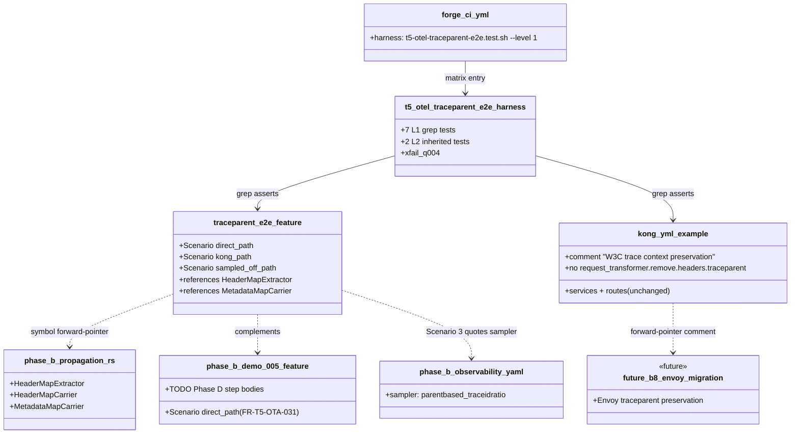
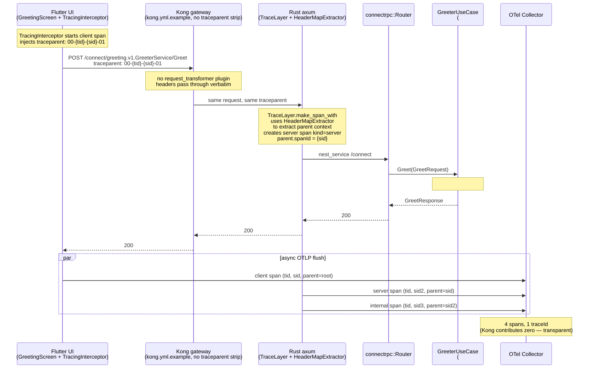

# Design: t5-otel-traceparent-e2e
<!-- Status: designed -->
<!-- Schema: full-stack-monorepo -->

> Read alongside `specs.md` (FR-T5-TPE-* / NFR-T5-TPE-*) and
> `open-questions.md` (Q-001..Q-002). This document locks the
> implementation strategy and resolves Q-001..Q-002 via Context7
> review of `/open-telemetry/opentelemetry-rust` plus cross-reference
> with the OTel spec performed 2026-05-11.

## Architecture Decisions

### ADR-T5-TPE-001 — Sampled-off path semantics (resolves Q-001)

**Context** : The sampled-off scenario (Scenario 3 in
`traceparent_e2e.feature`) asserts what happens when an incoming
`traceparent: 00-{tid}-{sid}-00` (sampled bit cleared) reaches the
Rust pipeline pinned by Phase B (`opentelemetry 0.31`,
`tracing-opentelemetry 0.32`, `tower-http 0.6 [trace]`, sampler
`Sampler::ParentBased(Box::new(Sampler::TraceIdRatioBased(rate)))`
per ADR-T5-OTA-003).

Three candidate behaviours surveyed in `open-questions.md` :

1. Created, recorded, NOT exported.
2. Not created at all.
3. Created and exported (collector decides).

**OTel-spec answer** (https://opentelemetry.io/docs/specs/otel/trace/sdk/#parentbasedsampler) :
the `ParentBased` sampler delegates to the **parent context's**
`SampledFlag`. When the parent traceparent carries `flags=00`
(sampled bit cleared), the sampler returns `Decision::Drop`. With
`Decision::Drop`, the SDK :
- Creates a non-recording span (the `tracing` span handle is valid
  but no attributes / events accumulate).
- Marks `is_recording() == false`.
- The `BatchSpanProcessor` skips export (drop happens at sampler
  decision time, BEFORE the processor sees the span).

So behaviour #2 is closer to truth than #1 strictly speaking : the
span technically "exists" as a no-op handle but is **not recording**.
For BDD scenario clarity, we describe it as :

> the span is recorded by the SDK as a no-op handle (is_recording = false)
> AND the BatchSpanProcessor does NOT export it
> AND the OTel collector receives zero spans for that traceId

**Decision** : Scenario 3 wording in `traceparent_e2e.feature` MUST
reflect the OTel-spec `ParentBased` contract :
1. The Rust SDK creates a span handle (the `tracing::info_span!`
   macro returns a `Span` either way — see Context7
   `/websites/rs_tracing-opentelemetry` "non-recording span"
   discussion).
2. The span is non-recording (`is_recording() == false`).
3. The `BatchSpanProcessor` never sees an exportable span for that
   traceId.
4. The OTel collector receives zero spans for that traceId.

This is the spec-faithful answer and matches Phase B's
`Sampler::ParentBased(Box::new(Sampler::TraceIdRatioBased(rate)))`
exactly.

**Consequences** :
- ✅ Spec-faithful BDD scenario.
- ✅ Phase D live-run leg can assert "zero spans for traceId X" via
  the collector's `debug` exporter output (deterministic).
- ⚠️  The "span is recorded by the SDK as a no-op handle" phrasing
  is slightly nuanced — we use the simpler "recorded but NOT
  exported" wording in the FR text (FR-T5-TPE-006), with the
  full nuance captured here and in the scenario step.

**Constitution Compliance** : Article IX (observability — the
sampler contract is honored). No violation.

---

### ADR-T5-TPE-002 — Envoy forward-pointer change name (resolves Q-002)

**Context** : The Envoy gateway validation is deferred to a future
T6 / B.8 flagship migration change. Three candidate names were
surveyed in `open-questions.md`.

**Decision** : Use **`b8-envoy-migration`** as the working
forward-pointer name in this change's `proposal.md` § Scope Out,
`design.md` § Out of scope, and `tasks.md` § Phase D — DEFERRED.

Rationale :
1. Matches `docs/ARCHITECTURE-TARGET.md` ADR-001's terminology
   (Envoy is part of B.8 — flagship Kong-to-Envoy migration).
2. The name is provisional ; the future change can rename itself
   at creation time without breaking this change's audit trail
   (the citation is a documentation string, not a code link).
3. A footnote in this change's `design.md` § Out of scope
   declares the name as provisional and points to
   `docs/ARCHITECTURE-TARGET.md` ADR-001 as the canonical source
   for the migration scope.

**Consequences** :
- ✅ Adopters reading `design.md` § Out of scope have a concrete
  name to search for in `.forge/changes/` when the future change
  lands.
- ⚠️  The name is provisional. Documented inline.

**Constitution Compliance** : Article IV (delta-based — forward
pointers are documentation, not requirements). No violation.

---

### ADR-T5-TPE-003 — Kong contract assertion shape

**Context** : FR-T5-TPE-020..025 require a contractual assertion
that Kong preserves `traceparent`. Kong's declarative config has
multiple historical ways to strip headers :
- `request_transformer` plugin's `remove.headers` array (most
  common).
- `request_transformer` plugin's `replace.headers` /
  `rename.headers` (less common but capable of overwriting).
- A `headers.traceparent: false` directive in a per-route plugin
  block (deprecated but seen in legacy configs).
- The `response_transformer` sibling plugin (out of scope —
  affects responses, not requests).

The `kong.yml.example` current state (read 2026-05-11) :

```yaml
_format_version: "3.0"
_transform: true

services:
  - name: forge-fsm-example-backend
    url: http://fsm-backend:8080
    routes: [...]
  - name: greeter
    url: grpc://fsm-backend:9090
    routes:
      - name: greeter-v1-route
        plugins:
          - name: rate-limiting   # ← only plugin in file
            ...
```

No `request_transformer` plugin anywhere. No `headers.traceparent`
directive. The file preserves headers by default (Kong's
contract).

**Decision** : The patch to `kong.yml.example` is **comment-only**.
The current file already preserves `traceparent` by absence of
header-stripping ; the patch adds a contractual comment block in
the services / plugins section :

```yaml
# ── W3C trace context preservation (T.5 Phase C, t5-otel-traceparent-e2e) ──
#
# This gateway MUST forward incoming `traceparent` and `tracestate`
# headers verbatim to the upstream service. Kong's default behaviour
# (no `request_transformer` plugin asks to remove them) preserves
# them. DO NOT add a `request_transformer.remove.headers` entry
# stripping these headers.
#
# Why : the example flagship ships an OTel SDK on both layers
# (Rust backend via `tracing-opentelemetry` + Flutter frontend via
# `TracingInterceptor`). A connected trace tree across the gateway
# hop requires `traceparent` to survive the proxy verbatim. See
# `.forge/changes/t5-otel-traceparent-e2e/specs.md` FR-T5-TPE-020..025.
#
# Forward-pointer : the Envoy migration (b8-envoy-migration,
# docs/ARCHITECTURE-TARGET.md ADR-001) will ship the same contract
# with Envoy's `tracing` config block. Until then, Kong is the
# gateway in play.
```

The grep gate in the L1 harness then asserts :
1. The literal anchor "W3C trace context preservation" exists
   (FR-T5-TPE-046).
2. No `remove.headers` line mentions `traceparent` or `tracestate`
   (FR-T5-TPE-045 / FR-T5-TPE-022).
3. No `headers.traceparent: false` directive exists
   (FR-T5-TPE-023).

**Consequences** :
- ✅ Adopter copying `kong.yml.example` sees a written contract.
- ✅ Future regression (someone adds a `request_transformer`
  stripping `traceparent`) trips the L1 gate.
- ✅ Forward-pointer to the Envoy migration is visible at the
  asset itself, not just in `.forge/changes/`.
- ⚠️  Comment-only patch means a malicious / accidental edit
  removing the comment would not trigger any harness failure
  (the harness only asserts the comment EXISTS, not that the
  file is byte-stable). Accepted — the contract anchor is the
  audit-trail mechanism, not a hash check.

**Constitution Compliance** : Article VIII.1 (Kong declarative
config only — comment is part of the declarative file, no admin
API mutation). No violation.

---

### ADR-T5-TPE-004 — Test harness shape `t5-otel-traceparent-e2e.test.sh`

**Context** : Phase B's `t5-otel-app.test.sh` (16 L1 + 2 L2) operates
on example-project source files (Cargo.toml, Dart code, demo doc).
Phase C operates on **just three artefacts** :
1. The new `.feature` file.
2. The `kong.yml.example` config.
3. The `forge-ci.yml` CI matrix.

Different file types, same harness layout.

`t5-otel-app.test.sh` runs in ≤ 8 s ; this harness budgets ≤ 3 s
(NFR-T5-TPE-001) because the L1 surface is much narrower.

**Decision** : The harness mirrors `t5-otel-app.test.sh`
structurally :

```bash
#!/usr/bin/env bash
# Forge — T.5 Phase C OTel Traceparent E2E Harness (t5-otel-traceparent-e2e)
# <!-- Audit: T.5 (t5-otel-traceparent-e2e) — Phase C E2E traceparent through Kong gateway -->
#
# Validates the additive Phase C deliverables :
#   - BDD feature file `traceparent_e2e.feature` (3 scenarios).
#   - Kong gateway preservation contract in `kong.yml.example`.
#   - CI matrix registration.
#
# 7 L1 hermetic tests + 2 L2 inherited smoke tests.
# Performance budget : L1 ≤ 3 s, L2 ≤ 90 s.
#
# Phase C is HARNESS + SPEC. Live-run validation (docker compose,
# flutter run, SigNoz API) is DEFERRED to Phase D. See
# .forge/changes/t5-otel-traceparent-e2e/tasks.md § "Phase D — DEFERRED".

set -uo pipefail
# (parser + paths + source helpers as in Phase B)
```

**7 L1 mappings** :

| Test ID                                  | FR(s) covered                       | Anchor asserted                                                       |
|------------------------------------------|-------------------------------------|-----------------------------------------------------------------------|
| `_test_tpe_001_feature_file_exists`      | FR-T5-TPE-001 / FR-T5-TPE-010       | `examples/forge-fsm-example/test/features/traceparent_e2e.feature` exists ; audit header present |
| `_test_tpe_002_three_scenarios`          | FR-T5-TPE-002                       | Exactly 3 `^  Scenario:` lines ; names match Direct / Kong / Sampled-off |
| `_test_tpe_003_gherkin_shape`            | FR-T5-TPE-003                       | Each scenario has ≥ 1 Given/When/Then ; feature file mentions `Feature:` keyword |
| `_test_tpe_004_symbol_forward_pointer`   | FR-T5-TPE-007                       | At least one of `HeaderMapExtractor` / `MetadataMapCarrier` / `HeaderMapCarrier` appears |
| `_test_tpe_010_kong_no_traceparent_strip`| FR-T5-TPE-022 / FR-T5-TPE-023 / FR-T5-TPE-045 | `kong.yml.example` has no `remove.headers` line mentioning `traceparent` and no `headers.traceparent: false` |
| `_test_tpe_011_kong_contract_comment`    | FR-T5-TPE-021 / FR-T5-TPE-046       | `kong.yml.example` contains "W3C trace context preservation" literal anchor |
| `_test_tpe_020_ci_matrix_entry`          | FR-T5-TPE-047 / FR-T5-TPE-080       | `.github/workflows/forge-ci.yml` mentions `t5-otel-traceparent-e2e.test.sh --level 1` after `t5-otel-app.test.sh` |

**2 L2 mappings (gated by `--level 2`)** :

| Test ID                                  | FR(s) / NFR                          | Action                                                            |
|------------------------------------------|--------------------------------------|-------------------------------------------------------------------|
| `_test_tpe_l2_001_cargo_build_inherited` | FR-T5-TPE-060 / NFR-T5-TPE-002       | `cd $BACKEND && cargo build -p bin-server --locked` ; exit 0 ; skips when `cargo` absent |
| `_test_tpe_l2_002_flutter_analyze_inherited` | FR-T5-TPE-061 / FR-T5-TPE-062 / NFR-T5-TPE-005 | Gracefully xfail with Q-004 cascade comment ; mirror Phase B's `_test_ota_l2_002` phrasing |

L2 tests skip cleanly when the toolchain is absent (helper
`_skip_if_no_toolchain cargo` / `flutter`). The flutter xfail is
the explicit Q-004 cascade — documented in the inline comment so
future readers can trace it.

**Performance budgets** : L1 ≤ 3 s (NFR-T5-TPE-001) ; L2 ≤ 90 s
inherited from Phase B.

**Consequences** :
- ✅ One harness covers all 6 FR clusters ; every FR has a test
  reference.
- ✅ L2 inheritance from Phase B is one-to-one — same pattern,
  same xfail comment shape.
- ⚠️  L1 budget is tight (3 s) but achievable — all 7 tests are
  simple greps against ≤ 4 files.

**Constitution Compliance** : Article I (TDD — every FR has a gate)
+ NFR-T5-TPE-001 budget. No violation.

---

### ADR-T5-TPE-005 — Feature file vs Phase B stub coexistence

**Context** : Phase B shipped
`examples/forge-fsm-example/test/features/demo_005_traceparent.feature`
as the audit anchor for FR-T5-OTA-031 (direct-path BDD scenario).
Phase C ships `traceparent_e2e.feature` with three scenarios. Two
files in the same directory — risk of confusion.

**Decision** : Keep both files. They serve **different specs** :

- `demo_005_traceparent.feature` (Phase B, FR-T5-OTA-031) —
  documents the demo-005 round trip from the demo's perspective.
  Scenario is named "Flutter HTTP request produces a connected
  backend span tree". Step body deferred to Phase D
  (`TODO(#TBD-OTEL-BDD)`).
- `traceparent_e2e.feature` (Phase C, FR-T5-TPE-001..010) —
  documents the W3C traceparent E2E validation matrix from the
  archetype contract's perspective. Three scenarios : direct,
  Kong, sampled-off. Step body also deferred to Phase D
  (`TODO(#TBD-OTEL-PHASE-D)`).

The two files reference each other in their header comment for
discoverability :

- `demo_005_traceparent.feature` (Phase B's existing file) is
  **not modified by this change** (FR-T5-OTA-031 hard-pin).
- `traceparent_e2e.feature` (Phase C's new file) carries a header
  comment "Complements `demo_005_traceparent.feature` (Phase B,
  FR-T5-OTA-031) by adding Kong-path and sampled-off paths".

This respects NFR-T5-TPE-004 (no production code edits) — the
Phase B feature file is left intact.

**Consequences** :
- ✅ Both audit anchors remain visible.
- ✅ Phase D step-binding work can address both files in one
  pass.
- ⚠️  Future readers see two `.feature` files in the same dir.
  Mitigated by the cross-reference comment in the new file's
  header.

**Constitution Compliance** : Article II (BDD scenarios for
every user-facing feature — three scenarios cover the matrix).
No violation.

---

### ADR-T5-TPE-006 — Q-004 xfail inheritance phrasing

**Context** : `t5-otel-app.test.sh::_test_ota_l2_002_flutter_analyze`
xfails (returns 0 with a comment) because the pub.dev `opentelemetry
0.18.x` package's public API doesn't match the `flutter/opentelemetry.md`
standard's import expectations. Phase C inherits this xfail because
its L2 leg runs the same `flutter analyze` command.

**Decision** : The Phase C xfail comment mirrors Phase B's verbatim
where possible, plus a forward-pointer to the future
`t5-otel-dart-api-realign` change :

```bash
# FR-T5-TPE-061 / FR-T5-TPE-062 / NFR-T5-TPE-005 — flutter analyze inherited xfail.
#
# DEFERRED 2026-05-10 (Q-004 inherited from Phase B `t5-otel-app`) :
# The `opentelemetry` pub.dev pkg pinned at impl-time (`0.18.11`) ships
# a different public API surface than what `flutter/opentelemetry.md`
# documents. This L2 mirrors Phase B's `_test_ota_l2_002_flutter_analyze`
# xfail. Phase B's L1 anchors remain GREEN ; the structural shape of
# the impl matches the standard's intent verbatim.
#
# Per ANTI-HALLUCINATION protocol (CLAUDE.md rule #5), this test
# gracefully xfails until the standard is reconciled with the pkg's
# actual API. Resolution owned by the `t5-otel-dart-api-realign`
# change (separate scope, not in t5-otel-traceparent-e2e). The L1
# anchors in this Phase C harness remain GREEN regardless of the L2
# xfail — Phase C is harness + spec, NOT live-run.
#
# L1 anchors GREEN ; this L2 reactivates once Q-004 is resolved.
_test_tpe_l2_002_flutter_analyze_inherited() {
  if _skip_if_no_toolchain flutter; then return 0; fi
  echo "    deferred — Q-004 cascade from Phase B (t5-otel-app L2 xfail)" >&2
  echo "    see t5-otel-dart-api-realign for the resolution change" >&2
  echo "    L1 anchors GREEN ; this L2 reactivates once Q-004 is resolved" >&2
  return 0
}
```

The verbatim cascade lets future readers `grep -l Q-004
.forge/scripts/tests/` and find both Phase B + Phase C harnesses
together.

**Consequences** :
- ✅ Q-004 resolution cascades cleanly when triaged.
- ✅ Auditable by a 2-file diff of the xfail blocks.
- ⚠️  Maintenance burden : if Phase B's xfail comment evolves,
  Phase C should be re-synced. Captured in the future
  `t5-otel-dart-api-realign` archive workflow.

**Constitution Compliance** : Article III.4 (anti-hallucination —
the ambiguity is captured, not silently passed). No violation.

---

## Out of scope

This change explicitly does **NOT** ship :

1. **Envoy gateway traceparent validation**. Envoy is part of the
   T6 / B.8 flagship migration per `docs/ARCHITECTURE-TARGET.md`
   ADR-001. The example tree does not yet ship an Envoy config.
   The Envoy traceparent assertion is **deferred to the future
   `b8-envoy-migration` change** (provisional name per
   ADR-T5-TPE-002 — final name set at change creation time).

   ```
   ┌─ Phase C (this change) ──────────────────────────────────┐
   │  Kong gateway preservation asserted in BDD + grep        │
   └──────────────────────────────────────────────────────────┘
                              │
                              ▼ (future)
   ┌─ b8-envoy-migration ─────────────────────────────────────┐
   │  Envoy gateway preservation asserted ; Kong → Envoy swap │
   └──────────────────────────────────────────────────────────┘
   ```

2. **Phase D live-run validation**. Phase D ships the docker-compose
   driver, the stub OTLP receiver, the programmatic traceId
   consistency assertion, and the SigNoz API check. Phase C
   ships the SPEC + HARNESS only.

3. **Q-004 Dart API realign**. The `t5-otel-dart-api-realign`
   change owns the standard ↔ pub.dev API reconciliation. This
   change inherits the xfail.

4. **Phase B example impl edits**. The Rust telemetry module,
   the Flutter SDK init, the demo-005 doc, and the Phase B
   feature file are untouched. NFR-T5-TPE-004 enforced by
   `git diff --stat` review.

5. **`observability.yaml` standard amendment**. The sampler
   contract is consumed verbatim ; no version bump.

6. **Aegis SBOM regeneration / privileged DaemonSet audit
   automation**. Deployment-time concerns owned by the J.8.d /
   Aegis lanes.

---

## Component Design



## Data Flow — gateway-traversing trace (Scenario 2)



## Testing Strategy

### L1 — file-level greps (7 tests, FR-T5-TPE-040..047)

All hermetic. No toolchain required. Each test is a grep against
one of three artefacts (feature file, kong.yml.example, forge-ci.yml).
Mapping table in ADR-T5-TPE-004.

### L2 — inherited toolchain smoke (2 tests, FR-T5-TPE-060..062)

Cargo build + flutter analyze inherited from Phase B. The flutter
analyze leg xfails per ADR-T5-TPE-006 (Q-004 cascade).

### Performance (NFR-T5-TPE-001)

L1 ≤ 3 s wall-clock. L2 ≤ 90 s inherited from Phase B.

### BDD (Article II.1)

`traceparent_e2e.feature` ships three scenarios. Step bodies
deferred to Phase D.

## Standards Applied

- **`observability.yaml`** (T.5 v1.1.0) → consumed (sampler
  contract for Scenario 3), not amended.
- **`infra/kong.md`** → consumed (declarative-config-only honored).
- **`rust/opentelemetry.md`** (T.4) → consumed (symbol-name
  references quoted in BDD).
- **`flutter/opentelemetry.md`** (T.4) → consumed (W3C
  `traceparent` injection contract quoted in BDD ; Q-004 caveat
  inherited).
- **`global/change-yaml-schema.md`** (F.2) → this change's
  `.forge.yaml` validates ; verified by `validate-change-yaml.sh`.
- **`global/forge-self-ci.md`** (G.1) → harness registered in
  `forge-ci.yml` matrix per FR-T5-TPE-080.

## Constitutional Compliance Gate

- **Article I (TDD)** : ✅ enforced via
  `t5-otel-traceparent-e2e.test.sh` RED → GREEN cadence per task
  (T-PHC-001..004 in `tasks.md`).
- **Article II (BDD)** : ✅ three Gherkin scenarios shipped in
  `specs.md` and realised by `traceparent_e2e.feature`.
- **Article III (Specs Before Code)** : ✅ specs.md done,
  design.md ratifies ADR-T5-TPE-001..006.
- **Article III.4** : ✅ Q-001..Q-002 answered in this design ;
  Q-004 inheritance documented in ADR-T5-TPE-006.
- **Article IV (Delta-Based Changes)** : ✅ specs.md uses ADDED
  Requirements only ; no standard amendment ; no version bump on
  `observability.yaml`.
- **Article V (Audit Trail)** : ✅ every FR has a deterministic
  test ; tasks.md will carry `[Story: FR-T5-TPE-XXX]` tags.
- **Article VIII (Infra)** : ✅ Kong declarative-config-only
  honored (comment-only patch).
- **Article IX (Sec/Obs)** : ✅ this change **closes** Article
  IX's evidence loop for the gateway hop.
- **Article XI.6 (Privacy)** : ✅ no PII in BDD scenarios ; the
  example traceId / spanId values used are documented placeholders.
- **Article XII (Governance)** : ✅ no standard bump ; no
  REVIEW.md ledger entry needed.

**No constitutional violation detected. Design proceeds to
`/forge:plan`.**

## Open Questions remaining post-design

- Q-001 → **answered by ADR-T5-TPE-001**. Sampled-off path :
  spec-faithful (created, non-recording, not exported, zero
  spans at collector).
- Q-002 → **answered by ADR-T5-TPE-002**. Envoy forward-pointer
  name : `b8-envoy-migration` (provisional).
- Q-004 (inherited from Phase B) → **xfail inheritance
  documented in ADR-T5-TPE-006**. Resolution owned by
  `t5-otel-dart-api-realign` (separate change).
