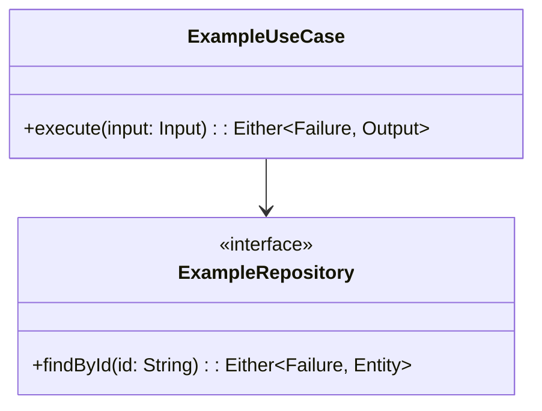
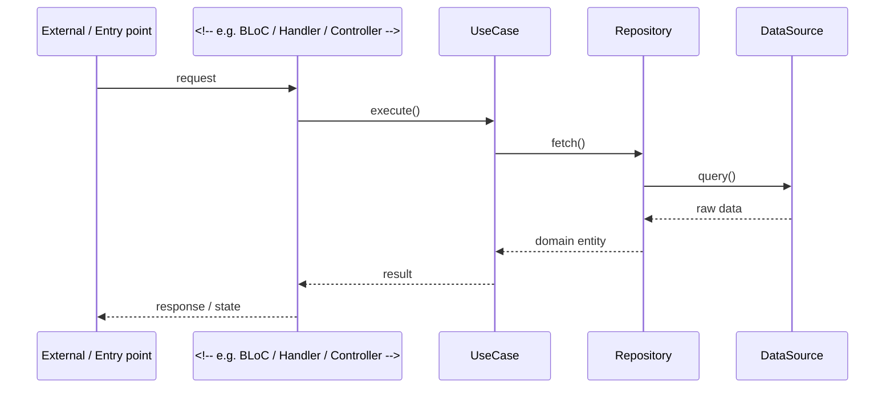

<!-- Audit: B.1.6 (part of b1-workflow, per-layer design template) -->
<!-- Layer: <layer-id> — replace <layer-id> with backend / frontend / infra when copying -->

# Design: <change-name> (<layer-id>)

## Cross-Layer References

<!-- FIRST section, required by FR-GL-020. List the FR-GL-* requirements this layer's
     slice satisfies and link back to the main specs.md for end-to-end traceability. -->

- This layer's slice of `<change-name>` satisfies **FR-GL-XXX** parts [a], [b].
- Full requirement set: see `.forge/changes/<change-name>/specs.md`.
- Sibling per-layer designs: <!-- e.g. design-backend.md, design-frontend.md -->
- Cross-layer contract authority: Hermes-API (for any shared proto changes).

## Architecture Decisions

### ADR-001: <!-- Decision title scoped to <layer-id> -->

- **Context**: <!-- Why this decision is needed within this layer -->
- **Options Considered**:
  - Option A: <!-- description + trade-offs -->
  - Option B: <!-- description + trade-offs -->
- **Decision**: <!-- What was chosen -->
- **Consequences**: <!-- What becomes easier/harder within this layer -->
- **Constitution Compliance**: Article <!-- N --> — <!-- how it complies -->

<!-- Add more ADRs as needed for this layer -->

## Component Design

<!-- Mermaid class/component diagram scoped to <layer-id> only.
     Do NOT include components owned by sibling layers. -->

## Data Flow

<!-- Mermaid sequence diagram for the primary flow within this layer.
     Show the layer boundary clearly; external calls leave the diagram as
     "ExternalLayer" participant with a note. -->

## Testing Strategy

<!-- Per-layer test pyramid. Adjust tools column to match the layer:
     backend/  → cargo test, cucumber-rs, criterion
     frontend/ → flutter_test, bloc_test, bdd_widget_test, golden_toolkit
     infra/    → docker compose config, YAML lint, integration smoke -->

| Test Type    | What to Test                          | Tools                          | Coverage Target  |
|--------------|---------------------------------------|--------------------------------|-----------------|
| Unit         | Use cases, domain logic, mappers      | <!-- layer test runner -->     | 100% domain      |
| Integration  | <!-- repository / adapter layer -->   | <!-- layer integration tool --> | Key paths        |
| BDD          | User journeys touching this layer     | <!-- layer BDD tool -->        | All FR with AC   |
| Performance  | <!-- hot paths, bench targets -->     | <!-- bench tool if any -->     | No regressions   |

## Standards Applied

<!-- List the standards loaded via this layer's nested CLAUDE.md (from the archetype
     template) and document how each one applies to this specific design. -->

| Standard                      | How Applied Here                                      |
|-------------------------------|------------------------------------------------------|
| `global/tdd-rules`            | <!-- TDD protocol: RED → GREEN cycles planned -->    |
| `global/bdd-rules`            | <!-- BDD scenarios scoped to this layer's FRs -->    |
| `global/multi-layer-workflow` | <!-- Cross-layer contract alignment rules followed -->|
| `<!-- layer standard -->`     | <!-- e.g. flutter/architecture or rust/architecture -->|

## Security Considerations

<!-- Layer-scoped Aegis review items. Focus on what THIS layer owns:
     backend  → auth checks, SQL injection, secrets, domain-purity
     frontend → XSS surface, deep-link validation, local storage
     infra    → network exposure, image provenance, secret injection -->

- <!-- Item 1: describe the risk and the mitigation -->
- <!-- Item 2 -->
- **Aegis verdict**: <!-- PASS / PENDING / flag for review -->

## Observability Plan

<!-- Spans, metrics, and logs emitted by this layer only.
     Cross-layer trace propagation (W3C TraceContext) is documented
     in the main design.md cross-layer section. -->

- **Traces**: <!-- span names to create, e.g. "layer.use_case.execute" -->
- **Metrics**: <!-- counters/histograms to emit, e.g. "layer.requests.total" -->
- **Logs**: <!-- what to log, at which level (INFO / WARN / ERROR), and why -->
