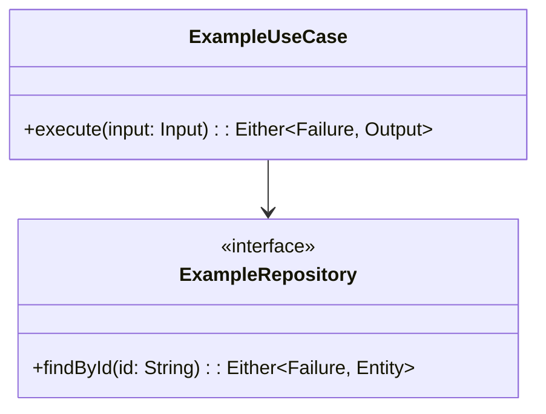
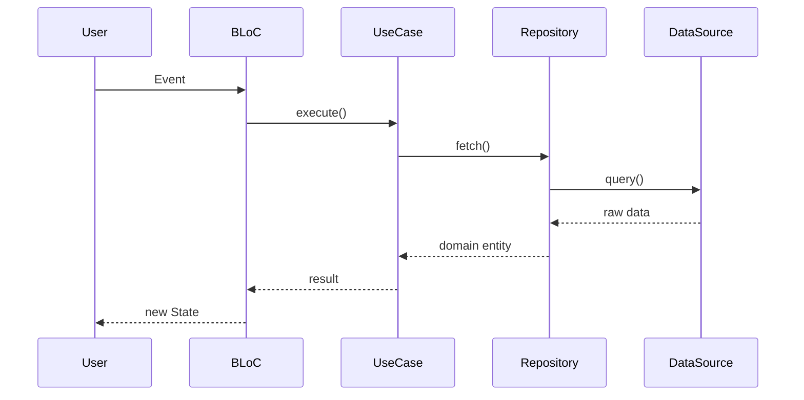

# Design: <!-- change-name -->

## Architecture Decisions

### ADR-001: <!-- Decision title -->
- **Context**: <!-- Why this decision is needed -->
- **Options Considered**:
  - Option A: <!-- description + trade-offs -->
  - Option B: <!-- description + trade-offs -->
- **Decision**: <!-- What was chosen -->
- **Consequences**: <!-- What becomes easier/harder -->
- **Constitution Compliance**: Article <!-- N --> — <!-- how it complies -->

<!-- Add more ADRs as needed -->

## Component Design

<!-- Mermaid class diagram showing new/modified components -->

## Data Flow

<!-- Mermaid sequence diagram for the primary flow -->

## Testing Strategy

| Test Type | What to Test | Tools | Coverage Target |
|-----------|-------------|-------|----------------|
| Unit | Use cases, domain logic, mappers | flutter_test / cargo test | 100% domain |
| Widget | BLoC integration, widget rendering | bloc_test, flutter_test | Key flows |
| BDD | User journeys | bdd_widget_test / cucumber-rs | All FR with AC |
| Golden | Visual regression | golden_toolkit | Custom widgets |
| Integration | End-to-end flows | flutter_driver | Critical paths |

## Standards Applied

| Standard | How Applied |
|----------|-------------|
| `flutter/architecture` | <!-- specific application --> |
| `flutter/state-management` | <!-- specific application --> |
| `global/tdd-rules` | <!-- TDD protocol to follow --> |
| `global/bdd-rules` | <!-- BDD scenarios planned --> |

## Security Considerations
<!-- Flag any security implications for Aegis to review -->
- 

## Observability Plan
<!-- How this feature will be instrumented -->
- Traces: <!-- what spans to create -->
- Metrics: <!-- what metrics to emit -->
- Logs: <!-- what to log and at what level -->
