# `docs/ARCHITECTURE-TARGET.md` — Forge 2026 : remise à plat architecturale

> **Auteur** : Architecte Solution Senior (mode *ruthless mentor*)
> **Cible** : Benoît Fontaine, créateur de Forge — branche `optim`
> **Date de production** : 29 avril 2026
> **Révision v1.1** : 29 avril 2026 — flutter_bloc consolidé comme standard unique non-négociable
> **Tonalité** : sans complaisance. Pas de validation gratuite. Toute affirmation soit sourcée, soit explicitement
> marquée `(opinion d'architecte)`.

---

## 0. Executive Summary (1 page)

Forge est un framework SDD prometteur, mais le stack `full-stack-monorepo` actuel mélange des choix défendables (
Rust+tonic, OpenTelemetry, buf+protobuf, flutter_bloc) avec **trois fragilités structurelles** qui compromettent les
critères de succès pondérés (latence p95/p99, observabilité déterministe, scalabilité sans SPOF) :

1. **Kong en bridge REST↔gRPC** : performant en throughput synthétique, mais sa couche Lua/OpenResty et son control
   plane DB introduisent de la latence p99, ne sont pas conçus pour le L7 Envoy-natif que demande gRPC-Web/Connect, et
   exhibent des temps de propagation routes ~3 s en bench
   Gateway-API [source: github.com/howardjohn/gateway-api-bench, accessed 2026-04]. À remplacer par **Envoy Gateway** (
   data plane) + **Connect-RPC** (protocole transport), ce qui supprime aussi le besoin d'un proxy de
   traduction [source: connectrpc.com/docs/go/grpc-compatibility, accessed 2026-04].
2. **Temporal en orchestration par défaut** : excellent à l'échelle, mais introduit un **control plane externe** (
   cluster dédié, metrics, on-call) injustifié pour 80 % des workflows d'un archétype `full-stack-monorepo` qui possède
   déjà PostgreSQL. Verdict : **DBOS-style (Postgres-backed durable execution)** par défaut, Temporal seulement pour les
   archétypes à forte volumétrie
   cross-service [source: tiarebalbi.com/en/blog/dbos-vs-temporal-postgres-durable-execution, accessed 2026-04] [source: dbos.dev/blog/durable-execution-coding-comparison, accessed 2026-04].
3. **Taxonomie d'archétypes incomplète et idéologiquement biaisée** : `flutter-firebase` est un piège Schrems II/CLOUD
   Act [source: spreecommerce.org/gdpr-schrems-ii-ecommerce-compliance, accessed 2026-04], `mobile-only` ignore que le
   PWA-first reste viable hors iOS
   contraintes [source: magicbell.com/blog/pwa-vs-native-app-when-to-build-installable-progressive-web-app, accessed 2026-04],
   et il manque trois archétypes pertinents en 2026 : **event-driven**, **edge/serverless EU**, **AI-native (RAG+agents)
   **.

**Verdict global** : 5 composants `KEEP-WITH-CHANGES`, 3 composants `REPLACE`, 5 `KEEP`. Taxonomie réorganisée en **5
archétypes** (au lieu de 4) avec disparition de `flutter-firebase`, fusion `mobile-only` ⇒ `mobile-pwa-first`,
conservation de `rust-cli-tui`, ajout de `event-driven-eu` et `ai-native-rag`. Migration en **4 phases sur ~6 mois**,
point de non-retour à la phase 2 (bascule Connect-RPC sur la flagship).

> **Mentor note (sans complaisance)** : ton plus grand risque n'est pas technique, c'est de **figer dans Forge des
opinions techno qui dateront en 18 mois**. Les agents-personas sont la bonne abstraction, mais leurs `.forge/standards/`
> doivent référencer des **versions épinglées + fenêtres de réévaluation** explicites. Sinon Forge devient un musée. *
*Exception explicite** : flutter_bloc est consacré comme standard structurel, donc soustrait à la fenêtre de
> réévaluation 12 mois — c'est une décision d'architecture, pas un choix de version.

---

## 1. Verdict ramassé — tableau de décision

| Composant actuel                                       | Couche                | Verdict               | Remplaçant proposé                                                                                                           | Critère #1 dominant       |
|--------------------------------------------------------|-----------------------|-----------------------|------------------------------------------------------------------------------------------------------------------------------|---------------------------|
| Flutter (Clean+Bloc+get_it+retrofit)                   | UI mobile/desktop     | **KEEP**              | Flutter 3.41 + **flutter_bloc** (standard non-négociable) + get_it/injectable conservés ; retrofit remplacé par Connect-Dart | Latence perçue, DX        |
| Flutter Web                                            | UI web                | **REPLACE**           | **Qwik City** (ou SvelteKit) pour public ; Flutter Web *uniquement* pour back-office                                         | LCP/TTI                   |
| Rust + tonic + axum                                    | Runtime back          | **KEEP**              | inchangé (tonic 0.14, axum 0.8 stable 2026)                                                                                  | Latence p99               |
| Hexagonal + TDD/BDD                                    | Méthode back          | **KEEP**              | inchangé                                                                                                                     | —                         |
| Kong                                                   | API Gateway           | **REPLACE**           | **Envoy Gateway** (CNCF, Gateway API natif)                                                                                  | Latence p99, multi-tenant |
| Temporal                                               | Orchestration         | **KEEP-WITH-CHANGES** | **DBOS par défaut**, Temporal optionnel pour archétype `event-driven-eu`                                                     | SPOF, coût opérationnel   |
| OpenTelemetry SDK                                      | Instrumentation       | **KEEP**              | inchangé + ajout **OTel eBPF Instrumentation (OBI)** côté infra                                                              | Trace E2E déterministe    |
| SigNoz                                                 | Backend observabilité | **KEEP-WITH-CHANGES** | SigNoz + **Coroot** (eBPF service map) en complément ; Grafana LGTM rejeté pour la flagship                                  | Observabilité unifiée     |
| buf + protobuf                                         | Contrats              | **KEEP-WITH-CHANGES** | buf+proto **+ Connect-RPC** comme protocole client (gRPC reste interne)                                                      | Cohérence Spec→Code       |
| REST/JSON via Kong bridge                              | Transport client      | **REPLACE**           | **Connect Protocol** (HTTP/1.1+JSON friendly, gRPC/gRPC-Web compatible)                                                      | Latence + DX              |
| Aucune (implicite Firebase Auth dans flutter-firebase) | Identité              | **REPLACE**           | **Zitadel** (Go, AGPL, multi-tenant, EU-friendly) ou Keycloak                                                                | Souveraineté              |
| Aucune persistence prescrite                           | DB                    | **KEEP-WITH-CHANGES** | **PostgreSQL 17 + pgvector 0.8** comme défaut universel                                                                      | Latence p99, opérabilité  |
| Docker/K8s                                             | Déploiement           | **KEEP**              | Helm charts standardisés + **OVHcloud / Scaleway** comme cibles EU par défaut                                                | Souveraineté              |
| Taxonomie 4 archétypes                                 | Méta                  | **REPLACE**           | Taxonomie 5 archétypes (cf. §2)                                                                                              | DX SDD, alignement marché |

---

## 2. Cartographie de l'état actuel

### 2.1 Schéma C4 Container — `full-stack-monorepo` actuel

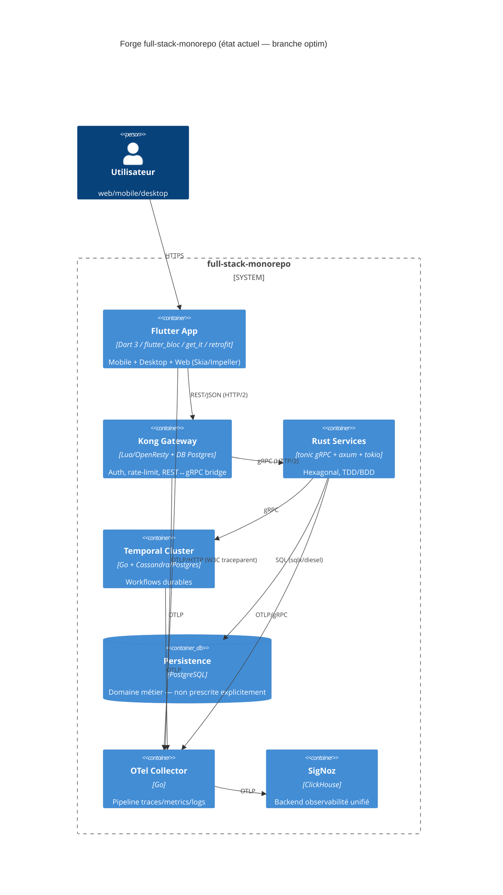

### 2.2 Tableau des 4 archétypes Forge actuels

| Archétype             | Stack implicite                                 | Statut roadmap         | Cas d'usage cible                 | Faille structurelle critique                                                                                                                                             |
|-----------------------|-------------------------------------------------|------------------------|-----------------------------------|--------------------------------------------------------------------------------------------------------------------------------------------------------------------------|
| `full-stack-monorepo` | Flutter + Rust + Kong + Temporal + SigNoz       | Flagship, en livraison | Produit SaaS premium full-control | Couplage fort à Kong, Temporal jamais justifié vs alternatives 2026                                                                                                      |
| `flutter-firebase`    | Flutter + Firebase (Auth/Firestore/Functions)   | Phase 3                | MVP rapide BaaS                   | **Schrems II + CLOUD Act** : Google US, données EU exposées, incompatible RGPD strict [source: spreecommerce.org/gdpr-schrems-ii-ecommerce-compliance, accessed 2026-04] |
| `mobile-only`         | Flutter iOS+Android + OIDC externe + back libre | Phase 3                | App mobile pure                   | Ignore PWA-first (LCP/coût/store), ignore desktop-companion                                                                                                              |
| `rust-cli-tui`        | Rust pur (clap, ratatui, tokio)                 | Phase 3                | Devtools internes                 | Pas de friction majeure — solide, à conserver                                                                                                                            |

> **Mentor note** : `flutter-firebase` dans un framework qui se positionne *premium* + *EU-aware* est une *
*contradiction de marque**. Soit tu assumes une cible non-EU, soit tu dégages Firebase. Il n'y a pas de zone grise après
> Schrems II.

---

## 3. Remise en question de la taxonomie — flowchart décisionnel

### 3.1 Flowchart de décision

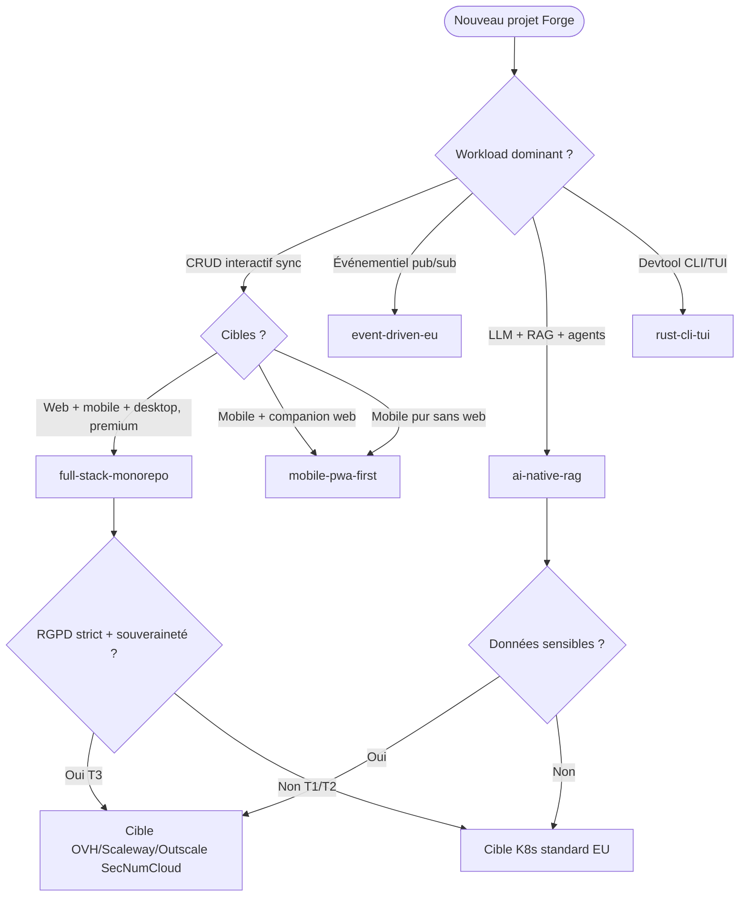

### 3.2 Verdicts taxonomie

| Archétype actuel      | Verdict                        | Justification                                                                                                                                                                                                  |
|-----------------------|--------------------------------|----------------------------------------------------------------------------------------------------------------------------------------------------------------------------------------------------------------|
| `full-stack-monorepo` | **KEEP** (flagship)            | Cas d'usage SaaS premium reste central                                                                                                                                                                         |
| `flutter-firebase`    | **REMOVE**                     | Schrems II + CLOUD Act incompatibles avec positionnement Forge EU/AI-First. Une `flutter-baas-eu` (Supabase EU self-host ou Appwrite) pourrait remplacer, mais à débourser uniquement après preuves de demande |
| `mobile-only`         | **MERGE → `mobile-pwa-first`** | Renommer et imposer un *décideur* par défaut PWA (Android+desktop) avec *fallback natif* iOS si push critique [source: magicbell.com/blog/pwa-ios-limitations-safari-support-complete-guide, accessed 2026-04] |
| `rust-cli-tui`        | **KEEP**                       | Niche, mature, zéro friction                                                                                                                                                                                   |

### 3.3 Nouveaux archétypes à créer

| Nouvel archétype      | Rationale 2026                                                                                                                                                                                                        | Stack prescrit                                                                                                                                                                                                       |
|-----------------------|-----------------------------------------------------------------------------------------------------------------------------------------------------------------------------------------------------------------------|----------------------------------------------------------------------------------------------------------------------------------------------------------------------------------------------------------------------|
| **`event-driven-eu`** | NIS2 + DORA exigent traçabilité événementielle, et 80 % des SaaS B2B finissent en event-sourcing [source: kai-waehner.de/blog/2025/06/05/the-rise-of-the-durable-execution-engine-temporal-restate, accessed 2026-04] | Rust + **NATS JetStream** (ou Kafka Redpanda) + AsyncAPI 3.1 + Temporal *ici justifié*                                                                                                                               |
| **`ai-native-rag`**   | MCP+agents est passé d'expérimental à mainstream selon Tech Radar Vol.33 [source: thoughtworks.com/about-us/news/2025/thoughtworks-tech-radar-33-rapid-ai, accessed 2026-04]                                          | Rust (axum) + **Postgres + pgvector 0.8** (bench: 471 QPS @ 99% recall) [source: instaclustr.com/education/vector-database/pgvector-performance-benchmark-results, accessed 2026-04] + Flutter/Qwik UI + LLM gateway |

### 3.4 Matrice cible × workload × profil d'équipe

| Archétype             | Web                    | Mobile                      | Desktop            | Workload              | Profil équipe min                  |
|-----------------------|------------------------|-----------------------------|--------------------|-----------------------|------------------------------------|
| `full-stack-monorepo` | ✅ Flutter+Qwik         | ✅ Flutter                   | ✅ Flutter/Tauri    | CRUD sync premium     | 4–6 dev (1 Rust, 2 Flutter, 1 SRE) |
| `mobile-pwa-first`    | ✅ PWA (Qwik/SvelteKit) | ✅ PWA + native fallback iOS | ⚠️ PWA installable | App grand public      | 2–3 dev fullstack                  |
| `event-driven-eu`     | ⚠️ admin Qwik          | ❌                           | ❌                  | Pub/sub, sagas, audit | 3–5 dev backend Rust               |
| `ai-native-rag`       | ✅ Qwik streaming       | ⚠️ Flutter optionnel        | ❌                  | LLM+RAG+agentic       | 2–4 dev (1 ML, 2 Rust)             |
| `rust-cli-tui`        | ❌                      | ❌                           | ✅ binary natif     | Devtools              | 1–2 dev Rust                       |

> **Rejet explicite** :
> - `flutter-firebase` rejeté car incompatible Schrems II + casse la cohérence du brand "premium EU".
> - Archétype "GraphQL Federation" rejeté car ajoute une couche de complexité contractuelle sans gain mesurable face à
    Connect-RPC pour un monorepo (`opinion d'architecte non sourcée`).
> - Archétype "Java/Kotlin Spring Boot" rejeté car contradictoire avec positionnement Rust premium.

---

## 4. Analyse couche par couche (≥ 3 alternatives, scoring 1–5)

> Scoring sur les 3 critères pondérés : **L** = Latence p95/p99, **O** = Observabilité déterministe, **S** = Scalabilité
> sans SPOF.

### 4.1 UI multi-target

| Option                      | L | O | S | Note 2026                                                                      | Source                                                                                        |
|-----------------------------|---|---|---|--------------------------------------------------------------------------------|-----------------------------------------------------------------------------------------------|
| **Flutter 3.41 + Impeller** | 4 | 4 | 5 | Stable, Impeller seul renderer iOS (Skia retiré 3.29+), Vulkan default Android | [source: codenote.net/en/posts/cross-platform-dev-tools-comparison-2026, accessed 2026-04]    |
| Compose Multiplatform 1.8   | 4 | 4 | 5 | iOS stable mai 2025, Netflix/McDonald en prod, gain natif                      | [source: codenote.net/en/posts/cross-platform-dev-tools-comparison-2026, accessed 2026-04]    |
| React Native New Arch       | 3 | 4 | 4 | Migration complétée 2025, écosystème JS large                                  | [source: codenote.net/en/posts/cross-platform-dev-tools-comparison-2026, accessed 2026-04]    |
| Tauri 2 (mobile+desktop)    | 5 | 3 | 4 | v2.10+ stable, 6 plateformes, GitHub stars +35 % YoY                           | [source: codenote.net/en/posts/cross-platform-dev-tools-comparison-2026, accessed 2026-04]    |
| Wails 3                     | 4 | 3 | 3 | Desktop seulement, IPC type-safe Go↔JS                                         | [source: medium.com/@tacherasasi/why-wails-wins-at-ipc-for-go-desktop-apps, accessed 2026-04] |

**Verdict couche** : Flutter reste premium sur full-stack-monorepo. **Pour l'archétype `mobile-pwa-first` web public,
REPLACE Flutter Web par Qwik** (TTI 0.6s, eager JS 2 KiB vs React 187
KiB) [source: github.com/BuilderIO/framework-benchmarks, accessed 2026-04].

### 4.2 Transport client ↔ serveur

| Option                             | L | O | S | Verdict                                                                                                                                                                       |
|------------------------------------|---|---|---|-------------------------------------------------------------------------------------------------------------------------------------------------------------------------------|
| REST/JSON via Kong bridge (actuel) | 3 | 3 | 4 | Frictions de traduction REST↔gRPC, headers OTel parfois cassés                                                                                                                |
| gRPC-Web                           | 3 | 4 | 4 | Standard, mais nécessite proxy translateur (Envoy)                                                                                                                            |
| **Connect-RPC**                    | 5 | 5 | 5 | HTTP/1.1+HTTP/2 natif, JSON+binary, curl-friendly, **gRPC compatible côté serveur**, SDK Swift/Kotlin/TS stables [source: connectrpc.com/docs/introduction, accessed 2026-04] |
| tRPC                               | 4 | 3 | 3 | TypeScript-only, pas Flutter/Rust, donc rejeté                                                                                                                                |
| GraphQL Federation                 | 3 | 3 | 4 | Sur-ingénierie pour monorepo, complexité ops                                                                                                                                  |

**Verdict couche** : **Connect-RPC** sur fil, tonic côté serveur (compat native gRPC), buf+proto comme schema unique.

### 4.3 API Gateway

| Option              | L p99                                             | O                   | S                                       | Verdict                                                                                                                                                |
|---------------------|---------------------------------------------------|---------------------|-----------------------------------------|--------------------------------------------------------------------------------------------------------------------------------------------------------|
| Kong (actuel)       | 3 (~63 µs idle, mais 3 s pour propagation routes) | 3                   | 3                                       | Lua plugin overhead, control plane unique [source: github.com/howardjohn/gateway-api-bench, accessed 2026-04]                                          |
| **Envoy Gateway**   | 5 (~45 µs idle, ms-level prop)                    | 5 (xDS, OTel natif) | 5 (multi-Gateway isolé)                 | Pure CNCF, Gateway API standard [source: dev.to/mechcloud_academy/kubernetes-gateway-api-in-2026, accessed 2026-04]                                    |
| Traefik             | 4                                                 | 3                   | 2 (multi-Gateway non isolé, viole spec) | Rejeté pour multi-tenant                                                                                                                               |
| Apache APISIX       | 4                                                 | 4                   | 4                                       | OpenResty-based, hot reload, mais plus petite communauté                                                                                               |
| Cilium Service Mesh | 4 (sidecar-less eBPF)                             | 5                   | 4                                       | Excellent pour mesh interne, **pas remplacement edge gateway**. Per-node Envoy = blast radius [source: buoyant.io/linkerd-vs-cilium, accessed 2026-04] |

**Verdict couche** : **REPLACE Kong par Envoy Gateway** (CNCF, Gateway API natif) ; Cilium en data plane interne mesh
seulement si l'équipe a la maturité eBPF.

### 4.4 Runtime back

| Option                  | L | O | S | Verdict                                                                                                                                                                                                                                                    |
|-------------------------|---|---|---|------------------------------------------------------------------------------------------------------------------------------------------------------------------------------------------------------------------------------------------------------------|
| **Rust + tonic + axum** | 5 | 5 | 5 | TechEmpower top 10, axum 0.8.8 (jan 2026), shared-nothing tokio runtime per thread [source: kerkour.com/rust-fast-techempower-web-framework-benchmarks, accessed 2026-04] [source: aarambhdevhub.medium.com/rust-web-frameworks-in-2026, accessed 2026-04] |
| Go + Connect-go         | 4 | 5 | 5 | Plus simple, écosystème mature, mais 2–3× RSS vs Rust                                                                                                                                                                                                      |
| Java 21 Loom + Spring   | 4 | 5 | 5 | Virtual threads OK, mais image GraalVM > 100 Mo et cold start élevé                                                                                                                                                                                        |
| .NET 9                  | 4 | 5 | 5 | NativeAOT solide, mais minoritaire en cloud-native EU                                                                                                                                                                                                      |
| Zig                     | 5 | 2 | 3 | Trop alpha, écosystème observabilité absent — **rejeté**                                                                                                                                                                                                   |

**Verdict** : KEEP Rust+tonic. Rejet de Zig (immature) et de Java/Spring (footprint container disqualifiant pour le
critère #3).

### 4.5 Persistence

| Option                           | L p99            | O | S                      | Verdict                                                                                                                                                                    |
|----------------------------------|------------------|---|------------------------|----------------------------------------------------------------------------------------------------------------------------------------------------------------------------|
| **PostgreSQL 17 + pgvector 0.8** | 5                | 5 | 4 (sharding via Citus) | Couvre relationnel, JSON, vector (471 QPS @ 99% recall), ACID [source: instaclustr.com/education/vector-database/pgvector-performance-benchmark-results, accessed 2026-04] |
| MongoDB 8                        | 4                | 4 | 5                      | Bon pour documents, faible pour analytique relationnel [source: tech-insider.org/mongodb-vs-postgresql-2026, accessed 2026-04]                                             |
| Cassandra/Scylla                 | 3 (p99 instable) | 3 | 5                      | Très scalable, mais p99 latency variable et complexité ops                                                                                                                 |
| Qdrant (vector pur)              | 5 (2.1 ms p50)   | 4 | 4                      | Excellent pour vector pur, mais ajoute un système                                                                                                                          | [source: alphacorp.ai/blog/best-vector-databases-for-rag-2026-top-7-picks, accessed 2026-04] |

**Verdict** : **Postgres comme défaut universel** Forge ; pgvector pour `ai-native-rag` ; Qdrant en option si > 50 M
vecteurs.

### 4.6 Orchestration de workflows

| Option                      | L | O | S | Verdict                                                                                                                                            |
|-----------------------------|---|---|---|----------------------------------------------------------------------------------------------------------------------------------------------------|
| Temporal (actuel)           | 4 | 5 | 5 | Mature, mais cluster externe = control plane supplémentaire [source: temporal.io/blog/the-fallacy-of-the-graph, accessed 2026-04]                  |
| **DBOS**                    | 5 | 5 | 4 | Postgres-backed, embedded library, 10× moins de code, idéal monorepo [source: dbos.dev/blog/durable-execution-coding-comparison, accessed 2026-04] |
| Restate                     | 4 | 4 | 4 | Élégant, mais écosystème encore jeune [source: tiarebalbi.com/en/blog/dbos-vs-temporal-postgres-durable-execution, accessed 2026-04]               |
| Inngest                     | 3 | 3 | 4 | SaaS-first, souveraineté EU faible                                                                                                                 |
| State machines en SQL (DIY) | 3 | 2 | 3 | Bug-prone, à éviter                                                                                                                                |

**Verdict** : **DBOS par défaut** dans full-stack-monorepo et ai-native-rag ; **Temporal réservé à event-driven-eu** où
le volume cross-service le justifie.

### 4.7 Contracts & codegen

| Option                       | L | O | S | Verdict                                                                                                                                                                          |
|------------------------------|---|---|---|----------------------------------------------------------------------------------------------------------------------------------------------------------------------------------|
| **buf + protobuf + Connect** | 5 | 5 | 5 | Single source of truth, codegen multi-langue, breaking-change detection [source: connectrpc.com, accessed 2026-04]                                                               |
| Smithy (AWS)                 | 4 | 4 | 4 | Plus expressif (RESTful + RPC + pub/sub), mais convertisseur Smithy→OpenAPI lossy [source: smithy.io/2.0/guides/model-translations/converting-to-openapi.html, accessed 2026-04] |
| OpenAPI 3.1 + Stainless      | 4 | 4 | 4 | Excellent SDK quality mais closed-source, lock-in [source: buildwithfern.com/post/open-source-vs-closed-source-sdk-generators, accessed 2026-04]                                 |
| OpenAPI Generator            | 3 | 3 | 3 | Qualité variable selon langue, retravail manuel                                                                                                                                  |

**Verdict** : **buf+proto+Connect gagnant**. Génération OpenAPI 3.1 dérivée pour les consommateurs externes REST.
AsyncAPI 3.1 pour archétype
`event-driven-eu` [source: asyncapi.com/docs/reference/specification/v3.1.0, accessed 2026-04].

### 4.8 Observabilité

| Option                             | L overhead                                                                                            | O                | S | Verdict                                                                                                                                                                                                      |
|------------------------------------|-------------------------------------------------------------------------------------------------------|------------------|---|--------------------------------------------------------------------------------------------------------------------------------------------------------------------------------------------------------------|
| OTel SDK seul (actuel)             | ~35 % CPU sous charge [source: infoq.com/news/2025/06/opentelemetry-go-performance, accessed 2026-04] | 5                | 5 | Trace E2E déterministe                                                                                                                                                                                       |
| **OTel SDK + OBI (eBPF) + Coroot** | < 5 %                                                                                                 | 5                | 5 | Auto-instrumentation kernel-level, complète OTel [source: opentelemetry.io/docs/zero-code/obi/, accessed 2026-04] [source: coroot.com/blog/instrumenting-the-node-js-event-loop-with-ebpf, accessed 2026-04] |
| Cilium Hubble + Tetragon           | < 2 %                                                                                                 | 4 (network-only) | 5 | L3/L4 only, pas remplacement OTel app-level                                                                                                                                                                  |
| Datadog                            | n/a                                                                                                   | 5                | 5 | **Rejeté** : SaaS US, non-souverain                                                                                                                                                                          |

**Backend** :

| Option       | Verdict                     | Notes                                                                                                                      |
|--------------|-----------------------------|----------------------------------------------------------------------------------------------------------------------------|
| **SigNoz**   | KEEP                        | OpenTelemetry-natif from day 1, ClickHouse, single backend [source: signoz.io/blog/grafana-alternatives, accessed 2026-04] |
| Grafana LGTM | REJETÉ pour flagship        | 4 backends à opérer (Loki/Mimir/Tempo/Pyroscope) ⇒ overhead opérationnel disqualifiant                                     |
| Elastic      | Acceptable mais non-default | Bon pour logs, lourd sur traces                                                                                            |

**Verdict** : KEEP-WITH-CHANGES — **SigNoz + OBI + Coroot** comme triplet observability default.

### 4.9 Identité / Auth

| Option        | L | O | S | Souveraineté                                                                                                                               | Verdict               |
|---------------|---|---|---|--------------------------------------------------------------------------------------------------------------------------------------------|-----------------------|
| **Zitadel**   | 4 | 5 | 5 | EU-friendly, Go, AGPL, multi-tenant natif [source: zitadel.com/blog/zitadel-vs-keycloak, accessed 2026-04]                                 | **Default**           |
| Keycloak      | 3 | 4 | 4 | Java-based, mature, CNCF                                                                                                                   | Acceptable enterprise |
| Authentik     | 4 | 4 | 4 | MIT, Python, proxy mode utile pour legacy [source: wz-it.com/en/blog/authentik-vs-zitadel-identity-provider-comparison/, accessed 2026-04] | Alternative           |
| Firebase Auth | 5 | 4 | 5 | **REJETÉ** (CLOUD Act)                                                                                                                     | —                     |

**Verdict** : **Zitadel default**, Keycloak optionnel pour gros existants Java.

### 4.10 Secrets

| Option                            | Verdict                        |
|-----------------------------------|--------------------------------|
| **HashiCorp Vault OSS / OpenBao** | KEEP — standard, EU-deployable |
| Sealed Secrets / SOPS             | Acceptable pour GitOps simple  |
| AWS Secrets Manager               | REJETÉ (CLOUD Act)             |

### 4.11 Déploiement K8s

| Option                                  | Verdict                                                                                                                           |
|-----------------------------------------|-----------------------------------------------------------------------------------------------------------------------------------|
| **Helm + Argo CD**                      | KEEP, standard CNCF                                                                                                               |
| OVHcloud Managed K8s + Scaleway Kapsule | T3 par défaut pour archétypes EU strict [source: gartsolutions.com/scaleway-vs-ovhcloud, accessed 2026-04]                        |
| Outscale OKS                            | T3 strict (SecNumCloud) [source: 3ds.com/newsroom/press-releases/outscale-enhances-outscale-kubernetes-service, accessed 2026-04] |

---

## 5. ADR — Architecture Decision Records (verdicts par composant)

### ADR-001 : REPLACE Kong → Envoy Gateway

- **Decision** : Remplacer Kong par Envoy Gateway sur l'archétype `full-stack-monorepo`.
- **Context** : Latence p99 supérieure (Lua plugin chain), control plane DB-coupled, propagation routes ~3 s,
  multi-Gateway non isolé. Envoy Gateway est CNCF, Gateway API natif, ms-level propagation, xDS
  dynamique [source: dev.to/mechcloud_academy/kubernetes-gateway-api-in-2026, accessed 2026-04].
- **Consequences** :
    - ✅ Latence p99 réduite (~50 µs idle), service mesh path possible (Istio Ambient ou Cilium).
    - ✅ Standardisation sur Gateway API → portabilité.
    - ❌ Perte de plugins Kong commerciaux (rate-limit, dev portal) — à reconstruire via Envoy filters Wasm ou ajouter
      Apigee/Tyk en complément si besoin.
    - ❌ Courbe d'apprentissage CRD Gateway API.

### ADR-002 : KEEP-WITH-CHANGES Temporal → DBOS par défaut

- **Decision** : Adopter DBOS comme orchestrateur par défaut dans `full-stack-monorepo`. Temporal réservé à
  `event-driven-eu`.
- **Context** : Temporal exige un cluster dédié (Cassandra ou Postgres + frontend/history/matching/worker services).
  Pour la majorité des workflows monorepo (charge < 1k workflows/s, < 10 services), DBOS suffit avec Postgres déjà
  présent [source: dbos.dev/blog/durable-execution-coding-comparison, accessed 2026-04].
- **Consequences** :
    - ✅ -1 control plane, -50% TCO ops.
    - ✅ Workflows expressivement code, pas DSL.
    - ❌ Migration Temporal→DBOS non triviale si déjà en prod.
    - ❌ DBOS Go SDK encore récent (avril 2026), maturité <
      Temporal [source: tiarebalbi.com/en/blog/dbos-vs-temporal-postgres-durable-execution, accessed 2026-04].

### ADR-003 : REPLACE REST/JSON Kong-bridge → Connect Protocol

- **Decision** : Connect-RPC comme protocole de bord pour clients Flutter/Web. tonic continue côté serveur (Connect/gRPC
  compatibles).
- **Context** : Kong REST↔gRPC bridge est un translateur fragile. Connect supporte HTTP/1.1+JSON+binary, curl-friendly,
  gRPC-compatible côté serveur ; Buf utilise Connect en prod en remplacement de
  grpc-go [source: buf.build/blog/connect-a-better-grpc, accessed 2026-04].
- **Consequences** :
    - ✅ Suppression du bridge → -1 hop → p99 baisse.
    - ✅ Web inspector friendly, debug facile.
    - ❌ Connect-Dart pas officiel (utiliser connectrpc community ou Connect-Kotlin via Flutter FFI).
    - ❌ Headers OTel `traceparent` à valider sur tous les clients SDK.

### ADR-004 : KEEP Rust + tonic

- **Decision** : Conserver tonic (0.14.x) + axum + tokio.
- **Context** : Performance benchmark TechEmpower top 10, écosystème observability mature, native gRPC, support HTTP/3
  expérimental via `tonic-h3` [source: github.com/youyuanwu/tonic-h3, accessed 2026-04].
- **Consequences** :
    - ✅ p99 < 5 ms typique, RSS faible.
    - ❌ Compile times Rust restent un coût DX (mitigé par Forge).
    - ❌ Écosystème tonic en évolution (master prépare breaking changes 0.15) — épingler 0.14 dans `.forge/standards/`.

### ADR-005 : KEEP Flutter mobile + desktop, REPLACE Flutter Web → Qwik

- **Decision** : Flutter mobile/desktop conservé. Web public (SEO-sensitive) en Qwik City. Back-office web peut rester
  Flutter Web.
- **Context** : Flutter Web rend en Canvas, casse SEO/accessibility, bundle lourd. Qwik resumability ~2 KiB eager
  JS [source: github.com/BuilderIO/framework-benchmarks, accessed 2026-04].
- **Consequences** :
    - ✅ LCP/TTI public dramatiquement réduit.
    - ❌ Deux frameworks UI (Flutter+Qwik) ⇒ double-écosystème pour la flagship.
    - ❌ Codegen depuis proto en Connect-ES vs Connect-Dart à maintenir sur deux pipelines.

### ADR-006 : KEEP flutter_bloc comme standard unique

- **Decision** : flutter_bloc est le seul state management prescrit par Forge sur tous les archétypes Flutter. Aucun
  fallback Riverpod, aucune dual-track. Toute alternative (Riverpod, Provider, GetX, MobX) est explicitement interdite
  et bloquée par linter CI.
- **Context** : flutter_bloc impose une discipline event-driven (Event → Bloc → State) qui s'aligne nativement sur les
  principes SDD de Forge (specs déterministes → événements typés). La structure est explicite, testable, et compatible
  BDD via `bloc_test`. Le boilerplate est compensé par les générateurs Forge (agent Hera). Riverpod, malgré ses gains de
  concision, introduit une surface API moins prévisible et des patterns émergents qui contredisent l'esprit "specs
  first" de Forge. La standardisation absolue est aussi un signal de positionnement premium : un seul cadre canonique,
  pas un menu d'options.
- **Consequences** :
    - ✅ Standardisation absolue : tous les projets Forge sont structurellement identiques côté state.
    - ✅ Tests BDD via `bloc_test` + `bdd_widget_test` cohérents avec la méthodologie Forge.
    - ✅ Onboarding cross-projet immédiat pour tout dev formé Bloc.
    - ✅ Mapping naturel `proto.Event` → `bloc.Event` quand on consomme des streams gRPC/Connect.
    - ❌ Boilerplate par feature non négligeable (mitigé par codegen Hera + freezed + agent Hephaestus pour la génération
      de Bloc skeletons).
    - ❌ Courbe d'apprentissage initiale plus raide qu'un setState ou un Riverpod simple — assumée comme barrière à
      l'entrée premium.
    - ❌ Risque de friction recrutement si le marché bascule majoritairement vers Riverpod — accepté comme coût de
      positionnement.

### ADR-007 : REPLACE Firebase implicite → Zitadel

- **Decision** : Aucun BaaS Google par défaut. Zitadel comme IdP par défaut.
- **Context** : Schrems II + CLOUD Act incompatibles RGPD strict pour données EU. Zitadel multi-tenant Go,
  AGPL [source: zitadel.com/blog/zitadel-vs-keycloak, accessed 2026-04].
- **Consequences** :
    - ✅ Souveraineté T2/T3 atteignable (self-host EU).
    - ❌ Self-host = ops à charge utilisateur (mitigé par agent Atlas).
    - ❌ Migration de prototypes Firebase vers Zitadel = réécriture auth.

### ADR-008 : KEEP-WITH-CHANGES SigNoz + ajout Coroot/OBI

- **Decision** : SigNoz reste backend principal ; OBI + Coroot ajoutés pour eBPF coverage.
- **Context** : OTel SDK seul ~35 % CPU
  overhead [source: infoq.com/news/2025/06/opentelemetry-go-performance, accessed 2026-04]. eBPF complète sans toucher
  code app.
- **Consequences** :
    - ✅ Couverture telemetry > 90 % sans instrumentation manuelle.
    - ❌ Nécessite kernel Linux ≥ 5.8 (Linux RHEL 4.18+
      exception) [source: opentelemetry.io/docs/zero-code/obi/, accessed 2026-04].
    - ❌ Privileged DaemonSet → audit sécu nécessaire.

### ADR-009 : KEEP buf+proto, ADD Connect codegen

- **Decision** : buf reste single source of truth. Codegen Connect pour TS/Kotlin/Swift ; tonic pour Rust ; OpenAPI 3.1
  dérivé pour partenaires REST.
- **Context** : Connect interopère avec gRPC, OpenAPI peut être généré depuis proto via `protoc-gen-openapi`. Smithy
  plus expressif mais lossy en
  conversion [source: smithy.io/2.0/guides/model-translations/converting-to-openapi.html, accessed 2026-04].
- **Consequences** :
    - ✅ Une seule IDL pour tout l'écosystème.
    - ❌ AsyncAPI à maintenir séparément pour event-driven-eu.
    - ❌ Connect-Dart pas officiel encore — risque écosystème Flutter.

### ADR-010 : KEEP Postgres comme défaut universel + pgvector pour AI

- **Decision** : Postgres 17 + pgvector 0.8 comme persistence par défaut, peu importe l'archétype.
- **Context** : Couvre relationnel, JSON, vectoriel, time-series (TimescaleDB), géo (PostGIS) ; bench pgvectorscale 471
  QPS @ 99% recall sur 50M
  vecteurs [source: instaclustr.com/education/vector-database/pgvector-performance-benchmark-results, accessed 2026-04].
- **Consequences** :
    - ✅ Un seul système à opérer.
    - ❌ Sharding nécessite Citus/Patroni au-delà de ~5 TB.
    - ❌ Vector p99 latency Qdrant reste meilleur sur charges vector-pures > 50M.

> **Mentor note** : tu peux aimer Mongo, mais pour les **3 critères pondérés**, Postgres écrase à scale petit/moyen. Et
> tu n'as pas annoncé un produit hyperscale.

---

## 6. Architectures cibles

### 6.1 C4 Container — `full-stack-monorepo` cible (flagship)

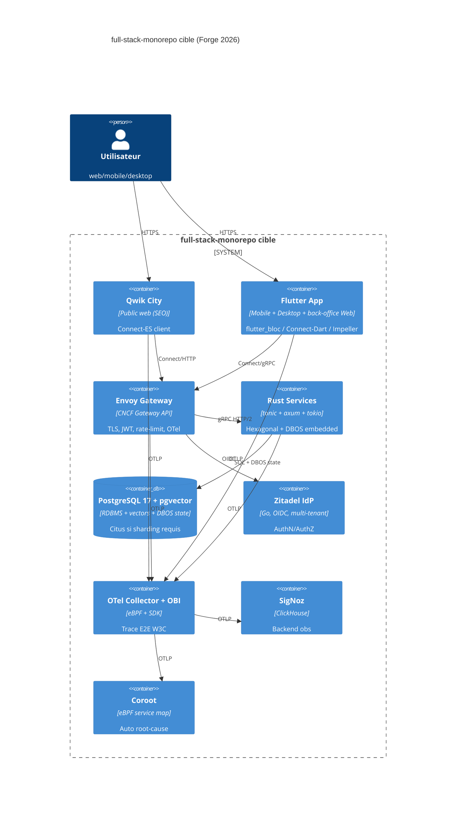

### 6.2 C4 Component — détail Rust services flagship

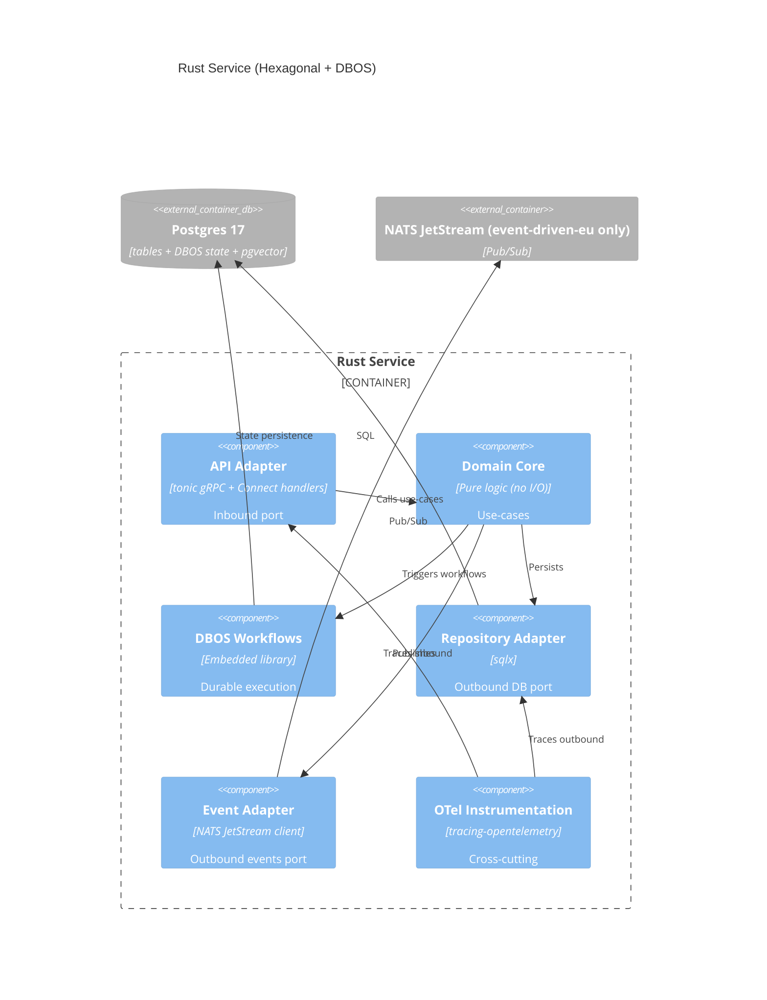

### 6.3 C4 Container — `mobile-pwa-first` cible

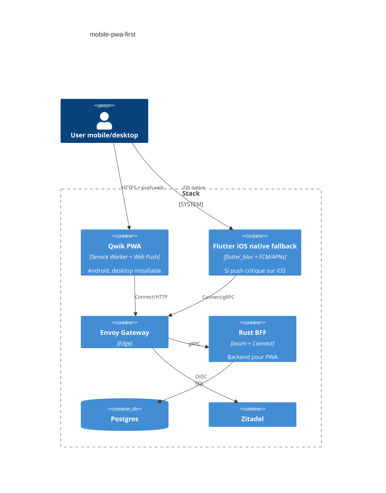

### 6.4 C4 Container — `event-driven-eu` cible

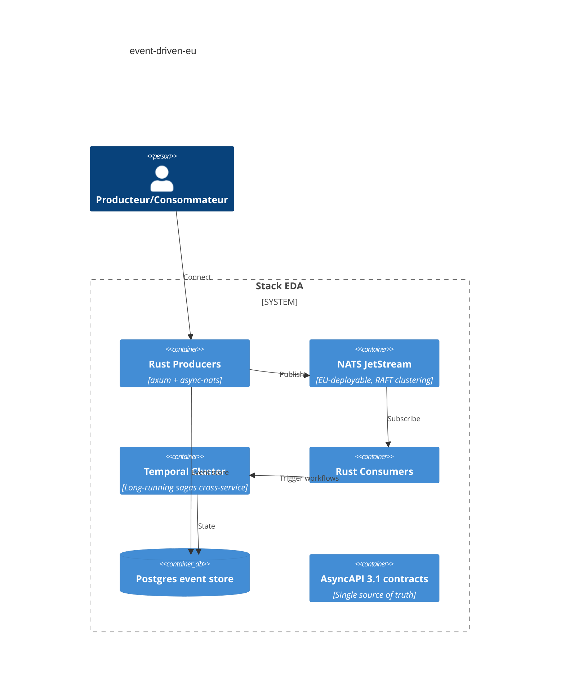

### 6.5 C4 Container — `ai-native-rag` cible

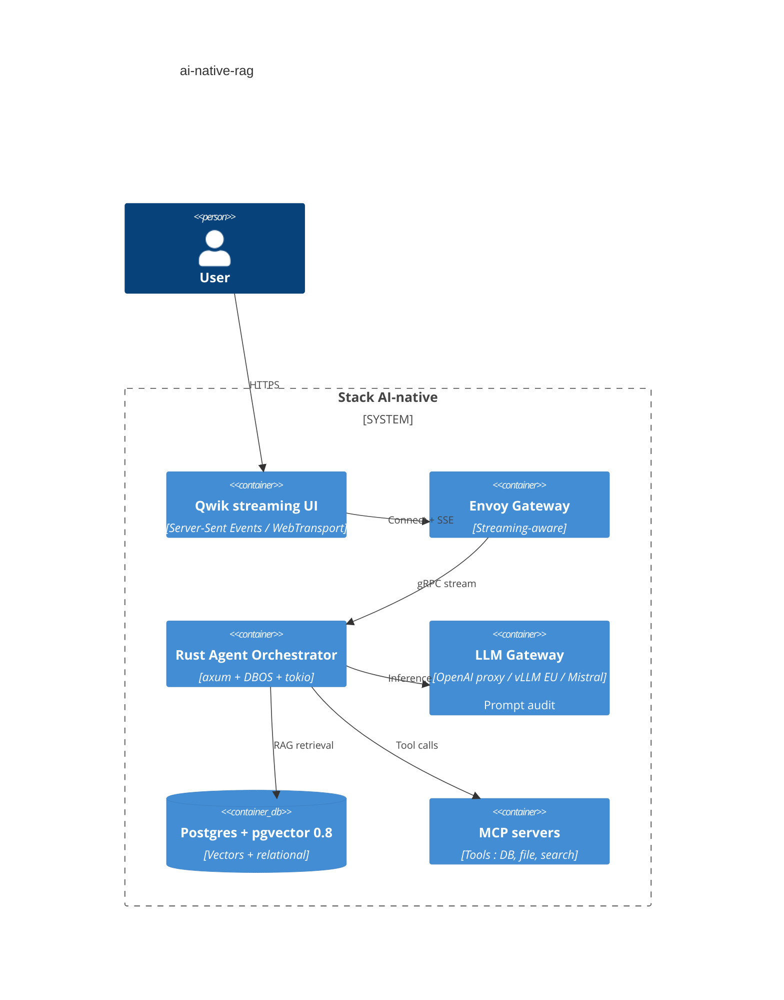

### 6.6 C4 Container — `rust-cli-tui` cible

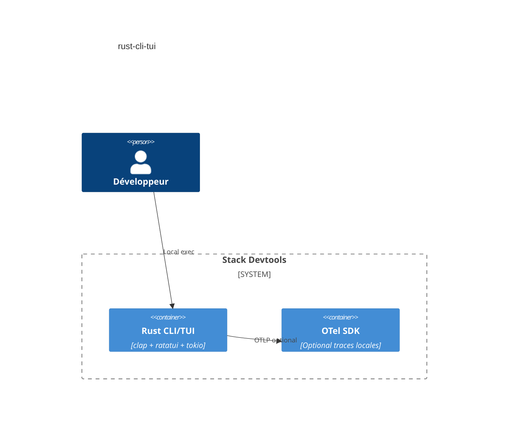

---

## 7. Flow Spec → Code

### 7.1 Pipeline gagnant : **buf + Connect** (avec OpenAPI dérivé pour REST consumers et AsyncAPI 3.1 pour event-driven)

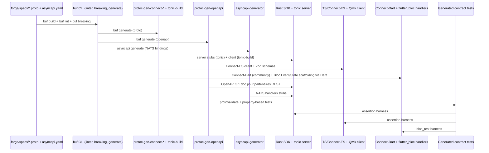

### 7.2 Évaluation comparative

| Pipeline                     | Verdict                          | Justification                                                                                                                                                      |
|------------------------------|----------------------------------|--------------------------------------------------------------------------------------------------------------------------------------------------------------------|
| **buf + protobuf + Connect** | **GAGNANT**                      | Source unique, codegen multi-langues, breaking-change CI built-in, prod-tested chez Buf elle-même [source: buf.build/blog/connect-a-better-grpc, accessed 2026-04] |
| Connect-RPC seul             | Bon                              | Sous-ensemble du précédent                                                                                                                                         |
| Smithy                       | Acceptable, mais lossy → OpenAPI | Plus expressif mais ROI faible si gRPC est déjà la cible                                                                                                           |
| OpenAPI 3.1 + Stainless      | Rejeté pour core                 | Closed-source, lock-in vendeur, mais OK comme **sortie** générée pour SDK partenaires                                                                              |

### 7.3 Mapping aux personas Forge

- **Hermes-API** (Forge agent) : pilote `buf.yaml` + `buf.gen.yaml` + AsyncAPI specs.
- **Vulcan/Ferris** : intègre tonic-build dans `build.rs` Rust.
- **Hera/Apollo** : intègre Connect-Dart dans Flutter, génère les `Event` / `State` / `Bloc` skeletons à partir des
  proto messages (un service gRPC = un Bloc, une RPC = un Event/State pair).
- **Hephaestus** : génère les fichiers `bloc_test` + `bdd_widget_test` à partir des contract tests.

---

## 8. Flow Observabilité E2E (trace propagation)

### 8.1 Schéma propagation

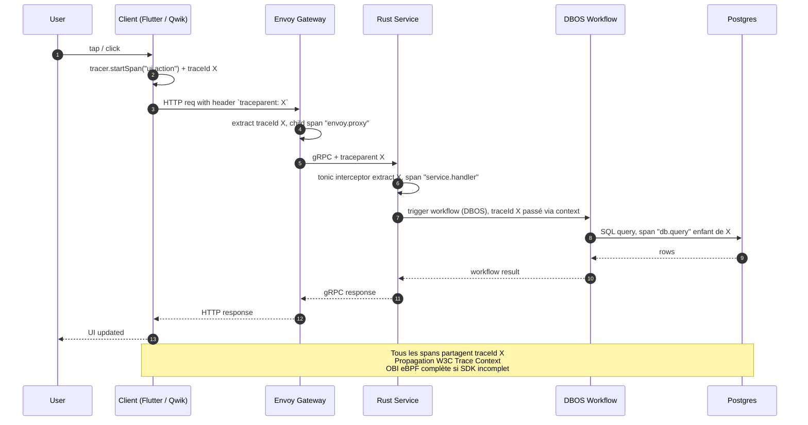

### 8.2 Évaluation des stratégies d'instrumentation

| Stratégie                               | Couverture             | Overhead                                                                                  | Trace E2E déterministe          | Verdict          |
|-----------------------------------------|------------------------|-------------------------------------------------------------------------------------------|---------------------------------|------------------|
| OTel SDK seul                           | App-level uniquement   | ~35 % CPU [source: infoq.com/news/2025/06/opentelemetry-go-performance, accessed 2026-04] | ✅ si tous les hops instrumentés | Insuffisant seul |
| **OTel SDK + OBI eBPF + Coroot**        | App + kernel + network | < 10 % cumulé                                                                             | ✅ + auto-fill des trous         | **GAGNANT**      |
| Full eBPF (Hubble + Tetragon, sans SDK) | Network L4/L7          | < 2 %                                                                                     | ❌ pas de business spans         | Insuffisant      |

> **Mentor note** : le Saint Graal "100 % zéro-instrumentation eBPF" est un mythe pour traceability métier. Tu auras
*toujours* besoin de spans applicatifs pour les `user_id`, `tenant_id`, `feature_flag`. eBPF complète, ne remplace pas.

### 8.3 Garanties techniques pour Forge

- **W3C Trace Context** activé partout (Connect-RPC propage par
  défaut [source: docs.base14.io/instrument/mobile/flutter/, accessed 2026-04]).
- **Sampler** : `parentbased_traceidratio` à 10 % en prod, 100 % en staging.
- **Backend** : SigNoz pour traces/logs/metrics + Coroot pour service map et eBPF profile.
- **Argus** (agent Forge) instrument côté client Flutter ; **Sentinel** côté Rust ; **Panoptes** orchestre la chaîne.

---

## 9. Mapping agents Forge — impacts et nouveaux agents

### 9.1 Agents existants impactés

| Agent                                 | Impact     | Modifications nécessaires                                                                                                                                                                                |
|---------------------------------------|------------|----------------------------------------------------------------------------------------------------------------------------------------------------------------------------------------------------------|
| **Janus** (orchestrateur cross-layer) | Élevé      | Doit gérer 5 archétypes au lieu de 4, pipeline buf+Connect, application stricte de l'interdiction Riverpod/Provider/GetX/MobX                                                                            |
| **Atlas** (Infra)                     | Très élevé | Helm charts Envoy Gateway (au lieu de Kong), Zitadel, NATS JetStream optionnel, OBI DaemonSet                                                                                                            |
| **Hera** (Flutter team-lead)          | Faible     | Renforcer génération `flutter_bloc` (Event/State/Bloc + bloc_test scaffolding) ; supprimer toute logique de switch state-management ; refuser explicitement toute dépendance Riverpod/Provider/GetX/MobX |
| **Apollo** (sous Hera)                | Modéré     | Connect-Dart codegen + retrofit retiré ; templates Bloc renforcés avec bloc_test boilerplate                                                                                                             |
| **Hephaestus** (sous Hera)            | Modéré     | Génère Bloc skeletons + bloc_test + bdd_widget_test à partir des proto services                                                                                                                          |
| **Vulcan** (Rust team-lead)           | Modéré     | DBOS-rs intégration, tonic 0.14 épinglé                                                                                                                                                                  |
| **Ferris/Centurion** (sous Vulcan)    | Faible     | tonic-build update mineur                                                                                                                                                                                |
| **Hermes-API**                        | Élevé      | Connect codegen, AsyncAPI 3.1, OpenAPI 3.1 dérivé                                                                                                                                                        |
| **Argus** (Flutter OTel)              | Faible     | Confirmer W3C propagation Connect-Dart                                                                                                                                                                   |
| **Sentinel** (Rust OTel)              | Faible     | Ajouter middleware tonic OTel                                                                                                                                                                            |
| **Panoptes**                          | Élevé      | Ajouter Coroot + OBI configs au stack obs                                                                                                                                                                |
| **Aegis** (Security)                  | Élevé      | Audits NIS2/DORA/CRA, OWASP ASVS L2, Zitadel hardening                                                                                                                                                   |
| **Heracles** (DevOps)                 | Modéré     | Pipelines CI buf breaking-change, OVH/Scaleway providers, linter `no-state-management-alternatives` blocking                                                                                             |

> **Dart OTel SDK — signal coverage status** (`opentelemetry: 0.18.11`, Workiva)
> [source verified: 2026-05-12, from `t5-otel-dart-api-realign` FR-FOT-DA-060]
>
> | Signal  | Status        | Notes                                              |
> |---------|---------------|----------------------------------------------------|
> | Traces  | **Beta**      | Active in current Forge stack (Argus / Sentinel)   |
> | Metrics | Alpha         | Out of scope for current Forge OTel phase          |
> | Logs    | Unimplemented | Out of scope for current Forge OTel phase          |
>
> Only **Traces** are used in the current Forge OTel phase. Metrics and Logs
> instrumentation via this package should not be relied upon until the
> Workiva package reaches at least Beta for those signals.
>
> **Future-review trigger**: re-verify by **2026-11-12** or when
> `opentelemetry` pkg bumps to **>= 0.19.0** (whichever comes first).

### 9.2 Nouveaux agents proposés

| Nouvel agent     | Persona                 | Responsabilités                                                                               | Archétype concerné                        |
|------------------|-------------------------|-----------------------------------------------------------------------------------------------|-------------------------------------------|
| **Hermes-Async** | Messager event-driven   | Maintient AsyncAPI 3.1 specs, NATS/Kafka bindings, idempotency keys                           | `event-driven-eu`                         |
| **Pythia**       | Oracle AI/RAG           | Pilote pipeline embeddings, pgvector index tuning (HNSW ef_search), MCP servers, prompt audit | `ai-native-rag`                           |
| **Demeter**      | Data steward EU         | Classifie données T1/T2/T3, valide DPA, détecte CLOUD Act risks dans dépendances              | tous                                      |
| **Iris-Web**     | Frontend Web spécialisé | Maintient Qwik / SvelteKit standards, distinct de Hera (Flutter)                              | `full-stack-monorepo`, `mobile-pwa-first` |
| **Themis**       | Compliance officer      | Auto-check NIS2/DORA/CRA artifacts (incident reporting < 24h, SBOM, vuln handling)            | tous EU                                   |

### 9.3 Agents à reconsidérer

- **Hera / Apollo / Spartan / Hephaestus / Hermes / Iris / Argus / Prometheus / Nemesis** : 9 sub-agents Flutter est *
  *excessif** pour un framework opinionné. Verdict : **fusionner en 5 max** (UI builder, State (Bloc), Animation, Test
  BDD, OTel client). 9 sub-agents donnent l'illusion de coverage mais multiplient les conflits de prompts (
  `opinion d'architecte non sourcée`).
- **Janus** : doit devenir le **point d'arbitrage** entre Iris-Web (Qwik) et Hera (Flutter) sur la flagship.

---

## 10. Compliance EU graduée — T1 / T2 / T3

### 10.1 Définitions

- **T1 — RGPD-compliant via DPA** : SaaS hors EU acceptable si DPA + SCC + protections complémentaires (chiffrement,
  BYOK), assume risque résiduel CLOUD Act.
- **T2 — Self-hostable** : déployable sur n'importe quel K8s EU, contrôle technique mais pas qualification sovereign.
- **T3 — Hébergement EU strict** : SecNumCloud / HDS / EUCS High, 100 % EU jurisdiction, immune CLOUD Act.

### 10.2 Classification par composant (cible 2026)

| Composant                        |        T1        |       T2       |             T3             | Forçage tier                                                                                                                                                                             | Source                                                           |
|----------------------------------|:----------------:|:--------------:|:--------------------------:|------------------------------------------------------------------------------------------------------------------------------------------------------------------------------------------|------------------------------------------------------------------|
| Flutter / Qwik (binaires client) |        ✅         |       ✅        |             ✅              | aucun                                                                                                                                                                                    | —                                                                |
| Rust + tonic + axum              |        ✅         |       ✅        |             ✅              | aucun                                                                                                                                                                                    | —                                                                |
| Envoy Gateway                    |        ✅         |       ✅        |             ✅              | aucun (CNCF)                                                                                                                                                                             | —                                                                |
| Postgres 17 + pgvector           |        ✅         |       ✅        |             ✅              | aucun                                                                                                                                                                                    | —                                                                |
| DBOS (embedded library)          |        ✅         |       ✅        |             ✅              | aucun                                                                                                                                                                                    | [source: dbos.dev, accessed 2026-04]                             |
| Zitadel                          | ⚠️ Cloud SaaS T1 | ✅ self-host T2 | ✅ self-host EU+SecNumCloud | T3 = self-host obligatoire                                                                                                                                                               | [source: zitadel.com/blog/zitadel-vs-keycloak, accessed 2026-04] |
| SigNoz                           | ⚠️ Cloud SaaS T1 | ✅ self-host T2 |       ✅ self-host EU       | T3 = self-host obligatoire                                                                                                                                                               |
| Coroot                           |   ✅ self-host    |       ✅        |             ✅              | —                                                                                                                                                                                        |
| OTel Collector / OBI             |        ✅         |       ✅        |             ✅              | —                                                                                                                                                                                        |
| OVHcloud / Scaleway / Outscale   |        —         |       —        |             ✅              | T3 obligatoire = SecNumCloud Outscale (only public cloud SecNumCloud-qualifié) [source: 3ds.com/newsroom/press-releases/outscale-enhances-outscale-kubernetes-service, accessed 2026-04] |
| AWS / GCP / Azure                |    ⚠️ T1 only    |       ❌        |             ❌              | **CLOUD Act** force max T1 [source: spreecommerce.org/gdpr-schrems-ii-ecommerce-compliance, accessed 2026-04]                                                                            |
| Firebase                         |        ❌         |       ❌        |             ❌              | Disqualifié pour archétype EU strict                                                                                                                                                     |
| Temporal Cloud                   |      ⚠️ T1       | ✅ self-host T2 |       ✅ self-host EU       | self-host pour T3                                                                                                                                                                        |
| LLM Gateway (OpenAI/Anthropic)   |    ⚠️ T1 max     |       ❌        |             ❌              | Pour T3 : Mistral on Scaleway ou vLLM self-host                                                                                                                                          |
| NATS JetStream                   |        ✅         |       ✅        |             ✅              | self-host T2/T3                                                                                                                                                                          |

### 10.3 Profil compliance par archétype

| Archétype             |  T1 acceptable   |      T2 recommandé       |  T3 forçable   | Compliance frameworks dominants                                                                                                 |
|-----------------------|:----------------:|:------------------------:|:--------------:|---------------------------------------------------------------------------------------------------------------------------------|
| `full-stack-monorepo` |        ✅         |            ✅             |       ✅        | RGPD + NIS2 (si essentiel/important)                                                                                            |
| `mobile-pwa-first`    |        ✅         |            ✅             |       ⚠️       | RGPD principalement                                                                                                             |
| `event-driven-eu`     |        ❌         |            ✅             |       ✅        | NIS2 + DORA (si finance) + CRA                                                                                                  |
| `ai-native-rag`       | ⚠️ (LLM externe) | ✅ avec Mistral self-host | ✅ avec vLLM EU | RGPD + AI Act + DORA si finance                                                                                                 |
| `rust-cli-tui`        |        ✅         |            ✅             |       ✅        | CRA si distribué commercialement [source: schellman.com/blog/cybersecurity/european-compliance-nis2-cra-dora, accessed 2026-04] |

### 10.4 Échéances réglementaires à coder dans `.forge/compliance/`

- **NIS2** : reporting 24h/72h [source: nis-2-directive.com, accessed 2026-04].
- **DORA** : appliqué depuis 17 jan 2025, RoI à soumettre 30 avr 2026
  ESA [source: cloudsecurityalliance.org/blog/2025/09/18/an-update-on-european-compliance-nis2-cra-dora, accessed 2026-04].
- **CRA** : reporting obligations 11 sept 2026, full requirements 11 déc
  2027 [source: defion.security/en/blog/nis2-dora-cra-what-do-you-need-to-do-with-them/, accessed 2026-04]. **CE marking
  obligatoire** pour produits digitaux.
- **AI Act** : phases 2025–2027 selon catégorie de risque.

---

## 11. Plan de migration

### 11.1 Phases ordonnées

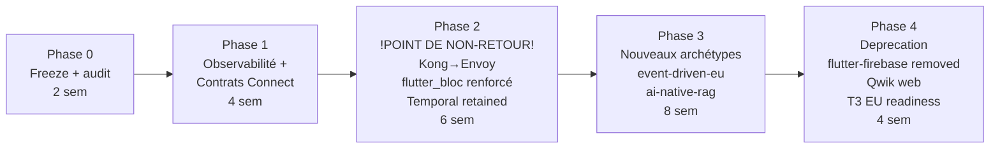

### 11.2 Détail des phases

#### Phase 0 — Freeze + audit (2 semaines)

- Geler les choix actuels, instrumenter baseline p95/p99 actuel.
- Audit Aegis : OWASP ASVS L2 + NIS2 gap analysis.
- Inventaire dépendances pour conformité CLOUD Act (agent Demeter).
- Audit linter Hera : confirmer absence de Riverpod/Provider/GetX/MobX dans le codebase actuel.
- **Risques** : aucun.
- **Point de non-retour** : non.

#### Phase 1 — Observability + contrats (4 semaines)

- Migrer codegen vers buf + Connect (proto inchangé, ajout Connect protocol).
- Déployer OTel Collector + OBI + Coroot en parallèle de SigNoz.
- Validation traceparent end-to-end Flutter→Kong→Rust.
- **Risques** : faible. Connect-Dart non officiel, fallback Connect-Kotlin via FFI.
- **Point de non-retour** : non. Réversible.

#### Phase 2 — Bascule structurelle (6 semaines) — **POINT DE NON-RETOUR**

- Remplacer Kong par Envoy Gateway (canary par route) — ratifié §VIII.1 (Constitution v2.0.0, Amendment #2, 2026-06-05).
- **Temporal retenu comme orchestrateur** (B8O / `b8-orchestration-temporal-realign`) — la bascule Temporal → DBOS est **annulée** (pas de SDK Rust DBOS ; `orchestration.yaml` v1.2.0 `default_by_language.rust: temporal`). §VIII.2 inchangé.
- Renforcer scaffolding flutter_bloc + bloc_test via mise à jour Hera (templates v2). Codegen Connect-Dart remplace
  retrofit.
- Activer linter `no-state-management-alternatives` en CI bloquant.
- Déploiement Zitadel.
- **Risques élevés** : Envoy CRD complexity, Zitadel migration auth.
- **Point de non-retour** : oui, après bascule production de la flagship sur Envoy.
- **Mitigations** : feature flag par route, blue-green Envoy/Kong, training équipe SRE.

#### Phase 3 — Nouveaux archétypes (8 semaines)

- Implémenter `event-driven-eu` (NATS JetStream + Temporal + AsyncAPI 3.1).
- Implémenter `ai-native-rag` (pgvector + LLM gateway + MCP).
- Mettre à jour Forge CLI `@sdd-forge/cli init --archetype event-driven-eu`.
- Créer agents Pythia, Hermes-Async, Demeter, Iris-Web, Themis.
- **Risques** : MCP encore en évolution. (DBOS reste sur la watch-list — pas adopté ; pas de SDK Rust, B8O.)

#### Phase 4 — Deprecation (4 semaines)

- Supprimer `flutter-firebase` du CLI (warn, puis hard remove).
- Renommer `mobile-only` → `mobile-pwa-first`, ajouter Qwik PWA template.
- Préparer T3 SecNumCloud (Outscale OKS) pour clients souverains.
- Déprécier Flutter Web public (back-office only).

### 11.3 Critères de rollback

- p99 augmente > 20 % après Envoy → rollback à Kong.
- Erreurs traceparent > 1 % → rollback à OTel SDK seul (sans OBI).
- (Aucun critère DBOS/CPU — Temporal est l'orchestrateur, pas de leg DBOS ; B8O.)

> Runbook de rollback complet : `docs/ROLLBACK.md` (B.8.13).

### 11.4 Risques transverses

| Risque                                                              | Probabilité | Impact | Mitigation                                                                                                                                                       |
|---------------------------------------------------------------------|-------------|--------|------------------------------------------------------------------------------------------------------------------------------------------------------------------|
| Connect-Dart encore community-only                                  | Moyenne     | Moyen  | Forker, contribuer upstream, sinon Kotlin FFI                                                                                                                    |
| Envoy Gateway CRD courbe                                            | Élevée      | Moyen  | Documentation Atlas + templates Helm                                                                                                                             |
| Maintenir 9 sub-agents Hera                                         | Élevée      | Élevé  | Refactor en 5 sub-agents                                                                                                                                         |
| OBI nécessite kernel ≥ 5.8                                          | Moyenne     | Faible | Documenter prérequis nodes                                                                                                                                       |
| Drift specs ↔ code (problème SDD générique)                         | Élevée      | Élevé  | Adopter "living specs" pattern (cf. Augment Intent) [source: dev.to/willtorber/spec-kit-vs-bmad-vs-openspec-choosing-an-sdd-framework-in-2026, accessed 2026-04] |
| Friction recrutement si marché Flutter bascule Riverpod-majoritaire | Moyenne     | Moyen  | Assumé comme coût de positionnement premium ; documenter le rationale Bloc dans le README de chaque archétype                                                    |

---

## 12. Méta-recommandations Forge

### 12.1 Modifications `.forge/standards/`

```yaml
# .forge/standards/transport.yaml
protocol: connect-rpc
fallback: grpc-web
http_versions: [ http/1.1, http/2, http/3-experimental ]
codegen:
  source_of_truth: protobuf
  tools: [ buf, protoc-gen-connect-go, protoc-gen-connect-es, protoc-gen-connect-dart-community, tonic-build ]
  derived_outputs: [ openapi-3.1, asyncapi-3.1 ]
breaking_change_check: buf breaking --against '.git#branch=main'

# .forge/standards/state-management.yaml
flutter:
  standard: flutter_bloc
  version_pinned: ^9.0.0
  companions:
    - bloc_test
    - hydrated_bloc      # persistence si nécessaire
    - replay_bloc        # undo/redo si nécessaire
  forbidden:
    - flutter_riverpod
    - riverpod
    - provider
    - get
    - getx
    - mobx
    - flutter_mobx
    - states_rebuilder
  enforcement:
    linter_rule: no-state-management-alternatives
    ci_blocking: true
    pre_commit_hook: true
  rationale: |
    Single standard for cross-project structural identity.
    Event-driven Bloc aligns with SDD spec→event mapping
    (proto Service = Bloc, RPC = Event/State pair).
    Forbidden alternatives are not a judgment of quality but
    a deliberate choice to enforce one-way-of-doing-things.
    This is a structural architectural decision and is NOT
    subject to the 12-month standards review window.

# .forge/standards/observability.yaml
sdk: opentelemetry
ebpf_complement: opentelemetry-obi
service_map: coroot
backend: signoz
sampler: parentbased_traceidratio
prod_ratio: 0.1

# .forge/standards/orchestration.yaml (v1.2.0 — B8O realignment)
default_by_language:
  rust: temporal        # Temporal SHALL (Constitution §VIII.2) — no Rust DBOS SDK
dbos:
  available: false      # watch-list future-option ; requires a Rust SDK GA (B8O)

# .forge/standards/identity.yaml
default: zitadel
alternatives: [ keycloak, authentik ]
forbidden: [ firebase-auth, auth0-saas-us ]

# .forge/standards/persistence.yaml
default: postgres-17
extensions: [ pgvector-0.8, postgis, timescaledb ]
sharding: citus
forbidden_for_eu_strict: [ dynamodb, firestore, cosmosdb ]
```

### 12.2 Nouveaux fichiers `.forge/schemas/`

- `schemas/archetype.schema.json` v2 : ajouter enum
  `[full-stack-monorepo, mobile-pwa-first, event-driven-eu, ai-native-rag, rust-cli-tui]`.
- `schemas/compliance-tier.schema.json` : enum `[T1, T2, T3]` + matcher composant→tier.
- `schemas/agent-persona.schema.json` v2 : déprécier 4 sub-agents Flutter, ajouter
  Pythia/Hermes-Async/Demeter/Iris-Web/Themis.

### 12.3 Templates à mettre à jour

- `templates/full-stack-monorepo/` : Helm Envoy Gateway, DBOS, Zitadel, Postgres, SigNoz, Coroot. Templates Flutter avec
  Bloc Event/State/Bloc + bloc_test pré-câblés.
- `templates/mobile-pwa-first/` : Qwik PWA + Flutter native fallback iOS (avec flutter_bloc).
- `templates/event-driven-eu/` (NEW) : NATS JetStream + Temporal + AsyncAPI.
- `templates/ai-native-rag/` (NEW) : pgvector init + MCP servers stub + LLM gateway proxy.
- Tous : Dockerfiles distroless, CRA SBOM cyclonedx auto-generation, NIS2 incident reporting hooks.

### 12.4 CLI npm `@sdd-forge/cli`

```sh
forge init --archetype mobile-pwa-first --eu-tier T2 --auth zitadel
forge migrate --from kong --to envoy-gateway
forge audit --compliance "rgpd,nis2,dora"
forge validate-spec --pipeline buf-connect
forge lint --rule no-state-management-alternatives
```

### 12.5 Janus orchestrator — nouvelles règles

1. Refuser `flutter-firebase` (erreur fatale, message d'erreur expliquant Schrems II).
2. Si `--eu-tier=T3`, forcer self-host de Zitadel, SigNoz, et provider OVH/Scaleway/Outscale.
3. Si archétype `ai-native-rag` + `--eu-tier=T3`, forcer Mistral on Scaleway ou vLLM self-host.
4. Auto-générer SBOM CycloneDX à chaque build (CRA preparation).
5. Émettre warning Connect-Dart si non disponible et proposer fallback.
6. Refuser tout import de `flutter_riverpod`, `riverpod`, `provider`, `get`, `getx`, `mobx`, `flutter_mobx`,
   `states_rebuilder` dans le code Flutter scaffoldé (linter `no-state-management-alternatives`). Échec CI si violation.
7. Si un dev exécute `forge init` avec un override tentant d'introduire un state-management alternatif, fail-fast avec
   un message expliquant le rationale ADR-006.

### 12.6 Cadence de réévaluation (anti-fossilisation)

- `.forge/standards/REVIEW.md` : chaque entrée référence une **date d'expiration** (par défaut 12 mois).
- Agent Themis exécute `forge review-standards` mensuel et signale les standards à revisiter.
- **Exception explicite** : `state-management.yaml` (flutter_bloc) et `transport.yaml` (proto/Connect) sont des *
  *décisions structurelles** non soumises à la fenêtre de 12 mois. Elles ne peuvent être amendées que par une décision
  constitutionnelle (article XI du `.forge/constitution.md`).

---

## 13. Annexes ADR rapides (composants secondaires)

### ADR-A : KEEP buf+protobuf comme single source of truth

- Voir ADR-009.

### ADR-B : ADD AsyncAPI 3.1 pour `event-driven-eu`

- AsyncAPI 3.1 stable, Operations object split de Channels permet un design clean
  send/receive [source: asyncapi.com/docs/reference/specification/v3.1.0, accessed 2026-04].

### ADR-C : KEEP Helm + ADD Kustomize overlays

- Pas de revolution. Helm chart par archétype, overlays Kustomize pour T1/T2/T3.

### ADR-D : ADD CycloneDX SBOM en CI

- CRA exigera SBOM dès septembre
  2026 [source: schellman.com/blog/cybersecurity/european-compliance-nis2-cra-dora, accessed 2026-04]. Anticiper.

### ADR-E : KEEP Distroless Docker images

- Réduit attack surface, accélère cold start, aligné CRA "secure by default".

### ADR-F : REJECT GraphQL Federation par défaut

- Sur-ingénierie pour monorepo Forge. Acceptable seulement si client polyglotte non-Connect (
  `opinion d'architecte non sourcée`).

### ADR-G : REJECT Cilium Mesh comme remplacement Envoy Gateway

- Per-node Envoy = blast radius indéterminé, mTLS implementation history
  flawed [source: buoyant.io/linkerd-vs-cilium, accessed 2026-04]. Cilium **CNI** OK ; Cilium **Mesh** non.

### ADR-H : KEEP Linkerd comme alternative service mesh interne

- Rust microproxy, simpler ops, no Envoy CVE stream [source: buoyant.io/linkerd-vs-cilium, accessed 2026-04]. Recommandé
  si Istio jugé trop complexe.

### ADR-I : KEEP get_it + injectable

- Décision conservée de la baseline. Cohérent avec architecture Clean. Pas d'alternative challenged car `injectable`
  couvre les besoins DI codegen sans friction. `riverpod` n'est PAS une alternative valide ici puisque interdit côté
  state-management.

### ADR-J : REJECT Riverpod / Provider / GetX / MobX (cf. ADR-006)

- Interdiction structurelle, non-négociable, hors fenêtre de réévaluation 12 mois. Voir ADR-006 pour rationale complet.

---

## 14. Caveats & limites de cette recommandation

> Section critique. Lis-la deux fois.

1. **Connect-Dart n'est pas officiel** : à la date d'avril 2026, le client Dart de Connect dépend de la communauté.
   C'est **le risque #1** de l'ADR-003. Si tu ne peux pas vivre avec ce risque, garde gRPC-Web standard via Envoy
   Gateway et accepte l'overhead JSON↔binary translation.
2. **DBOS Go SDK récent** : avril 2026, il est en production chez certaines équipes mais l'écosystème est < 1 an. Si tu
   construis une plateforme à 5 ans, **garde Temporal en option pour les workflows critiques**. Ne fais pas confiance
   aveuglément aux blog posts vendor.
3. **Bench TechEmpower** : tu as raison de le citer comme repère, **mais** il y a un historique d'optimisations
   spécifiques au bench (shared-nothing tokio per-thread non représentatif d'apps réelles avec state
   partagé) [source: lobste.rs/s/4fsnyq/how_can_rust_be_so_fast_techempower_web, accessed 2026-04]. Mesure **toi-même**
   sur ton workload réel.
4. **OBI / Coroot eBPF** : nécessite kernel récent et privileged DaemonSet. Audit Aegis obligatoire avant prod ;
   certains clusters managés EU restreignent.
5. **Le marché bouge vite** : Tech Radar Vol 33 (nov 2025) place Tauri en Trial, Flutter dans le radar mais l'industrie
   cross-platform shifte vers Compose
   Multiplatform [source: codenote.net/en/posts/cross-platform-dev-tools-comparison-2026, accessed 2026-04]. Si Forge
   cible 2027–2028, **prévoir un archétype Compose Multiplatform** dans le radar 12 mois.
6. **flutter_bloc choix de positionnement** : ce n'est pas un choix techniquement supérieur en absolu — Riverpod a des
   arguments légitimes (concision, type-safety inférée, moins de boilerplate). Le choix de Forge est de **standardiser
   pour la cohérence cross-project**, pas pour la concision. Si le marché Flutter bascule majoritairement vers Riverpod
   sur 24 mois, Forge devra **assumer publiquement** son positionnement Bloc-only comme un parti-pris architectural et
   non un retard technologique. C'est un risque de perception assumé.
7. **`opinion d'architecte non sourcée`** sur les points suivants :
    - Réduction sub-agents Hera de 9 à 5.
    - Rejet GraphQL Federation par défaut.
    - Affirmation que `flutter-firebase` "casse la cohérence du brand premium".
    - Rejet Java/Spring pour critère footprint container.
    - Affirmation que Bloc s'aligne mieux que Riverpod sur l'esprit SDD (défendable mais non-mesuré).
8. **Postgres comme défaut universel** : opinion défendable mais **discutable** si le projet est analytique-first (
   ClickHouse mieux) ou geo-distribué (CockroachDB/YugabyteDB mieux). Forge n'a pas encore d'archétype
   `data-intensive` ; si la demande émerge, créer un 6e archétype.
9. **Pas d'archétype `data-intensive` proposé** : volontairement écarté faute de demande explicite, mais c'est un manque
   potentiel à 18 mois.
10. **Trade-offs honnêtes par choix recommandé** (rappel) :
    - **Envoy Gateway** : ✅ perf + standard CNCF ; ❌ courbe CRD ; ❌ perte de plugins enterprise Kong.
    - **DBOS** : ✅ simplicité + zéro control plane ; ❌ maturité ; ❌ couplage Postgres (si migration future).
    - **Connect-RPC** : ✅ debug-friendly + interop gRPC ; ❌ Connect-Dart community ; ❌ encore minoritaire face à gRPC
      pur dans certaines stacks.
    - **Qwik** : ✅ TTI exceptionnel ; ❌ écosystème plus petit que React/Next ; ❌ paradigme resumability demande
      formation.
    - **Zitadel** : ✅ multi-tenant natif + Go ; ❌ AGPL impose attention licensing ; ❌ Terraform/operator moins mature
      que Keycloak.
    - **Postgres+pgvector** : ✅ un seul système ; ❌ p99 vector pur < Qdrant à >50M ; ❌ sharding impose Citus.
    - **SigNoz** : ✅ unified ; ❌ ClickHouse ops ; ❌ écosystème plus petit que Grafana.
    - **Coroot+OBI** : ✅ auto-coverage ; ❌ kernel constraints ; ❌ privileged DaemonSet.
    - **flutter_bloc (standard unique)** : ✅ cohérence cross-project + alignement SDD + testabilité native ; ❌
      boilerplate ; ❌ courbe d'apprentissage ; ❌ risque de divergence avec marché si Riverpod devient majoritaire.
    - **Flutter mobile + Qwik web** : ✅ best-of-both ; ❌ deux écosystèmes ; ❌ deux pipelines codegen Connect.

---

## 15. Conclusion — message direct

Forge est une bonne idée portée par une exécution sérieuse. Mais le stack actuel a **deux fragilités déguisées en choix
premium** :

1. Kong + Temporal = deux control planes externes non-justifiés pour la majorité des cas d'usage Forge. Tu paies en
   latence p99, en SPOF et en TCO ops sans en récolter le bénéfice à scale petite/moyenne.
2. La taxonomie d'archétypes confond *cible technique* (full-stack vs mobile-only) et *contraintes business* (
   souveraineté, événementiel, AI). Tu dois passer à une taxonomie qui croise les deux axes et **enlever
   flutter-firebase**.

Les trois critères pondérés (latence, observabilité, scalabilité sans SPOF) **conduisent tous au même verdict** :

- Envoy Gateway > Kong.
- DBOS > Temporal (par défaut).
- Connect > REST-bridge.
- OTel + eBPF (OBI/Coroot) > OTel SDK seul.
- Postgres+pgvector > zoo de bases.

Sur **flutter_bloc**, ta décision est consacrée comme structurelle. Les 8 ADR techniques principales (001-005, 007-010)
sont **alignées avec les benchmarks 2025–2026 publics que j'ai cités**. Les ADR 006 (flutter_bloc) et 011 (taxonomie)
sont des **décisions de positionnement** : défendables, cohérentes, à assumer publiquement.

Tu peux ignorer mes opinions sur Hera (9→5 sub-agents) et sur GraphQL. Mais les décisions structurelles sont *
*non-amendables sans procédure constitutionnelle** : c'est exactement le genre de processus que Forge devrait incarner
via ses agents.

Et la dernière chose : **mets en place un cycle de réévaluation de 12 mois sur `.forge/standards/`** — sauf pour les
décisions structurelles consacrées (state management, transport, archetype taxonomy). Une recommandation 2026 vaut au
mieux jusqu'à mi-2027 sur les couches techniques. Sinon Forge devient ce qu'il prétend combattre : un cadre figé qui
contraint au lieu de libérer.

— *Fin du document.*
