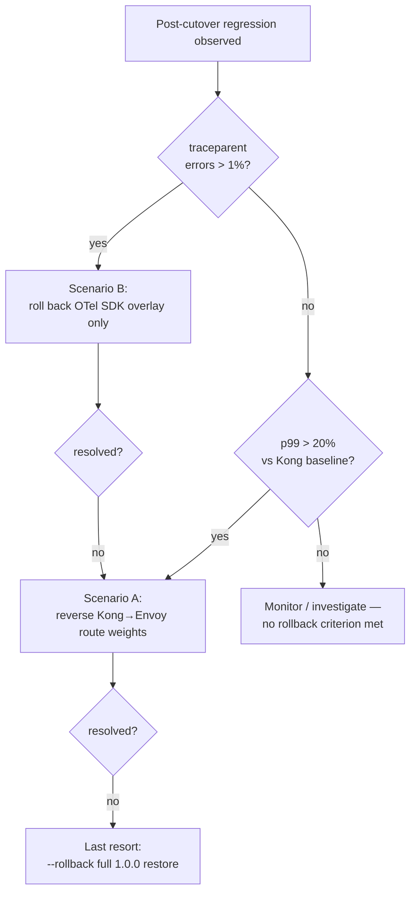

<!-- Audit: B.8.13 (b8-13-rollback-runbook) -->

# Rollback Runbook — full-stack-monorepo 1.0.0 → 2.0.0

Operational runbook for **reverting** a `full-stack-monorepo` migration from
`1.0.0` to `2.0.0` (the additive Envoy ∥ Kong / Connect ∥ REST / Zitadel / Qwik /
pg17 overlays delivered in B.8.4–B.8.12). It is the doc the migration guide
forward-references (`docs/MIGRATIONS.md`) for the *full* procedure.

Audience: the on-call SRE watching the cutover. If a post-cutover regression
trips one of the two criteria below, follow the matching scenario. Prefer the
**narrowest** reversal that resolves the regression — escalate only if it does
not.

> **Thresholds are relative deltas, never committed absolute numbers.** The
> reference example ships a placeholder backend (`fsm-backend: image: scratch`),
> so no real p50/p95/p99 latency figure exists in the repo (ADR-B8-1-002 +
> CLAUDE.md ANTI-HALLUCINATION PROTOCOL). You measure *your own* before/after
> baseline at run-time with the procedure in
> [§ Measuring](#measuring-before-after-the-b812-methodology).

These thresholds match the criteria embedded in the migrate driver
(`bin/forge-migrate-flagship.sh --rollback --dry-run`), verbatim:

> *p99 +>20% after Envoy → roll back Kong; traceparent errors >1% → roll back
> OTel SDK only. The cancelled orchestration-swap leg (B8O) contributes
> no CPU criterion.*

## Decision tree



There is **no DBOS- or CPU-based rollback criterion** — Temporal is the Rust
orchestrator and no DBOS leg was ever introduced (per B8O; see
[§ Supersession note](#supersession-note)).

---

## Scenario A — p99 latency regression after the Envoy cutover

The 2.0.0 overlay puts Envoy Gateway in front of the backend *in parallel* with
Kong (additive canary cutover by route). If Envoy adds tail latency, reverse the
route cutover — Kong is still present and is still the scaffolded default until
the 2.0.0 stable bump (B.8.14), so this is a **configuration** reversal, not a
code removal.

- **Detect** — Measure p99 on the happy-path through **both** the Kong route
  (before) and the Envoy route (after), using the B.8.12 measurement methodology
  (`docs/MIGRATIONS.md` → "Latency measurement methodology" / `docs/B8-BASELINE.md
  §6`): drive the Connect/gRPC round-trip (`demo-005-connect-greeting`), read
  p99 from the exporter/collector at run-time. Compare as a **relative delta** —
  do not record the raw figures in the repo.
- **Decide** — Trigger if **p99 regresses by more than `20 %`** (i.e. `> 20 %`
  above the Kong baseline). A regression below the threshold is monitored, not
  rolled back.
- **Execute** — Reverse the **Kong → Envoy route weights**: shift the canary
  `HTTPRoute` weights back to 100 % Kong / 0 % Envoy (the inverse of the canary
  cutover in `docs/MIGRATIONS.md`). No container is removed; Envoy stays deployed
  but receives no traffic. This is the documented criterion *p99 +>20% after
  Envoy → roll back Kong*.
- **Verify** — Confirm traffic is served via **Kong** again (route weights show
  Kong at 100 %, Envoy at 0 %; Kong health green) and that p99 returns to the
  pre-cutover baseline.
- **Re-attempt** — Once the latency cause is remediated (Envoy config, resource
  limits, etc.), re-apply the Phase-2 canary overlay and re-measure before
  shifting weights to Envoy again.

---

## Scenario B — traceparent propagation error rate

The 2.0.0 overlay adds an OTel SDK layer for end-to-end trace propagation
(`traceparent` Flutter→gateway→Rust). If propagation breaks, roll back **only**
that overlay — leave Envoy/Kong and the rest of the migration untouched.

- **Detect** — Measure the **`traceparent` propagation error rate** (spans whose
  parent context is missing or malformed) from the collector, before and after
  the OTel SDK overlay.
- **Decide** — Trigger if **`traceparent` errors exceed `1 %`** (i.e. `> 1 %`).
- **Execute** — Roll back the **OTel SDK overlay only** — revert the SDK overlay
  to the 1.0.0 instrumentation. Do **not** touch Envoy and do **not** run a
  full-tree rollback; this is the narrowest reversal. This is the documented
  criterion *traceparent errors >1% → roll back OTel SDK only*.
- **Verify** — Confirm the `traceparent` error rate returns **below `1 %`** and
  that traces are once again continuous across the Flutter→gateway→Rust hops.
- **Re-attempt** — After fixing the propagation defect (SDK version, context
  injection, header allow-list at the gateway), re-apply the OTel SDK overlay
  and re-measure.

---

## Last resort — full-tree rollback

When a narrow reversal is insufficient and the migration must be fully reverted:

```bash
# Preview the restore plan (no mutation):
bash bin/forge-migrate-flagship.sh --target . --rollback --dry-run

# Restore the full tree from the byte-frozen 1.0.0 snapshot:
bash bin/forge-migrate-flagship.sh --target . --rollback
```

`--rollback` restores the **full** target tree from the **byte-frozen 1.0.0
snapshot** (`.forge/scaffold-snapshots/full-stack-monorepo/1.0.0.tar.gz`; the
snapshot and its `.sha256` are never rebuilt or overwritten). `--rollback` is
**mutually exclusive with `--phase`** (full-snapshot restore only). Use this only
after the per-scenario reversals above have been ruled out — it discards *all*
2.0.0 overlay state, not just the regressing layer.

## Measuring before/after (the B.8.12 methodology)

Relative deltas only — see `docs/MIGRATIONS.md` → "Latency measurement
methodology (p50/p95/p99)" and `docs/B8-BASELINE.md §6` for the deterministic
procedure (stand up the stack against a real backend image, drive the
Connect/gRPC happy-path through the hermetic fake-OTLP collector, read p99 from
the exporter for the Kong route vs the Envoy route). No p50/p95/p99 number is
committed to the repo — you compute the relative delta against your own baseline.

---

## Supersession note

`docs/ARCHITECTURE-TARGET.md` is **sha256-pinned** by `t4.test.sh::_test_t4_023`
and is therefore **left byte-frozen** — it is *not* edited by this change. Its
§11/§12.1 still describe the **B8O-cancelled** "Temporal → DBOS" orchestration
model. **This runbook is the authoritative record** for rollback; the following
arch-doc references are **obsolete per B8O** (`b8-orchestration-temporal-realign`,
archived 2026-06-01) and superseded by `.forge/standards/orchestration.yaml`
v1.2.0 (`default_by_language.rust: temporal`, `dbos.available: false`):

| Arch-doc location | Obsolete text | Authoritative now |
|-------------------|---------------|-------------------|
| §11.1 mermaid | "DBOS embedded" (Phase 2 node) | Temporal retained — no DBOS bascule |
| §11.2 Phase 2 | "Migrer Temporal → DBOS pour workflows monorepo simples" | no orchestration swap |
| §11.2 Phase 2 risk | "DBOS Go SDK encore récent" | risk void — DBOS not adopted |
| §11.3 | "DBOS Postgres saturé > 70 % CPU → fallback à Temporal" | **no DBOS/CPU rollback criterion** |
| §11.4 risk table | "DBOS Go SDK breaking changes" | risk void — DBOS not adopted |
| §11.2 Phase 3 risk | "maturité DBOS pour AI agents" | DBOS on watch-list only (no Rust SDK) |
| §12.1 | `default: dbos` / `fallback: temporal` (YAML illustration) | `default_by_language.rust: temporal` |

An in-place correction of `docs/ARCHITECTURE-TARGET.md` (via
`bin/forge-rehash-architecture-doc.sh` + t4 re-ratification) is a separate,
non-B.8.13 doc cleanup — material edits to the pinned doc must be ratified by a
fresh Forge change (REHASH-LOG convention).
