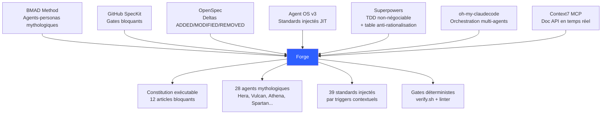
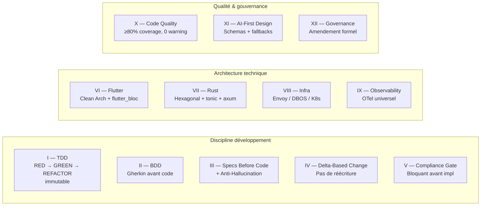
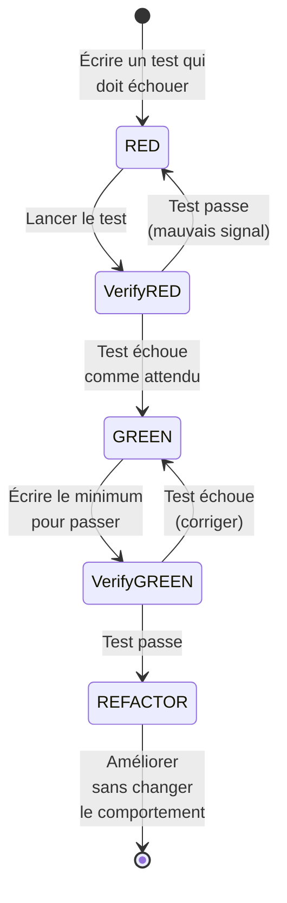
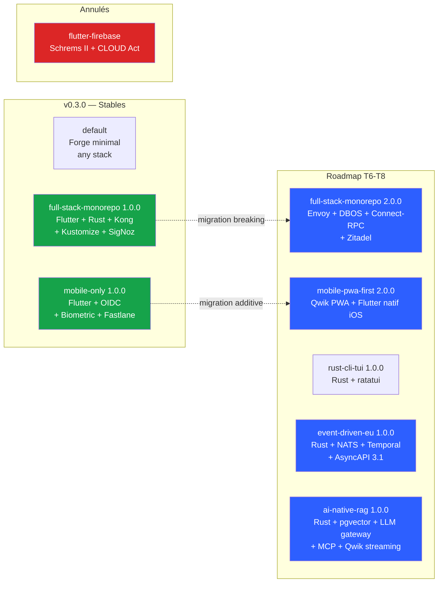
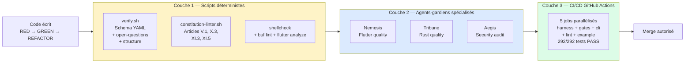
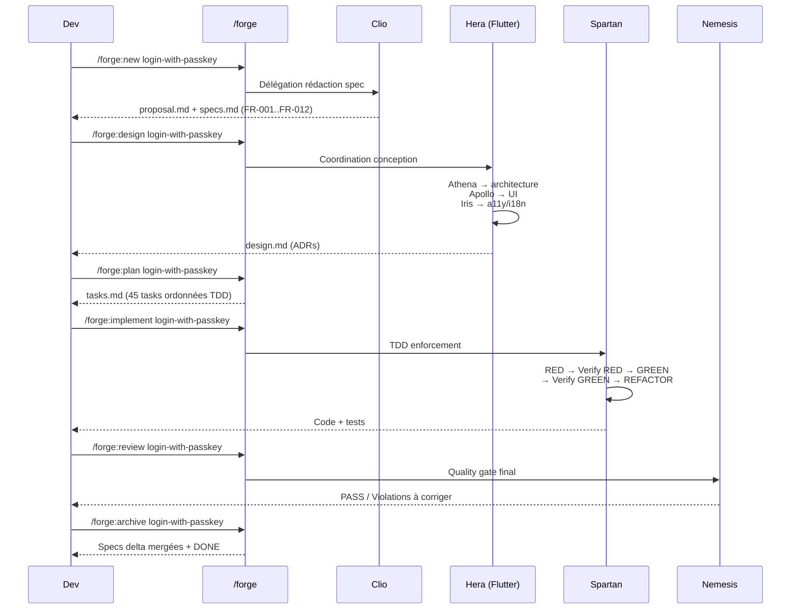
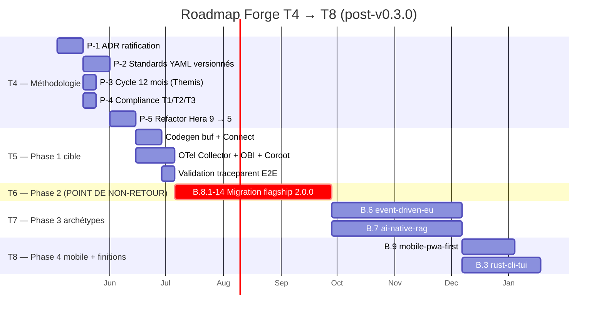

# Forge : transformer Claude Code en équipe d'ingénierie qui ne saute jamais la spec

> *« Specs are the source code of intent — Code is ephemeral; specs are the durable record of what was decided and why. »*

Il existe deux manières de rater un produit logiciel.

La première, c'est le **« just ship it »** : on code vite, les specs vivent dans des tickets Jira qu'on relit jamais, les tests sont écrits après coup (ou jamais), et trois mois plus tard plus personne ne sait pourquoi telle décision a été prise. Les bugs reviennent en production parce que l'intention initiale s'est dissoute.

La seconde, c'est l'**excès de cérémonie** : RFC, ADR, design reviews, comités d'architecture. Tout est documenté, mais rien n'est *exécuté*. Les checklists sont consultatives. Le développeur fatigué un vendredi à 17h reste la seule barrière entre la production et une migration cassée.

Forge — un framework de développement piloté par spécifications pour Claude Code — fait le pari qu'il existe une troisième voie : faire du processus lui-même un compilateur. Là où les frameworks classiques *recommandent*, Forge **refuse de progresser** quand un invariant est violé. La qualité n'est plus une affaire de volonté, c'est une affaire de structure.

Cet article raconte ce qu'est Forge, comment il s'est construit en quelques mois, ce qu'il vise, et comment l'utiliser concrètement.

---

## 1. L'idée de base : faire du processus un compilateur

Forge part d'un constat très simple : **les LLM amplifient les bonnes pratiques quand elles sont structurelles, et les mauvaises quand elles sont disciplinaires**. Donner à Claude une consigne du type « pense à écrire les tests avant le code » fonctionne dix minutes, puis se dissout dans la pression du contexte. Donner à Claude un agent qui *refuse* de produire du code tant qu'un test rouge n'existe pas, c'est un autre univers.

La proposition de valeur tient en trois lignes (`.forge/product/mission.md:65-72`) :

> *Unlike advisory frameworks (ADR templates, process wikis, review checklists), Forge's guardrails are structural — the tooling refuses to proceed when invariants are violated. The core value: a spec-driven pipeline where each phase has a blocking gate, and where the LLM is only one voice among several (deterministic scripts, mythological-persona agents, constitutional articles) rather than the sole arbiter.*

Trois conséquences directes :

1. **Le LLM n'est jamais l'arbitre final.** Il est une voix parmi d'autres. Des scripts shell déterministes (`verify.sh`, `constitution-linter.sh`) refusent un changement non-conforme sans avoir besoin de l'avis du modèle.
2. **Les specs sont obligatoires, pas optionnelles.** `/forge:implement` refuse de fonctionner sans `.forge/changes/<nom>/specs.md` complété.
3. **Le doute s'écrit, il ne se devine pas.** Quand la spec est ambiguë, l'agent émet `[NEEDS CLARIFICATION: question précise]` et **stoppe**. Deviner est explicitement interdit par la Constitution (Article III.4).

Le persona-cible, formalisé dans la mission, est très concret : Alex, ingénieur senior Flutter/Rust dans une scale-up de dix personnes, qui a vu deux initiatives « process » échouer parce qu'elles étaient consultatives. Forge n'est pas un framework généraliste — il vise délibérément les équipes Flutter + Rust qui livrent des clients mobiles couplés à des services backend.

---

## 2. Genèse : sept frameworks fusionnés en un

Forge n'a rien inventé seul. Le `NOTICE` du dépôt liste sept attributions. Chacune résout une douleur précise, et la valeur de Forge tient justement à leur composition.



| Source | Apport repris dans Forge |
|---|---|
| **BMAD Method** | Le concept d'agents-personas avec noms mythologiques (Hera, Vulcan, Athena, Spartan…), chacun gardien d'un domaine précis. |
| **GitHub SpecKit** | L'idée que les gates structurels sont *bloquants*. `/forge:review` peut refuser un merge ; `verify.sh` retourne un code 1 quand un invariant casse. |
| **OpenSpec** | Le format de specs delta (ADDED / MODIFIED / REMOVED) qui préserve l'historique des décisions au lieu de réécrire à chaque évolution. |
| **Agent OS v3** | Les standards injectés à la demande via `index.yml` — 39 règles indexées par triggers (mots-clés, scope, priorité), jamais chargées en bloc. |
| **Superpowers** | Le TDD comme loi non-négociable, et la table d'anti-rationalisation : « it's too simple to test », « it's just a utility function », « we'll add tests later »… toutes interdites. |
| **oh-my-claudecode** | Les keywords naturels (`autopilot`, `ulw`, `team`) et le pattern d'orchestration multi-agents. |
| **Context7 MCP** | La résolution d'API externes en temps réel : `resolve-library-id` puis `query-docs` *avant* d'écrire un import, pour ne pas halluciner une signature. |

Aucune de ces sources n'est dominante. Forge est un composite équilibré — chaque pièce remplit un rôle, aucune ne fait double emploi.

L'évolution s'est faite en quelques mois, par paliers (les fichiers de plan dans `~/.claude/plans` racontent cette histoire) :

- **Avril, semaines 1-2** : ratification de la Constitution v1.0.0, indexation des standards, conventions de nommage des changes.
- **Avril, semaines 2-3** : ajout de 4 agents structurants (Pythia produit, Calliope docs, Hermes-API contrats, Eris tests) et de 5 commandes (`/forge:verify`, `/forge:clarify`, `/forge:onboard`, `/forge:diff`, `/forge:metrics`). Création du `constitution-linter.sh` déterministe.
- **Avril, semaines 3-4** : projets pilotes (Flutter `ai_voice_widget`, Rust `sai-code`, microservices Go `saaster-kit`) qui valident la discipline en conditions réelles.
- **Mai 2026** : audit complet du framework, livraison de **v0.3.0** avec deux archétypes stables (`full-stack-monorepo` et `mobile-only`), Constitution v1.1.0 incluant l'Article XII Governance, **13 changes archivés et 292/292 tests verts**.

Forge applique Forge à lui-même : son propre dépôt utilise sa propre Constitution, ses propres standards, ses propres harnesses de test.

---

## 3. La Constitution : douze articles non-négociables

Le document central de Forge n'est pas un README, c'est `.forge/constitution.md`. Douze articles, ratifiés et versionnés (`v1.1.0`, effective au 30 avril 2026), qui régissent absolument tout. Le préambule est explicite :

> *When any article of this Constitution conflicts with a team preference, a shortcut, a deadline pressure, or a 'it's just this once' rationale, the Constitution wins. Always.* (`constitution.md:15`)



L'article qui change tout, c'est l'**Article I** : le TDD est immuable, sans exemption.



La Constitution énumère explicitement les cinq excuses interdites (`constitution.md:44-54`) :

> *« It's too simple to test. » / « It's just a utility function. » / « We'll add tests later. » / « This is a prototype. » / « Tests would take too long. » There are no exemptions.*

L'**Article III.4** est probablement le plus original. Quand un agent rencontre une ambiguïté, une contradiction ou un comportement non défini, il doit émettre `[NEEDS CLARIFICATION: <question>]` et **stopper toute implémentation**. Deviner est interdit. Le `constitution-linter.sh` refuse d'archiver un change qui contient encore un de ces marqueurs non résolus.

C'est le mécanisme anti-hallucination par excellence : transformer le doute en artefact tracé, et non en suite de tokens optimistes.

---

## 4. Le pipeline spec-driven

Tout le travail dans Forge passe par un pipeline standardisé. La commande maîtresse `/forge` détecte automatiquement l'état du projet et route vers la phase suivante. Mais on peut aussi piloter chaque étape manuellement.

```mermaid
flowchart TD
    Init[/forge:init<br/>Scaffold framework]
    Discover[/forge:discover<br/>Extraire conventions existantes]
    Vision[/forge:vision<br/>Mission + value prop]

    Init --> Discover
    Discover --> Vision
    Vision --> Explore

    Explore[/forge:explore<br/>Brainstorm libre]
    Propose[/forge:propose<br/>Problem + solution]
    Specify[/forge:specify<br/>RFC 2119 + FRs]
    Clarify[/forge:clarify<br/>Lever ambiguïtés]
    Design[/forge:design<br/>ADRs + architecture]
    Plan[/forge:plan<br/>Tasks ordonnées TDD]
    Implement[/forge:implement<br/>Cycle RED-GREEN-REFACTOR]
    Review[/forge:review<br/>Quality gates]
    Archive[/forge:archive<br/>Merge specs delta + DONE]

    Explore --> Propose
    Propose --> Specify
    Specify --> Clarify
    Clarify --> Design
    Design --> Plan
    Plan --> Implement
    Implement --> Review
    Review --> Archive

    Verify[/forge:verify<br/>Spec ↔ code 3 dimensions]
    Diff[/forge:diff<br/>ADDED / MODIFIED / REMOVED]
    Metrics[/forge:metrics<br/>Velocity + bottleneck]
    Status[/forge:status<br/>État du projet]

    Implement -.- Verify
    Implement -.- Diff
    Archive -.- Metrics
    Archive -.- Status

    style Init fill:#2d5fff,color:#fff
    style Archive fill:#16a34a,color:#fff
    style Implement fill:#dc2626,color:#fff
```

Concrètement, un change vit dans `.forge/changes/<nom-du-change>/` avec quatre fichiers obligatoires :

- `proposal.md` — pourquoi ce change ? Quel problème ? Quelle solution ?
- `specs.md` — exigences fonctionnelles (FR-XXX) et non-fonctionnelles, en RFC 2119 (MUST / SHOULD / MAY).
- `design.md` — décisions d'architecture (ADRs) avec alternatives rejetées et trade-offs.
- `tasks.md` — découpage en tâches ordonnées TDD, chacune référençant un `FR-XXX`.

Le linter constitutionnel vérifie en sortie :
- **Article V.1** — chaque tâche réfère bien à un FR (`[Story: FR-XYZ]`) ;
- **Article X.3** — la documentation des API publiques atteint le seuil (par défaut 80 %) ;
- **Article XI.3** — pas d'import IA + rendu UI sans `*.schema.json` (warning) ;
- **Article XI.5** — chaque module IA déclaré « avec fallback » a bien un test pair `*fallback*_test*` (fail).

La performance est budgétée : `verify.sh` s'exécute en moins de 5 secondes, `constitution-linter.sh` en moins de 3 secondes. Les gates ne sont pas un frein, ils sont une rampe.

---

## 5. Vingt-huit agents mythologiques

Forge orchestre une équipe de **28 agents** spécialisés, chacun avec un nom mythologique, une expertise scopée, et un droit de veto sur son domaine. La routing automatique se fait depuis l'agent maître `Forge`.

```mermaid
graph TD
    Forge[Forge<br/>Master orchestrateur]

    Forge --> Hera
    Forge --> Vulcan
    Forge --> Atlas
    Forge --> Cross

    subgraph Flutter[Flutter Team — orchestrée par Hera]
      Hera[Hera<br/>Coordination feature]
      Hera --> Athena[Athena<br/>Architecture FSD/Clean]
      Hera --> Spartan[Spartan<br/>TDD-BDD enforcement]
      Hera --> Apollo[Apollo<br/>UX/UI Material 3]
      Hera --> Hephaestus[Hephaestus<br/>Widgets custom]
      Hera --> Hermes[Hermes<br/>Performance]
      Hera --> Iris[Iris<br/>A11y + i18n]
      Hera --> Argus[Argus<br/>OTel client]
      Hera --> Prometheus[Prometheus<br/>AI / Voice / GenUI]
      Hera --> Nemesis[Nemesis<br/>Quality gate final]
    end

    subgraph Rust[Rust Team — orchestrée par Vulcan]
      Vulcan[Vulcan<br/>Coordination équipe]
      Vulcan --> Ferris[Ferris<br/>Architecture hexagonale]
      Vulcan --> Centurion[Centurion<br/>TDD-BDD enforcement]
      Vulcan --> Terminal[Terminal<br/>TUI ratatui]
      Vulcan --> Sentinel[Sentinel<br/>OTel server]
      Vulcan --> Tribune[Tribune<br/>Quality gate final]
    end

    subgraph Cross[Agents transversaux]
      Clio[Clio<br/>Specs RFC 2119]
      Socrates[Socrates<br/>DDD + Event Storming]
      Oracle[Oracle<br/>AI-first brainstorm]
      Atlas[Atlas<br/>Infra Docker/K8s/Kong]
      Panoptes[Panoptes<br/>Observability stacks]
      Aegis[Aegis<br/>Security / OWASP]
      Heracles[Heracles<br/>CI/CD]
      Pythia[Pythia<br/>Product PRFAQ]
      Calliope[Calliope<br/>Technical writing]
      HermesAPI[Hermes-API<br/>Contrats OpenAPI/gRPC]
      Eris[Eris<br/>Test architecture]
    end

    style Forge fill:#2d5fff,color:#fff
    style Hera fill:#7c3aed,color:#fff
    style Vulcan fill:#dc2626,color:#fff
    style Nemesis fill:#16a34a,color:#fff
    style Tribune fill:#16a34a,color:#fff
```



Quelques principes de design pour cette équipe :

- **Aucun agent ne devient une poubelle.** Chacun a une autorité scopée, et refuse poliment ce qui sort de son périmètre.
- **Les sous-équipes Flutter et Rust sont parallélisables.** Hera et Vulcan peuvent dispatcher en simultané, ce qui permet de travailler côté client et côté serveur en même temps quand les contrats `.proto` sont stables.
- **Les agents-gardiens (Nemesis, Tribune, Aegis) sont des derniers murs.** Ils valident *après* implémentation, indépendamment du contexte du développeur, en relisant la Constitution + les standards + le design.
- **Les agents structurants couvrent les quatre temps de la création.** Pythia clarifie l'intention produit, Clio écrit la spec, Hermes-API verrouille les contrats, Eris dimensionne la pyramide de tests. Quatre rôles distincts, quatre fenêtres de validation.

L'effet pratique est que chaque change Forge passe par une succession de mains spécialisées, exactement comme dans une équipe humaine bien rôdée — sauf qu'aucune main n'oublie de relire la Constitution.

---

## 6. Standards injectés à la demande

Une grosse partie de la magie de Forge se joue dans `.forge/standards/`. Le dossier contient **39 règles** organisées par domaine : `global/` (TDD, BDD, DDD, SOLID, naming), `flutter/` (architecture, tests, UI, state management), `rust/` (architecture, error handling, async), `infra/` (Docker, K8s, Kong, Temporal), `observability/` (OTel, SigNoz, ELK, Prometheus).

Plutôt que de tout charger d'un coup — ce qui saturerait le contexte du LLM et noierait l'agent dans des règles non pertinentes — Forge utilise un index avec **triggers contextuels** :

```yaml
# Extrait de .forge/standards/index.yml
- id: flutter/state-management
  triggers: [bloc, cubit, state, refactor]
  scope: flutter
  priority: high
- id: rust/error-handling
  triggers: [error, result, anyhow, thiserror]
  scope: rust
  priority: critical
- id: global/tdd
  triggers: [test, refactor, implement]
  scope: all
  priority: critical
```

Quand un agent travaille sur une tâche Flutter qui mentionne « bloc », le standard `flutter/state-management.md` est injecté automatiquement, juste-à-temps. Ni avant, ni en bloc, ni à choisir manuellement. Trois conséquences :

1. La **fenêtre de contexte reste petite** — on ne paie pas le coût des règles qu'on n'utilise pas.
2. Les **règles arrivent au bon moment** — elles sont « actives » exactement quand elles servent.
3. La **gouvernance est centralisée** — modifier une règle dans `index.yml` la propage à tous les projets utilisant Forge.

Les standards eux-mêmes ont un cycle de vie. Un standard a une **fenêtre de réévaluation** (par défaut 12 mois, gérée par l'agent Themis dans la roadmap T4). On ne pose pas une règle pour l'éternité — on la pose pour une décision actuelle, avec une obligation de re-discuter quand la fenêtre arrive.

Une règle est même structurellement protégée hors fenêtre : `flutter_bloc` est l'unique state management autorisé pendant douze mois (ADR-006). Pas de Riverpod, pas de Provider, pas de GetX. Un linter `no-state-management-alternatives` refusera tout import non conforme. C'est volontairement opinionné : Forge préfère cinq archétypes excellents à sept médiocres.

---

## 7. Les archétypes : la matière première

Un **archétype** dans Forge, c'est une combinaison curatée *(schema + standards + templates + script de scaffold + spec accumulée + snapshot tarball)* conçue pour un type de projet précis. C'est ce qui transforme `forge init` en générateur de squelette cohérent.



À v0.3.0, deux archétypes premium sont stables :

- **`full-stack-monorepo` 1.0.0** — Flutter (mobile + desktop) + Rust (5 crates hexagonales) + protos Buf + infra Kustomize + Kong + OTel/SigNoz. Adressé aux équipes 4-6 personnes qui livrent un produit complet. Un projet de référence vivant existe dans `examples/forge-fsm-example/` avec quatre demo changes (dont `demo-004` volontairement laissé en `specified` pour montrer comment se présentent les marqueurs `[NEEDS CLARIFICATION]`).
- **`mobile-only` 1.0.0** — Flutter iOS+Android avec OIDC externe (Auth0, Keycloak, Cognito, Okta), Keychain/Keystore, biométrie via `local_auth`, App Attest iOS et Play Integrity Android, pipelines Fastlane par plateforme. Adressé aux équipes mobile-native avec un backend déjà en place.

Un archétype `flutter-firebase` était initialement prévu — il a été **annulé** parce qu'incompatible avec les contraintes EU (Schrems II et CLOUD Act). Forge assume une cible géographique : être robuste pour les équipes européennes d'abord.

Trois archétypes sont en roadmap (`docs/new-archetypes-plan.md`) :

- `event-driven-eu` (Rust + NATS JetStream + Temporal + AsyncAPI 3.1, conformité T2/T3 RGPD/NIS2/DORA/CRA),
- `ai-native-rag` (Rust + pgvector + LLM gateway Mistral Scaleway / vLLM self-host + MCP + UI streaming Qwik),
- `rust-cli-tui` (auteurs d'outils CLI avec ratatui).

L'archétype phare `full-stack-monorepo` lui-même évoluera en **2.0.0** — une migration breaking qui remplace Kong par Envoy Gateway, Temporal par DBOS (Postgres-backed durable execution), et le bridge REST→gRPC par Connect-RPC. Le verdict est explicite (`new-archetypes-plan.md:49-51`) :

> *Le risque maintenant n'est pas de manquer d'exécution, c'est de figer un flagship dont les briques internes (Kong/Temporal/REST-bridge) ne survivront pas 18 mois dans les mains de tes adopters EU.*

---

## 8. Quality gates : trois couches qui se relisent

La qualité dans Forge n'est jamais l'affaire d'un seul gardien. Trois couches travaillent en parallèle, chacune avec son rôle.



**Couche 1 — les scripts déterministes.** `verify.sh` (~5 s) et `constitution-linter.sh` (~2 s) tournent sans LLM. Ils vérifient des invariants structurels : la schema YAML est valide, chaque tâche réfère un FR, chaque module IA déclaré « avec fallback » a un test pair, le ratio de doc des API publiques atteint le seuil. Aucun jugement, aucune hallucination possible.

**Couche 2 — les agents-gardiens.** Avant un merge, `/forge:review` invoque Nemesis (Flutter) ou Tribune (Rust). Ils relisent : conformité Constitution, cycle TDD respecté (RED écrit avant GREEN ?), coverage ≥ 80 %, scénarios BDD pour chaque comportement user-facing, design implémenté fidèlement. Aegis vérifie en plus la sécurité : minimisation PII, fallbacks IA testés, pas de HTML brut côté Generative UI.

**Couche 3 — la CI/CD.** Le workflow `forge-ci.yml` orchestre cinq jobs parallélisés (harness, gates, cli, lint, example) en concurrence asymétrique : une PR voit ses runs annulés sur push, mais `main` ne le fait pas. Le dépôt Forge dog-foode son propre framework — **292 tests pass sur 292**, treize harnesses déployés, zero régression sur les onze changes archivés avant l'introduction du schema YAML F.2.

---

## 9. Anti-hallucination : le cœur du dispositif IA

Deux mécanismes complémentaires construisent la défense de Forge contre l'hallucination LLM.

**Le marqueur `[NEEDS CLARIFICATION:]`** est explicite (`constitution.md:131-137`) :

> *When a specification contains ambiguity, contradictions, or undefined behavior, the implementing agent or developer MUST output `[NEEDS CLARIFICATION: <specific question>]` and STOP all implementation work. Guessing at intent is prohibited. Assumptions that turn out to be wrong cost more than the time saved by not asking.*

Ces marqueurs sont **trackés** dans `open-questions.md` avec un identifiant Q-NNN, un statut (`open` / `answered` / `wontfix`), et un bloc de résolution. Le change ne peut pas être archivé tant qu'il reste des questions ouvertes inline. C'est de l'incertitude *écrite*, pas de l'incertitude qu'on fait disparaître par optimisme.

**Context7 MCP** est l'autre pilier. Au lieu de faire confiance aux données d'entraînement (qui sont obsolètes pour des librairies évolutives comme `tonic`, `flutter_bloc`, `axum`), Forge appelle un serveur MCP qui résout les signatures d'API en temps réel :

```
1. resolve-library-id("tonic")   → /hyperium/tonic
2. query-docs("/hyperium/tonic") → docs courantes de la version 0.14.x
3. L'agent code avec les vraies signatures, pas des sigs hallucinées
```

Le `CLAUDE.md` du projet rend ce protocole obligatoire : *« Never use training data for external library API signatures — they change between versions. »* Trois lignes qui changent radicalement la qualité du code généré.

---

## 10. Comment l'utiliser concrètement

Forge se distribue par trois canaux. Aucun n'est exclusif.

```bash
# A — curl | sh (sans Node)
curl -fsSL https://raw.githubusercontent.com/bfontaine/forge/main/bin/forge-install.sh | bash

# B — npm
npx @sdd-forge/cli init
# ou install globale
npm install -g @sdd-forge/cli && forge init

# C — Docker (CI)
docker run --rm -v "$PWD:/workspace" -w /workspace forge/linter:latest
```

Le CLI couvre trois commandes principales :

- `forge init [--archetype <name>] [--auto] [--target <dir>] [--org <reverse-domain>] [--force]` — scaffold le framework. Trois modes : explicite (`--archetype mobile-only`), auto-détection (`--auto` inspecte `pubspec.yaml`, `Cargo.toml`…), ou wizard interactif.
- `forge verify [--target <dir>]` — exécute les gates déterministes, retourne 0 (pass), 1 (violation), 2 (scripts manquants).
- `forge version` — affiche la version installée.

Le CLI est **idempotent** : relancer `forge init` sans `--force` ne touche jamais à vos éditions. Le contenu projet (`.forge/changes/`, `.forge/specs/`, `.claude/settings.local.json`) n'est **jamais** copié — Forge respecte le périmètre du projet.

Une fois Forge installé, on ouvre Claude Code dans le dossier et on tape `/forge`. La commande maîtresse détecte l'état et route :

- pas de `.forge/constitution.md` → propose `/forge:init` ;
- pas de `.forge/standards/` → propose `/forge:discover` (extrait les conventions existantes) ;
- pas de mission produit → propose `/forge:vision` ;
- un change actif dans `.forge/changes/` → continue à sa phase courante ;
- aucun change actif → propose `/forge:explore` ou `/forge:new`.

Un workflow type pour démarrer une feature ressemble à ça :



Au quotidien, on jongle aussi avec :

- `/forge:status` — rapport complet de l'état du projet (changes en cours, archivés, bloqués) ;
- `/forge:metrics` — vélocité et goulots d'étranglement ;
- `/forge:diff <change>` — diff sémantique des specs (ADDED / MODIFIED / REMOVED) ;
- `/forge:verify <change>` — alignement spec ↔ code en trois dimensions (Completeness, Correctness, Coherence) ;
- `/forge:onboard` — checklist d'orientation pour un nouveau contributeur.

Et si vous travaillez sur un projet existant qui n'a pas démarré sous Forge, `/forge:discover` extrait vos conventions actuelles et les propose comme standards — Forge ne force pas la conformité immédiate, il crée des « gaps » traçables qui deviennent autant de futures issues à traiter.

---

## 11. Roadmap : la migration vers Forge 2.0

La trajectoire post-v0.3.0 est cartographiée dans `docs/new-archetypes-plan.md`. Six mois, cinq trimestres internes (T4 → T8), un point de non-retour.



Trois décisions structurelles définissent la migration breaking en `full-stack-monorepo 2.0.0` :

| ADR | Décision | Pourquoi |
|---|---|---|
| **ADR-001** | Kong → **Envoy Gateway** | Latence p99 trop élevée, gRPC-Web/Connect sous-optimal sur Kong, overhead Lua/OpenResty. |
| **ADR-002** | Temporal → **DBOS** par défaut | Overhead control plane injustifié pour 80 % des workflows. Temporal reste pour `event-driven-eu` (>10k workflows/jour). |
| **ADR-003** | Bridge REST/JSON → **Connect-RPC** | Fin du double mapping ; un seul protocole client/serveur. |

Le module **B.8** (migration flagship) liste quatorze items : audit baseline p95/p99, snapshot tarball legacy, schema 2.0.0, Helm Envoy, embedding DBOS, templates Connect-RPC, déploiement Zitadel self-host, stack SigNoz + OBI eBPF + Coroot service map, web public Qwik, scripts de migration `bin/forge-migrate-flagship.sh`, linter `no-state-management-alternatives`, tests E2E, critères de rollback (p99 +20 %, traceparent loss >1 %, DBOS CPU >70 %), bump du schema. Effort estimé : **XL, ~10-12 semaines** pour un développeur senior.

Au-delà, deux nouveaux archétypes premium étendent la couverture :

- **`event-driven-eu`** — pour les architectures orientées événements en contexte EU, avec compliance native RGPD/NIS2/DORA/CRA et contrats AsyncAPI 3.1 dérivés des protos.
- **`ai-native-rag`** — pour les produits IA-natifs (RAG, agents, MCP servers, streaming UI), avec gateway LLM (Mistral Scaleway en T1/T2, vLLM self-host en T3) et compliance AI Act.

Et `mobile-only` se transforme en **`mobile-pwa-first`** : le canal par défaut devient une PWA Qwik (Service Worker + Web Push VAPID + manifest + offline shell), avec fallback Flutter natif iOS quand le push critique l'exige.

L'objectif final est un **Forge 1.0 GA** stabilisé après franchissement complet de T2 P1 + P2 et de la migration B.8.

---

## 12. Conclusion : pourquoi Forge change la donne

Forge propose une thèse simple mais radicale : **dans une équipe qui code avec des LLM, la qualité ne peut pas être disciplinaire — elle doit être structurelle**. Toute règle qui peut être contournée par fatigue, par pression de deadline, ou par optimisme excessif, *sera* contournée. Forge transforme les règles en murs.

Trois mécanismes font tenir l'édifice :

1. Une **Constitution exécutable** dont chaque article a un linter déterministe — pas de jugement, pas d'hallucination possible.
2. **Vingt-huit agents** spécialisés, chacun avec un veto scopé, qui refusent de progresser quand leurs invariants sont violés.
3. **Trente-neuf standards** injectés à la demande, jamais en bloc, par triggers contextuels — la fenêtre de contexte reste petite, les règles arrivent au bon moment.

Le tout adossé à une **anti-hallucination explicite** (`[NEEDS CLARIFICATION:]` + Context7 MCP) qui transforme le doute en artefact tracé.

Le prix à payer est la **focalisation** : Forge cible Flutter et Rust, en EU, avec des stacks opinionées (`flutter_bloc`, `tonic`, hexagonal architecture). Ce n'est pas un framework généraliste, et il n'a pas vocation à le devenir. Trois utilisateurs cibles bien servis valent mieux que dix utilisateurs cibles tièdes.

Le bénéfice, lui, est qu'on cesse de jouer au gardien fatigué du vendredi à 17h. Les specs ne dérivent plus parce que la phase d'archivage les fusionne dans la spec accumulée de l'archétype. Les tests ne sont plus skippés parce que Spartan ou Centurion refusent de produire du code sans test rouge préalable. Les API externes ne sont plus hallucinées parce que Context7 fournit les signatures courantes. Le « on nettoiera au prochain sprint » devient impossible à dire — il y a un linter pour ça.

Si vous écrivez du Flutter ou du Rust avec Claude Code, et que vous avez déjà payé le coût d'une migration partie en vrille, d'une feature livrée sans tests, ou d'une signature d'API hallucinée par un LLM, Forge mérite votre attention. Il n'est pas un produit terminé — v0.3.0 vient de sortir, et la roadmap T4-T8 est dense — mais il est déjà self-hosting : son propre dépôt utilise sa propre Constitution, ses propres standards, ses propres harnesses. **Le framework qui se valide lui-même est probablement le seul qui mérite qu'on lui confie un produit.**

---

## Pour aller plus loin

- **Dépôt** : `https://github.com/bfontaine/forge`
- **Constitution** : `.forge/constitution.md` (12 articles, v1.1.0)
- **Guide utilisateur** : `docs/GUIDE.md`
- **Architecture cible** : `docs/ARCHITECTURE-TARGET.md` (~89 ko)
- **Roadmap détaillée** : `docs/new-archetypes-plan.md`
- **Gouvernance** : `GOVERNANCE.md` (modèle BDFL-with-fallback)
- **Licence** : Apache 2.0, avec attributions BMAD / SpecKit / OpenSpec / Agent OS v3 / Superpowers / oh-my-claudecode / Context7 dans `NOTICE`.

> *Quality is not a matter of willpower — it is a matter of process.*
> — Forge Constitution, Préambule
