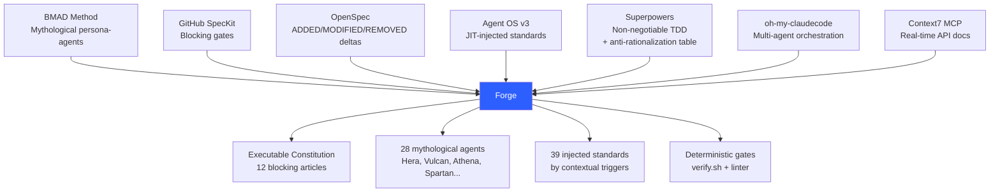
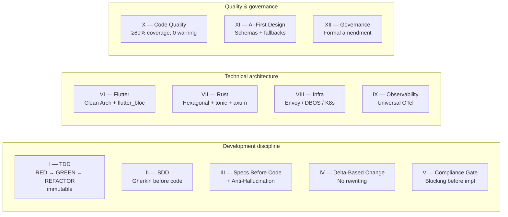
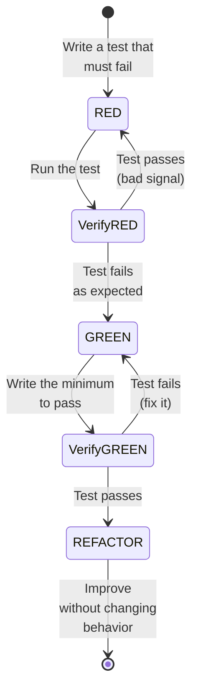
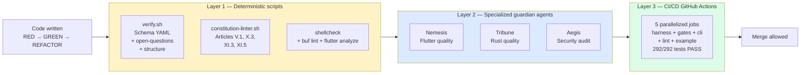
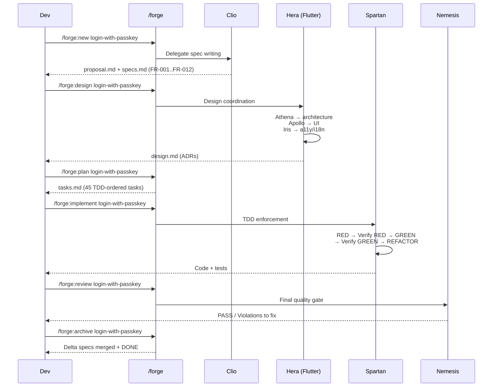

# Forge: turning Claude Code into an engineering team that never skips the spec

> *« Specs are the source code of intent — Code is ephemeral; specs are the durable record of what was decided and why. »*

There are two ways to fail at a software product.

The first is **"just ship it"**: you code fast, specs live in Jira tickets nobody ever rereads, tests are written afterward (or never), and three months later nobody remembers why a given decision was made. Bugs come back in production because the initial intent has dissolved.

The second is **excessive ceremony**: RFCs, ADRs, design reviews, architecture committees. Everything is documented, but nothing is *executed*. Checklists are advisory. The developer, tired on a Friday at 5pm, remains the only barrier between production and a broken migration.

Forge — a spec-driven development framework for Claude Code — bets there is a third way: making the process itself a compiler. Where classic frameworks *recommend*, Forge **refuses to proceed** when an invariant is violated. Quality is no longer a matter of willpower, it is a matter of structure.

This article covers what Forge is, how it was built over a few months, what it targets, and how to use it in practice.

---

## 1. The core idea: making the process a compiler

Forge starts from a very simple observation: **LLMs amplify good practices when they are structural, and bad ones when they are disciplinary**. Giving Claude an instruction like "remember to write tests before code" works for ten minutes, then dissolves under context pressure. Giving Claude an agent that *refuses* to produce code as long as no red test exists is a whole different universe.

The value proposition fits in three lines:

> *Unlike advisory frameworks (ADR templates, process wikis, review checklists), Forge's guardrails are structural — the tooling refuses to proceed when invariants are violated. The core value: a spec-driven pipeline where each phase has a blocking gate, and where the LLM is only one voice among several (deterministic scripts, mythological-persona agents, constitutional articles) rather than the sole arbiter.*

Three direct consequences:

1. **The LLM is never the final arbiter.** It is one voice among several. Deterministic shell scripts (`verify.sh`, `constitution-linter.sh`) reject a non-compliant change without needing the model's opinion.
2. **Specs are mandatory, not optional.** `/forge:implement` refuses to run without a completed `.forge/changes/<name>/specs.md`.
3. **Doubt is written down, not guessed.** When the spec is ambiguous, the agent emits `[NEEDS CLARIFICATION: specific question]` and **stops**. Guessing is explicitly forbidden by the Constitution (Article III.4).

The target persona, formalized in the mission, is very concrete: Alex, a senior Flutter/Rust engineer in a ten-person scale-up, who has seen two "process" initiatives fail because they were advisory. Forge is not a general-purpose framework — it deliberately targets Flutter + Rust teams that ship mobile clients coupled to backend services.

---

## 2. Genesis: seven frameworks merged into one

Forge invented nothing on its own. The repo's `NOTICE` lists seven attributions. Each solves a precise pain point, and Forge's value lies precisely in their composition.



| Source | Contribution adopted in Forge |
|---|---|
| **BMAD Method** | The concept of persona-agents with mythological names (Hera, Vulcan, Athena, Spartan…), each the guardian of a precise domain. |
| **GitHub SpecKit** | The idea that structural gates are *blocking*. `/forge:review` can reject a merge; `verify.sh` returns exit code 1 when an invariant breaks. |
| **OpenSpec** | The delta specs format (ADDED / MODIFIED / REMOVED) that preserves the history of decisions instead of rewriting on every evolution. |
| **Agent OS v3** | Standards injected on demand via `index.yml` — 39 rules indexed by triggers (keywords, scope, priority), never loaded all at once. |
| **Superpowers** | TDD as a non-negotiable law, and the anti-rationalization table: "it's too simple to test", "it's just a utility function", "we'll add tests later"… all forbidden. |
| **oh-my-claudecode** | The natural keywords (`autopilot`, `ulw`, `team`) and the multi-agent orchestration pattern. |
| **Context7 MCP** | Real-time resolution of external APIs: `resolve-library-id` then `query-docs` *before* writing an import, so as not to hallucinate a signature. |

None of these sources is dominant. Forge is a balanced composite — each piece fills a role, none is redundant.

The evolution happened over a few months, in stages (the plan files in `~/.claude/plans` tell this story):

- **April, weeks 1-2**: ratification of Constitution v1.0.0, indexing of standards, change naming conventions.
- **April, weeks 2-3**: addition of 4 structuring agents (Pythia for product, Calliope for docs, Hermes-API for contracts, Eris for tests) and 5 commands (`/forge:verify`, `/forge:clarify`, `/forge:onboard`, `/forge:diff`, `/forge:metrics`). Creation of the deterministic `constitution-linter.sh`.
- **April, weeks 3-4**: pilot projects (Flutter `ai_voice_widget`, Rust `sai-code`, Go microservices `saaster-kit`) that validate the discipline under real conditions.
- **May 2026**: full audit of the framework, delivery of **v0.3.0** with two stable archetypes (`full-stack-monorepo` and `mobile-only`), Constitution v1.1.0 including Article XII Governance, **13 archived changes and 292/292 green tests**.

Forge applies Forge to itself: its own repo uses its own Constitution, its own standards, its own test harnesses.

---

## 3. The Constitution: twelve non-negotiable articles

Forge's central document is not a README, it is `.forge/constitution.md`. Twelve articles, ratified and versioned (`v1.1.0`, effective 30 April 2026), that govern absolutely everything. The preamble is explicit:

> *When any article of this Constitution conflicts with a team preference, a shortcut, a deadline pressure, or a 'it's just this once' rationale, the Constitution wins. Always.*



The article that changes everything is **Article I**: TDD is immutable, with no exemption.



The Constitution explicitly enumerates the five forbidden excuses:

> *« It's too simple to test. » / « It's just a utility function. » / « We'll add tests later. » / « This is a prototype. » / « Tests would take too long. » There are no exemptions.*

**Article III.4** is probably the most original. When an agent encounters an ambiguity, a contradiction, or undefined behavior, it must emit `[NEEDS CLARIFICATION: <question>]` and **stop all implementation**. Guessing is forbidden. The `constitution-linter.sh` refuses to archive a change that still contains one of these unresolved markers.

This is the anti-hallucination mechanism par excellence: turning doubt into a tracked artifact, rather than into a stream of optimistic tokens.

---

## 4. The spec-driven pipeline

All work in Forge goes through a standardized pipeline. The master command `/forge` automatically detects the project's state and routes to the next phase. But you can also drive each step manually.

```mermaid
flowchart TD
    Init[/forge:init<br/>Scaffold framework]
    Discover[/forge:discover<br/>Extract existing conventions]
    Vision[/forge:vision<br/>Mission + value prop]

    Init --> Discover
    Discover --> Vision
    Vision --> Explore

    Explore[/forge:explore<br/>Free brainstorm]
    Propose[/forge:propose<br/>Problem + solution]
    Specify[/forge:specify<br/>RFC 2119 + FRs]
    Clarify[/forge:clarify<br/>Resolve ambiguities]
    Design[/forge:design<br/>ADRs + architecture]
    Plan[/forge:plan<br/>TDD-ordered tasks]
    Implement[/forge:implement<br/>RED-GREEN-REFACTOR cycle]
    Review[/forge:review<br/>Quality gates]
    Archive[/forge:archive<br/>Merge delta specs + DONE]

    Explore --> Propose
    Propose --> Specify
    Specify --> Clarify
    Clarify --> Design
    Design --> Plan
    Plan --> Implement
    Implement --> Review
    Review --> Archive

    Verify[/forge:verify<br/>Spec ↔ code, 3 dimensions]
    Diff[/forge:diff<br/>ADDED / MODIFIED / REMOVED]
    Metrics[/forge:metrics<br/>Velocity + bottleneck]
    Status[/forge:status<br/>Project state]

    Implement -.- Verify
    Implement -.- Diff
    Archive -.- Metrics
    Archive -.- Status

    style Init fill:#2d5fff,color:#fff
    style Archive fill:#16a34a,color:#fff
    style Implement fill:#dc2626,color:#fff
```

Concretely, a change lives in `.forge/changes/<change-name>/` with four mandatory files:

- `proposal.md` — why this change? What problem? What solution?
- `specs.md` — functional (FR-XXX) and non-functional requirements, in RFC 2119 (MUST / SHOULD / MAY).
- `design.md` — architecture decisions (ADRs) with rejected alternatives and trade-offs.
- `tasks.md` — breakdown into TDD-ordered tasks, each referencing an `FR-XXX`.

The constitutional linter checks at the end:
- **Article V.1** — each task does reference an FR (`[Story: FR-XYZ]`);
- **Article X.3** — public API documentation reaches the threshold (80% by default);
- **Article XI.3** — no AI import + UI rendering without `*.schema.json` (warning);
- **Article XI.5** — each AI module declared "with fallback" does have a matching test `*fallback*_test*` (fail).

Performance is budgeted: `verify.sh` runs in under 5 seconds, `constitution-linter.sh` in under 3 seconds. The gates are not a brake, they are a ramp.

---

## 5. Twenty-eight mythological agents

Forge orchestrates a team of **28 specialized agents**, each with a mythological name, scoped expertise, and a veto right over its domain. Automatic routing is done from the master agent `Forge`.

```mermaid
graph TD
    Forge[Forge<br/>Master orchestrator]

    Forge --> Hera
    Forge --> Vulcan
    Forge --> Atlas
    Forge --> Cross

    subgraph Flutter[Flutter Team — orchestrated by Hera]
      Hera[Hera<br/>Feature coordination]
      Hera --> Athena[Athena<br/>Architecture FSD/Clean]
      Hera --> Spartan[Spartan<br/>TDD-BDD enforcement]
      Hera --> Apollo[Apollo<br/>UX/UI Material 3]
      Hera --> Hephaestus[Hephaestus<br/>Custom widgets]
      Hera --> Hermes[Hermes<br/>Performance]
      Hera --> Iris[Iris<br/>A11y + i18n]
      Hera --> Argus[Argus<br/>OTel client]
      Hera --> Prometheus[Prometheus<br/>AI / Voice / GenUI]
      Hera --> Nemesis[Nemesis<br/>Final quality gate]
    end

    subgraph Rust[Rust Team — orchestrated by Vulcan]
      Vulcan[Vulcan<br/>Team coordination]
      Vulcan --> Ferris[Ferris<br/>Hexagonal architecture]
      Vulcan --> Centurion[Centurion<br/>TDD-BDD enforcement]
      Vulcan --> Terminal[Terminal<br/>TUI ratatui]
      Vulcan --> Sentinel[Sentinel<br/>OTel server]
      Vulcan --> Tribune[Tribune<br/>Final quality gate]
    end

    subgraph Cross[Cross-cutting agents]
      Clio[Clio<br/>Specs RFC 2119]
      Socrates[Socrates<br/>DDD + Event Storming]
      Oracle[Oracle<br/>AI-first brainstorm]
      Atlas[Atlas<br/>Infra Docker/K8s/Kong]
      Panoptes[Panoptes<br/>Observability stacks]
      Aegis[Aegis<br/>Security / OWASP]
      Heracles[Heracles<br/>CI/CD]
      Pythia[Pythia<br/>Product PRFAQ]
      Calliope[Calliope<br/>Technical writing]
      HermesAPI[Hermes-API<br/>OpenAPI/gRPC contracts]
      Eris[Eris<br/>Test architecture]
    end

    style Forge fill:#2d5fff,color:#fff
    style Hera fill:#7c3aed,color:#fff
    style Vulcan fill:#dc2626,color:#fff
    style Nemesis fill:#16a34a,color:#fff
    style Tribune fill:#16a34a,color:#fff
```



A few design principles for this team:

- **No agent becomes a junk drawer.** Each has scoped authority, and politely refuses anything outside its perimeter.
- **The Flutter and Rust sub-teams are parallelizable.** Hera and Vulcan can dispatch simultaneously, which makes it possible to work on the client side and the server side at the same time when the `.proto` contracts are stable.
- **The guardian agents (Nemesis, Tribune, Aegis) are last walls.** They validate *after* implementation, independently of the developer's context, by rereading the Constitution + the standards + the design.
- **The structuring agents cover the four moments of creation.** Pythia clarifies the product intent, Clio writes the spec, Hermes-API locks the contracts, Eris sizes the test pyramid. Four distinct roles, four validation windows.

The practical effect is that every Forge change passes through a succession of specialized hands, exactly like in a well-drilled human team — except that no hand ever forgets to reread the Constitution.

---

## 6. Standards injected on demand

A big part of Forge's magic happens in `.forge/standards/`. The folder contains **39 rules** organized by domain: `global/` (TDD, BDD, DDD, SOLID, naming), `flutter/` (architecture, tests, UI, state management), `rust/` (architecture, error handling, async), `infra/` (Docker, K8s, Kong, Temporal), `observability/` (OTel, SigNoz, ELK, Prometheus).

Rather than loading everything at once — which would saturate the LLM's context and drown the agent in irrelevant rules — Forge uses an index with **contextual triggers**:

```yaml
# Excerpt from .forge/standards/index.yml
- id: flutter/state-management
  triggers: [bloc, cubit, state, refactor]
  scope: flutter
  priority: high
- id: rust/error-handling
  triggers: [error, result, anyhow, thiserror]
  scope: rust
  priority: critical
- id: global/tdd
  triggers: [test, refactor, implement]
  scope: all
  priority: critical
```

When an agent works on a Flutter task that mentions "bloc", the standard `flutter/state-management.md` is injected automatically, just-in-time. Not before, not all at once, not to be chosen manually. Three consequences:

1. The **context window stays small** — you don't pay the cost of rules you don't use.
2. The **rules arrive at the right moment** — they are "active" exactly when they are useful.
3. **Governance is centralized** — modifying a rule in `index.yml` propagates it to all projects using Forge.

The standards themselves have a lifecycle. A standard has a **reevaluation window** (12 months by default, managed by the Themis agent in the T4 roadmap). You don't set a rule for eternity — you set it for a current decision, with an obligation to re-discuss when the window comes.

A rule is even structurally protected outside its window: `flutter_bloc` is the only authorized state management for twelve months (ADR-006). No Riverpod, no Provider, no GetX. A `no-state-management-alternatives` linter will reject any non-compliant import. This is deliberately opinionated: Forge prefers five excellent archetypes to seven mediocre ones.

---

## 7. The archetypes: the raw material

An **archetype** in Forge is a curated combination *(schema + standards + templates + scaffold script + accumulated spec + tarball snapshot)* designed for a precise project type. It is what turns `forge init` into a coherent skeleton generator.


At v0.3.0, two premium archetypes are stable:

- **`full-stack-monorepo` 1.0.0** — Flutter (mobile + desktop) + Rust (5 hexagonal crates) + Buf protos + Kustomize infra + Kong + OTel/SigNoz. Aimed at 4-6 person teams that ship a complete product. A living reference project exists in `examples/forge-fsm-example/` with four demo changes (including `demo-004`, deliberately left in `specified` to show what `[NEEDS CLARIFICATION]` markers look like).
- **`mobile-only` 1.0.0** — Flutter iOS+Android with external OIDC (Auth0, Keycloak, Cognito, Okta), Keychain/Keystore, biometrics via `local_auth`, App Attest on iOS and Play Integrity on Android, per-platform Fastlane pipelines. Aimed at mobile-native teams with a backend already in place.

A `flutter-firebase` archetype was initially planned — it was **cancelled** because it is incompatible with EU constraints (Schrems II and the CLOUD Act). Forge owns a geographic target: being robust for European teams first.

Three archetypes are on the roadmap:

- `event-driven-eu` (Rust + NATS JetStream + Temporal + AsyncAPI 3.1, T2/T3 GDPR/NIS2/DORA/CRA compliance),
- `ai-native-rag` (Rust + pgvector + Mistral Scaleway / vLLM self-host LLM gateway + MCP + Qwik streaming UI),
- `rust-cli-tui` (CLI tool authors with ratatui).

The flagship archetype `full-stack-monorepo` itself will evolve to **2.0.0** — a breaking migration that replaces Kong with Envoy Gateway, Temporal with DBOS (Postgres-backed durable execution), and the REST→gRPC bridge with Connect-RPC. The verdict is explicit:

> *The risk now is not lacking execution, it's freezing a flagship whose internal bricks (Kong/Temporal/REST-bridge) won't survive 18 months in the hands of your EU adopters.*

---

## 8. Quality gates: three layers that review each other

Quality in Forge is never the business of a single guardian. Three layers work in parallel, each with its own role.



**Layer 1 — the deterministic scripts.** `verify.sh` (~5 s) and `constitution-linter.sh` (~2 s) run without an LLM. They check structural invariants: the YAML schema is valid, each task references an FR, each AI module declared "with fallback" has a matching test, the public-API doc ratio reaches the threshold. No judgment, no hallucination possible.

**Layer 2 — the guardian agents.** Before a merge, `/forge:review` invokes Nemesis (Flutter) or Tribune (Rust). They review: Constitution compliance, TDD cycle respected (RED written before GREEN?), coverage ≥ 80%, BDD scenarios for each user-facing behavior, design faithfully implemented. Aegis additionally checks security: PII minimization, tested AI fallbacks, no raw HTML on the Generative UI side.

**Layer 3 — the CI/CD.** The `forge-ci.yml` workflow orchestrates five parallelized jobs (harness, gates, cli, lint, example) with asymmetric concurrency: a PR has its runs cancelled on push, but `main` does not. The Forge repo dog-foods its own framework — **292 tests pass out of 292**, thirteen harnesses deployed, zero regression across the eleven changes archived before the introduction of the F.2 YAML schema.

---

## 9. Anti-hallucination: the heart of the AI setup

Two complementary mechanisms build Forge's defense against LLM hallucination.

**The `[NEEDS CLARIFICATION:]` marker** is explicit:

> *When a specification contains ambiguity, contradictions, or undefined behavior, the implementing agent or developer MUST output `[NEEDS CLARIFICATION: <specific question>]` and STOP all implementation work. Guessing at intent is prohibited. Assumptions that turn out to be wrong cost more than the time saved by not asking.*

These markers are **tracked** in `open-questions.md` with a Q-NNN identifier, a status (`open` / `answered` / `wontfix`), and a resolution block. The change cannot be archived as long as inline open questions remain. This is *written* uncertainty, not uncertainty made to vanish through optimism.

**Context7 MCP** is the other pillar. Instead of trusting training data (which is stale for fast-moving libraries like `tonic`, `flutter_bloc`, `axum`), Forge calls an MCP server that resolves API signatures in real time:

```
1. resolve-library-id("tonic")   → /hyperium/tonic
2. query-docs("/hyperium/tonic") → current docs for version 0.14.x
3. The agent codes with the real signatures, not hallucinated sigs
```

The project's `CLAUDE.md` makes this protocol mandatory: *« Never use training data for external library API signatures — they change between versions. »* Three lines that radically change the quality of the generated code.

---

## 10. How to use it in practice

Forge is distributed through three channels. None is exclusive.

```bash
# A — curl | sh (without Node)
curl -fsSL https://raw.githubusercontent.com/bfontaine/forge/main/bin/forge-install.sh | bash

# B — npm
npx @sdd-forge/cli init
# or global install
npm install -g @sdd-forge/cli && forge init

# C — Docker (CI)
docker run --rm -v "$PWD:/workspace" -w /workspace forge/linter:latest
```

The CLI covers three main commands:

- `forge init [--archetype <name>] [--auto] [--target <dir>] [--org <reverse-domain>] [--force]` — scaffolds the framework. Three modes: explicit (`--archetype mobile-only`), auto-detection (`--auto` inspects `pubspec.yaml`, `Cargo.toml`…), or interactive wizard.
- `forge verify [--target <dir>]` — runs the deterministic gates, returns 0 (pass), 1 (violation), 2 (missing scripts).
- `forge version` — displays the installed version.

The CLI is **idempotent**: rerunning `forge init` without `--force` never touches your edits. Project content (`.forge/changes/`, `.forge/specs/`, `.claude/settings.local.json`) is **never** copied — Forge respects the project's perimeter.

Once Forge is installed, you open Claude Code in the folder and type `/forge`. The master command detects the state and routes:

- no `.forge/constitution.md` → suggests `/forge:init`;
- no `.forge/standards/` → suggests `/forge:discover` (extracts existing conventions);
- no product mission → suggests `/forge:vision`;
- an active change in `.forge/changes/` → continues at its current phase;
- no active change → suggests `/forge:explore` or `/forge:new`.

A typical workflow to start a feature looks like this:



Day to day, you also juggle:

- `/forge:status` — full report of the project state (in-progress, archived, blocked changes);
- `/forge:metrics` — velocity and bottlenecks;
- `/forge:diff <change>` — semantic diff of the specs (ADDED / MODIFIED / REMOVED);
- `/forge:verify <change>` — spec ↔ code alignment across three dimensions (Completeness, Correctness, Coherence);
- `/forge:onboard` — orientation checklist for a new contributor.

And if you work on an existing project that did not start under Forge, `/forge:discover` extracts your current conventions and proposes them as standards — Forge does not force immediate compliance, it creates traceable "gaps" that become as many future issues to address.

---

## 11. Roadmap: the migration to Forge 2.0

The post-v0.3.0 trajectory covers six months, five internal quarters (T4 → T8), one point of no return.


Three structural decisions define the breaking migration to `full-stack-monorepo 2.0.0`:

| ADR | Decision | Why |
|---|---|---|
| **ADR-001** | Kong → **Envoy Gateway** | p99 latency too high, gRPC-Web/Connect suboptimal on Kong, Lua/OpenResty overhead. |
| **ADR-002** | Temporal → **DBOS** by default | Control-plane overhead unjustified for 80% of workflows. Temporal remains for `event-driven-eu` (>10k workflows/day). |
| **ADR-003** | REST/JSON bridge → **Connect-RPC** | End of the double mapping; a single client/server protocol. |

The **B.8** module (flagship migration) lists fourteen items: p95/p99 baseline audit, legacy tarball snapshot, 2.0.0 schema, Envoy Helm, DBOS embedding, Connect-RPC templates, self-host Zitadel deployment, SigNoz + OBI eBPF + Coroot service map stack, Qwik public web, migration scripts `bin/forge-migrate-flagship.sh`, `no-state-management-alternatives` linter, E2E tests, rollback criteria (p99 +20%, traceparent loss >1%, DBOS CPU >70%), schema bump. Estimated effort: **XL, ~10-12 weeks** for a senior developer.

Beyond that, two new premium archetypes extend the coverage:

- **`event-driven-eu`** — for event-driven architectures in an EU context, with native GDPR/NIS2/DORA/CRA compliance and AsyncAPI 3.1 contracts derived from the protos.
- **`ai-native-rag`** — for AI-native products (RAG, agents, MCP servers, streaming UI), with an LLM gateway (Mistral Scaleway in T1/T2, vLLM self-host in T3) and AI Act compliance.

And `mobile-only` transforms into **`mobile-pwa-first`**: the default channel becomes a Qwik PWA (Service Worker + Web Push VAPID + manifest + offline shell), with a native iOS Flutter fallback when critical push requires it.

The final goal is a **Forge 1.0 GA** stabilized after fully clearing T2 P1 + P2 and the B.8 migration.

---

## 12. Conclusion: why Forge changes the game

Forge proposes a simple but radical thesis: **in a team that codes with LLMs, quality cannot be disciplinary — it must be structural**. Any rule that can be circumvented through fatigue, deadline pressure, or excessive optimism *will* be circumvented. Forge turns rules into walls.

Three mechanisms hold the edifice together:

1. An **executable Constitution** in which each article has a deterministic linter — no judgment, no hallucination possible.
2. **Twenty-eight specialized agents**, each with a scoped veto, that refuse to proceed when their invariants are violated.
3. **Thirty-nine standards** injected on demand, never all at once, by contextual triggers — the context window stays small, the rules arrive at the right moment.

All of it backed by an **explicit anti-hallucination** (`[NEEDS CLARIFICATION:]` + Context7 MCP) that turns doubt into a tracked artifact.

The price to pay is **focus**: Forge targets Flutter and Rust, in the EU, with opinionated stacks (`flutter_bloc`, `tonic`, hexagonal architecture). It is not a general-purpose framework, and it is not meant to become one. Three well-served target users are worth more than ten lukewarm ones.

The benefit, for its part, is that you stop playing the tired Friday-5pm guardian. Specs no longer drift because the archiving phase merges them into the archetype's accumulated spec. Tests are no longer skipped because Spartan or Centurion refuse to produce code without a prior red test. External APIs are no longer hallucinated because Context7 provides the current signatures. "We'll clean it up next sprint" becomes impossible to say — there's a linter for that.

If you write Flutter or Rust with Claude Code, and you have already paid the cost of a migration gone off the rails, a feature shipped without tests, or an API signature hallucinated by an LLM, Forge deserves your attention. It is not a finished product — v0.3.0 just shipped, and the T4-T8 roadmap is dense — but it is already self-hosting: its own repo uses its own Constitution, its own standards, its own harnesses. **The framework that validates itself is probably the only one worth entrusting a product to.**

---

## Going further

- **Repository**: `https://github.com/bfontaine/forge`
- **Constitution**: 12 articles, v1.1.0, ratified
- **Governance**: BDFL-with-fallback model
- **License**: Apache 2.0, with attributions BMAD / SpecKit / OpenSpec / Agent OS v3 / Superpowers / oh-my-claudecode / Context7

> *Quality is not a matter of willpower — it is a matter of process.*
> — Forge Constitution, Preamble
