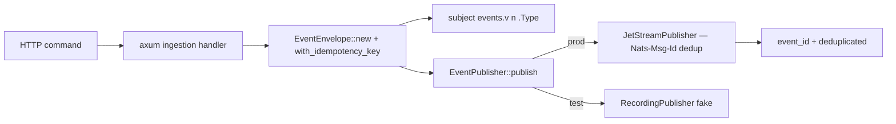

# Design: demo-001-ingestion-http-nats

<!-- Audit: B.6.8 (illustrative demo of b6-8-example) -->
<!-- Layers: [backend] — single-layer. -->

This design turns `specs.md` (FR-BE-001..003) into the concrete
`events/` ingestion decisions. The architecture is governed by the
archived `b6-3-standards` (`global/event-driven.md`,
`infra/nats-jetstream.md`) and the archetype's Rust layering; this design
records the demo-specific choices.

## Architecture Decisions

### ADR-001: `EventPublisher` is a hexagonal port; JetStream is one adapter

**Context.** FR-BE-002 needs a publish path that is unit-testable
without a live NATS server.

**Decision.** `EventPublisher` is an `async_trait` port. Production uses
`JetStreamPublisher` (wrapping an `async_nats::jetstream::Context`);
tests use an in-memory `RecordingPublisher`. The ingestion handler
depends on `&dyn EventPublisher`, so the request path never names a
concrete transport.

**Consequences.** ✅ The handler is tested against the fake (no network,
hermetic). ✅ Swapping NATS for Redpanda (the sovereign alternative) is
an adapter change, not a handler change. ⚠️ The live JetStream ack path
is exercised only under the toolchain-gated integration tier.

### ADR-002: Idempotency key = `Nats-Msg-Id`; business key overrides the id default

**Context.** FR-BE-001/002 require publish-side dedup. NATS JetStream
dedups on the `Nats-Msg-Id` header within a configured window.

**Decision.** The envelope's `idempotency_key` IS the `Nats-Msg-Id`. It
defaults to the event `id` (always unique) but the ingestion handler
overrides it with the caller's stable business key (e.g. `order-42`) via
`with_idempotency_key`, so a client retry does not double-publish.

**Consequences.** ✅ Exactly-once *effect* on the publish side without a
distributed lock. ✅ The same key is reused as the event-store append
uniqueness key in demo-002 (one idempotency story across both halves).
⚠️ Dedup is bounded by the JetStream dedup window (a config, documented
in `infra/nats/`), not infinite.

### ADR-003: Subject namespacing by version + type (`events.v<n>.<Type>`)

**Context.** FR-BE-001 requires event versioning so a consumer picks the
right deserializer.

**Decision.** The subject is `events.v<event_version>.<event_type>`
(`EventEnvelope::subject`). Version is in the subject (not only the
payload), so a v2 consumer subscribes to `events.v2.>` and never sees v1
bytes it cannot parse.

**Consequences.** ✅ Additive event evolution (a new version is a new
subject, old consumers unaffected). ✅ Matches the AsyncAPI 3.1 channel
layout in `shared/asyncapi/`.

## Component Design

## Standards Applied

| Standard | How |
|---|---|
| `global/event-driven` | event versioning, idempotency keys, subject namespacing |
| `infra/nats-jetstream` | `Nats-Msg-Id` publish dedup within the configured window |
| `global/proto-contracts` | `EventService.Publish` is the synchronous ingestion contract |
| `rust/architecture` | `EventPublisher` port; typed `PublishError`; no unwrap/panic |

## Constitutional compliance gate

| Article | Gate-blocked? | Justification |
|---|---|---|
| I — TDD | NO | inline RED→GREEN tests in envelope/publisher |
| II — BDD | NO | `features/ingestion_http_nats.feature` |
| IV — Delta | NO | specs.md uses ADDED FR-BE-* |
| VII — Rust | NO | hexagonal port; no unwrap/panic in prod paths |

✅ No violation. Next → `/forge:plan demo-001-ingestion-http-nats`.
