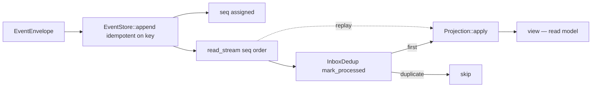

# Design: demo-002-projection-readmodel

<!-- Audit: B.6.8 (illustrative demo of b6-8-example) -->
<!-- Layers: [backend] — single-layer. -->

This design turns `specs.md` (FR-BE-001..003) into the concrete
`eventstore/` + consumer decisions. The architecture is governed by the
archived `b6-3-standards` (`global/event-driven.md`) and the archetype's
Rust layering.

## Architecture Decisions

### ADR-001: `EventStore` is a port; Postgres + in-memory are two adapters

**Context.** FR-BE-001 needs an append/read path that is unit-testable
without a live database.

**Decision.** `EventStore` is an `async_trait` port with `append` +
`read_stream`. `PgEventStore` uses the runtime `sqlx::query(...)` API
(NOT the compile-time `query!` macro), so the crate builds with **no
`DATABASE_URL` and no live database**. `InMemoryEventStore` is the
test/local-dev adapter. Idempotency on `idempotency_key` is enforced by
both (`ON CONFLICT DO NOTHING` / a membership check).

**Consequences.** ✅ The projection + consumer logic is tested against
the in-memory adapter (hermetic). ✅ The runtime query API keeps `cargo
build`/`test` green with no database. ⚠️ The live Postgres path is
exercised only under the toolchain-gated integration tier.

### ADR-002: Projections are pure folds — deterministic + replayable

**Context.** FR-BE-002 requires the read model to be rebuildable from the
event log.

**Decision.** A `Projection` is a fold: `apply(&mut self, &event)` +
`view()`. It reads only the event (no wall-clock, no RNG, no external
I/O), so folding the same log twice yields the same view — the read model
is a **pure function of the event stream** and can be dropped and rebuilt
at any time.

**Consequences.** ✅ Rebuild-on-demand (schema change → replay). ✅ The
fold is a 3-line unit test. ⚠️ Non-deterministic side effects (emails,
external calls) MUST NOT live in `apply` — they belong to a separate
process-manager (the saga, demo-003).

### ADR-003: Inbox dedup keyed on `idempotency_key` (outbox/inbox)

**Context.** FR-BE-003 — NATS delivers at-least-once, so a consumer must
be idempotent.

**Decision.** The consumer consults an `InboxDedup` keyed on the same
`idempotency_key` demo-001 uses for publish dedup. `mark_processed`
returns `true` once per key; a redelivery returns `false` and is skipped.
In production this is a Postgres `inbox` table; the in-memory version is
the unit-testable core.

**Consequences.** ✅ One idempotency key threads publish (demo-001) →
append (this demo's store) → consume (this demo's inbox). ✅ Exactly-once
*processing* under redelivery without distributed coordination.

## Component Design

## Standards Applied

| Standard | How |
|---|---|
| `global/event-driven` | append-only store, deterministic projection replay, outbox/inbox dedup |
| `rust/architecture` | `EventStore` / `Projection` ports; domain free of `sqlx`; no unwrap/panic |
| `rust/testing` | inline `#[cfg(test)]` folds + cucumber-rs BDD |

## Constitutional compliance gate

| Article | Gate-blocked? | Justification |
|---|---|---|
| I — TDD | NO | inline RED→GREEN tests in store/projection/consumer |
| II — BDD | NO | `features/projection_readmodel.feature` |
| IV — Delta | NO | specs.md uses ADDED FR-BE-* |
| VII — Rust | NO | ports; domain free of sqlx; no unwrap/panic |

✅ No violation. Next → `/forge:plan demo-002-projection-readmodel`.
