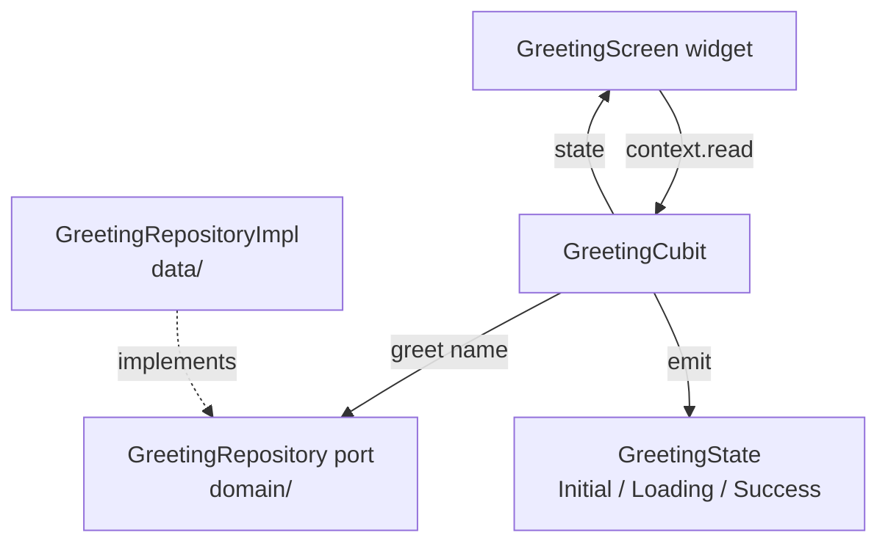

# Design: demo-002-greeting-screen

<!-- Audit: C.1 (illustrative demo) -->
<!-- Layers: [frontend] -->

## Architecture Decisions

### ADR-001: Cubit (not Bloc) for the simple state machine

**Context.** Article VI.3 distinguishes Cubit (simple,
synchronous, no event types) from Bloc (event-driven, multiple
transitions). The `GreetingScreen` has one user action ("Say
hello") and one async operation. No complex event routing.

**Decision.** Use `Cubit<GreetingState>` with three sealed
states (`GreetingInitial`, `GreetingLoading`,
`GreetingSuccess(String)`). Transitions :
`Initial --sayHello()--> Loading --(repository call)--> Success`.

**Consequences.**

- ✅ Less boilerplate than a full Bloc.
- ✅ Reads naturally for adopters new to flutter_bloc.
- ⚠️ If the demo grows event types (cancel, retry, validation),
  promote to Bloc.

**Constitution Compliance:** Article VI.3 confirmed.

### ADR-002: Fake `GreetingRepository` for this demo, real gRPC wired later

**Context.** A real gRPC client requires `protoc_plugin`-generated
stubs in `frontend/lib/generated/protos/`. The scaffolder ships a
proto-codegen task (`task proto`) but does not run it
automatically. Wiring grpc-dart to the codegen output is itself a
non-trivial setup that would dominate the demo's surface area.

**Decision.** The demo ships a `GreetingRepositoryImpl` that
fakes the gRPC response in-memory : it returns
`"Hello, $name!"` (or `"Hello, world!"` if empty). A `// TODO
(c1-followup): swap to real gRPC client` comment in the file
documents the follow-up.

**Consequences.**

- ✅ Demo stays focused on Flutter discipline.
- ✅ Adopters see the port + adapter pattern even with the
  fake.
- ⚠️ Demonstrates a fake, not real network. Documented in the
  proposal.

**Constitution Compliance:** Article VI.2 confirmed (port +
adapter even with a fake adapter).

### ADR-003: Golden test against light theme MaterialApp

**Context.** Article VI.8 mandates a golden test for every
custom widget with non-trivial visual output. `GreetingScreen`
qualifies (text field + button + result region).

**Decision.** Ship one golden under
`frontend/test/features/greeting/golden/greeting_screen_initial.png`
showing the initial empty state in `MaterialApp(theme:
ThemeData.light())`. Future iterations may add dark theme +
loaded state goldens.

**Consequences.**

- ✅ Catches regressions in widget rendering.
- ⚠️ Goldens require regeneration on Flutter SDK bump (acceptable
  cost).

**Constitution Compliance:** Article VI.8 confirmed.

## Component diagram

## Testing Strategy

| Test | Type | Location |
|---|---|---|
| `GreetingCubit.sayHello("Alice")` emits Loading then Success("Hello, Alice!") | unit (bloc_test) | `frontend/test/features/greeting/cubit/greeting_cubit_test.dart` |
| `GreetingRepositoryImpl.greet("")` returns "Hello, world!" | unit | `frontend/test/features/greeting/data/greeting_repository_impl_test.dart` |
| `GreetingScreen` renders TextField + Button initially | widget | `frontend/test/features/greeting/presentation/greeting_screen_test.dart` |
| Tapping the button displays the greeting | widget | same |
| Initial-state golden matches | golden | same |
| BDD scenarios pass | BDD | `frontend/integration_test/greeting_bdd_test.dart` (placeholder) |

## Standards Applied

- `flutter/architecture.md` — Clean+FSD triad.
- `flutter/state-management.md` — Cubit (FR-FE-001).
- `flutter/widget-patterns.md` — composition, semantic labels.
- `flutter/testing.md` — `flutter_test` + `bloc_test`.
- `flutter/responsive-design.md` — `LayoutBuilder` for narrow/wide.
- `flutter/accessibility.md` — semantic labels on text field +
  button.

✅ Constitutional gate green. Proceeding to /forge:plan.
