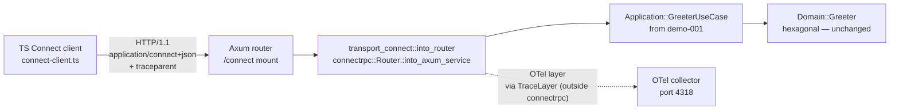

# Design: demo-005-connect-greeting

<!-- Status: archived -->

## Overview

Single-layer backend demo. Reuses the `Greeter` service hexagonal
implementation from `demo-001-greeting-service` and exposes it via the
Connect adapter shipped by `t5-connect-codegen` (`grpc-api/src/transport_connect.rs`).
No new domain code ; no new infra ; the only new artefact is a thin
TypeScript client that exercises the Connect path end-to-end and seeds
a W3C traceparent header for the L2 fixture.

## Decisions

### ADR-DEMO5-001 — TypeScript client only (no Rust S2S client)

Per ADR-T5-003 of the parent change. Rust server-to-server Connect
calls are out of scope for T.5 and are deferred to B.8 (T6) where
DBOS-driven workflows ship together with the codec.

### ADR-DEMO5-002 — Default to `application/connect+json` HTTP/1.1

The default codec is `application/connect+json` over HTTP/1.1 to
exercise the codec that was previously deferred to B.8. The same
handler also accepts gRPC-Web ; the L2 fixture test
(`_test_t5_l2_connectrpc_dual_codec`) covers the second codec.

### ADR-DEMO5-003 — `node --check` parser-only validation

The L1 test `_test_t5_020` runs `node --check` against
`connect-client.ts`. This validates JS syntax only ; it does NOT
type-check. The file is therefore written in TypeScript-compatible
JavaScript (no `as` casts, no interfaces, no type annotations) so
`node --check` accepts it without a TS compiler. A separate
`tsconfig.json` is intentionally NOT shipped — type checking is the
adopter's responsibility once they wire their proto-generated stubs.
