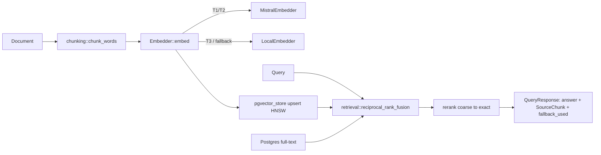

# Design: demo-001-doc-ingestion

<!-- Audit: B.7.7 (illustrative demo of b7-7-example) -->
<!-- Layers: [backend] — single-layer. -->

This design turns `specs.md` (FR-BE-001..006) into the concrete `rag/`
pipeline decisions. The architecture is governed by the archived
`b7-standards` (`global/rag-patterns.md`) and the archetype's Rust
layering; this design records the demo-specific choices.

## Architecture Decisions

### ADR-001: cucumber-rs for the ingest→query BDD

**Context.** Article II requires Given/When/Then for the user-facing
ingest→query behaviour. The Rust testing standard names cucumber-rs.

**Decision.** Use cucumber-rs with `features/doc_ingestion.feature`; the
step definitions drive the `rag/` pipeline (chunk → embed → upsert →
retrieve → rerank) over a deterministic in-memory fixture, with no
network. The inline `#[cfg(test)]` unit tests in each `rag/` module
carry the fine-grained RED→GREEN cycles; the `.feature` carries the
end-to-end behaviour.

**Consequences.** ✅ BDD + unit tests cover both the behaviour and the
primitives. ⚠️ The cucumber harness is illustrative (in-memory fixture),
not a live-DB integration test (that is a tooled L3 concern, ADR-B7-7-004).

### ADR-002: `Embedder` is a port; tier selection is a pure function

**Context.** FR-BE-002 needs provider-agnostic embeddings + a tier-aware
selection rule that must be unit-testable without constructing a heavy
ONNX embedder.

**Decision.** `Embedder` is an `async_trait` port with two impls
(`MistralEmbedder` cloud, `LocalEmbedder` behind the off-by-default
`local-embeddings` feature). The selection rule is a separate pure
function `select_backend(tier, preference) -> EmbedderKind`, so the T3
forcing rule is tested without I/O.

**Consequences.** ✅ The XI.6 rule (T3 ⇒ local) is a 3-line unit test.
✅ Default builds stay hermetic (ONNX is feature-gated). ⚠️ The local
model is downloaded on first run (documented build step).

### ADR-003: RRF over raw-score blending; pgvector `vector_cosine_ops`

**Context.** FR-BE-004 fuses a cosine-distance list and a BM25 list whose
raw scores are not comparable.

**Decision.** Fuse by **rank** via Reciprocal Rank Fusion (`k = 60`,
Cormack et al.), not by blending raw scores. The dense leg uses pgvector
HNSW over `vector_cosine_ops` (cosine distance), matching the embedder's
cosine-normalised vectors. Ties break by `document_id` for determinism.

**Consequences.** ✅ Robust across incomparable scorers; deterministic
output. ✅ HNSW gives sub-linear ANN recall at corpus scale.

### ADR-004: tier-aware embedder selection references `compliance-tiers`

**Context.** FR-BE-002 / XI.6 require T3 to forbid cloud egress.

**Decision.** `ComplianceTier` (T1/T2/T3) is parsed from `FORGE_EU_TIER`;
`select_backend` forces `Local` at T3. This is the tier-aware refusal
**hook** referenced by `compliance-tiers` + `llm-gateway.md`; the runtime
Janus refusal rules themselves are a separate brick (`b7-9-janus-ai`).

**Consequences.** ✅ The example materialises the EU-sovereign tier story
concretely. ⚠️ The demo ships the hook, not the full Janus enforcement.

## Component Design

## Standards Applied

| Standard | How |
|---|---|
| `global/rag-patterns` | chunking overlap, hybrid retrieval + RRF, re-rank, pgvector HNSW |
| `compliance-tiers` | tier-aware embedder selection (T3 ⇒ local, zero egress) |
| `rust/architecture` | `Embedder` port; domain free of `sqlx` |
| `rust/testing` | cucumber-rs BDD + inline `#[cfg(test)]` unit tests |

## Constitutional compliance gate

| Article | Gate-blocked? | Justification |
|---|---|---|
| I — TDD | NO | inline RED→GREEN tests per `rag/` module |
| II — BDD | NO | `features/doc_ingestion.feature` |
| IV — Delta | NO | specs.md uses ADDED FR-BE-* |
| VII — Rust | NO | hexagonal; no unwrap/panic in prod paths |
| XI.5/XI.6 — AI-First | NO | embedder fallback + T3 zero-egress local path |

✅ No violation. Next → `/forge:plan demo-001-doc-ingestion`.
