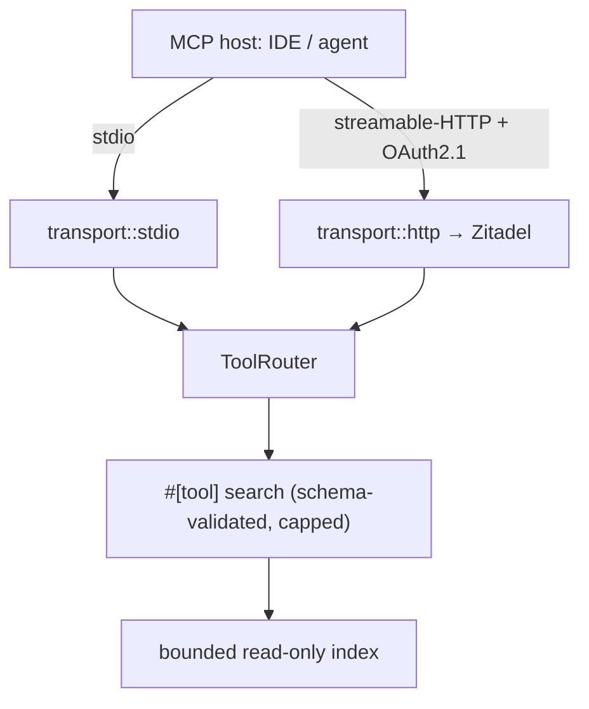

# Design: demo-002-mcp-search-tool

<!-- Audit: B.7.7 (illustrative demo of b7-7-example) -->
<!-- Layers: [backend] — single-layer. -->

This design turns `specs.md` (FR-BE-010..013) into the concrete `mcp/`
decisions, governed by `global/mcp-servers.md` (archived `b7-standards`)
and the archetype's Rust layering.

## Architecture Decisions

### ADR-001: declare the tool once with `#[tool_router]`; transport is feature-gated

**Context.** FR-BE-010 + FR-BE-012 require one `search` tool served over
two transports without duplicating the tool logic.

**Decision.** Declare `search` once on `SearchServer` via
`#[tool_router(server_handler)]` / `#[tool]`. The two transports
(`transport/stdio.rs`, `transport/http.rs`) are separate modules behind
the `mcp-stdio` (default) / `mcp-http` Cargo features; both mount the same
`ToolRouter`. The tool's behaviour and its least-privilege bound are
transport-independent.

**Consequences.** ✅ Single source of truth for the tool; no behaviour
drift between transports. ✅ Default build (stdio) stays light; HTTP +
OAuth deps are opt-in. ⚠️ Feature-gated modules need both feature sets
compiled in CI for full coverage (a tooled L2 concern).

### ADR-002: schema-validated input via `schemars`

**Context.** FR-BE-010 requires every inbound call to be validated.

**Decision.** `SearchParameters` derives `schemars::JsonSchema`; rmcp
uses the derived schema to validate calls and to advertise the typed
contract. `schemars` is pinned to the version rmcp 1.7.0 expects so the
derived bound satisfies the tool-router macro.

**Consequences.** ✅ The protocol advertises a typed contract; malformed
calls are rejected before reaching the handler. ✅ The schema is a unit
test (`schema_for!` names both fields).

### ADR-003: least privilege via a named hard cap

**Context.** FR-BE-011 requires the tool to never return an unbounded set.

**Decision.** `MAX_SEARCH_LIMIT = 50` is a named constant;
`effective_limit(requested)` clamps to `[1, MAX_SEARCH_LIMIT]` (`0` ⇒
default 10). The index is a fixed, read-only `Vec<(id, content)>` — no
filesystem, no shell, no SQL from raw arguments.

**Consequences.** ✅ The least-privilege contract is enforced by a pure,
tested function. ⚠️ The bounded substring index is illustrative; a
production server backs `search` with demo-001's RRF retriever (the
adapter is a documented extension point).

### ADR-004: OAuth 2.1 on HTTP only; stdio is local-trust

**Context.** FR-BE-013 — the network transport must authenticate; the
local stdio transport runs in the user's trust boundary.

**Decision.** The `mcp-http` transport composes the rmcp `auth` feature
(OAuth 2.1) routing to Zitadel/Envoy-OIDC. The `mcp-stdio` transport
carries no network auth (local process trust). The IdP itself is the B.8
substrate, consumed by reference.

**Consequences.** ✅ Defence-in-depth on the networked surface; no
needless friction for local dev. ⚠️ The OAuth flow is a documented hook
in this demo (no live IdP in tests).

## Component Design

## Standards Applied

| Standard | How |
|---|---|
| `global/mcp-servers` | `#[tool_router]`, dual transport, least privilege, schema-validated input, OAuth→Zitadel |
| `rust/architecture` | tool declared once; transports as adapters |
| `rust/testing` | inline `#[cfg(test)]` + cucumber-rs BDD |

## Constitutional compliance gate

| Article | Gate-blocked? | Justification |
|---|---|---|
| I — TDD | NO | inline RED→GREEN tests (schema, cap, search) |
| II — BDD | NO | `features/mcp_search.feature` |
| IV — Delta | NO | specs.md uses ADDED FR-BE-* |
| VII — Rust | NO | hexagonal; no unwrap/panic in prod paths |
| IX — Security | NO | least privilege, schema validation, OAuth on HTTP |

✅ No violation. Next → `/forge:plan demo-002-mcp-search-tool`.
